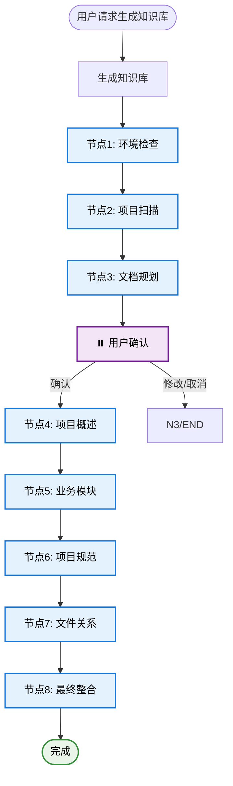

# Repository Wiki Generator

专业的项目知识库自动生成系统，基于代码事实生成100%可追溯的工程级文档。

## Application Layer



---

## Domain Layer

### S1[生成知识库]

**场景说明**: 用户请求为当前项目生成完整的知识库文档。

#### 执行步骤

**步骤1: 环境检查**
- 检查工作目录状态（可选 Git 警告）
- 记录当前 commit（如果在 Git 仓库中）
- 检查并创建 `gientech/wiki/` 输出目录

**步骤2: 项目结构扫描**
- 调用脚本扫描项目结构
- 执行：`echo '{"project_path": "."}' | python scripts/scan_project_structure.py`
- 脚本返回：构建系统、目录结构、各层文件列表、语言识别

**步骤3: 文档规划**
- 基于扫描结果生成文档规划
- 识别需要生成的文档列表
- 评估每个文档的预估行数
- 识别需要详细分析的业务模块
- 识别需要分析的关键调用链路

**MANDATORY**: 必须等待用户确认规划后才能继续

**步骤4: 生成项目概述**
- 生成 `gientech/wiki/00-项目概述.md`
- 参考：`references/document-templates.md` 中的项目概述模板
- 参考：`references/core-principles.md` 中的核心原则
- 参考：`references/source-annotation-format.md` 中的标注格式

**步骤5: 生成业务模块文档**
- 遍历所有业务模块
- 为每个模块生成 `gientech/wiki/01-业务模块-{模块名}.md`
- 单模块>2000行时拆分为多个文档
- 参考：`references/document-templates.md` 中的业务模块模板
- 参考：`references/usage-example-template.md` 中的示例模板

**步骤6: 生成项目规范**
- 生成 `gientech/wiki/99-项目规范.md`
- 从项目代码中提取实际编码规范
- 参考：`references/language-patterns.md` 中的语言模式
- 参考：`references/document-templates.md` 中的规范模板

**步骤7: 文件关系分析**
- 分析文件间的调用链路和数据流动
- 生成 `gientech/wiki/02-文件关系-*.md` 文档
- 参考：`references/tot-architecture.md` 中的节点7说明
- 参考：`references/document-templates.md` 中的文件关系模板

**步骤8: 最终整合**
- 验证所有文档质量和一致性
- 调用脚本验证：`echo '{"wiki_path": "gientech/wiki/"}' | python scripts/validate_document.py`
- 生成知识库索引文档 `gientech/wiki/README.md`
- 记录版本信息（生成时间、git commit、操作人员）

#### 质量要求

- **CRITICAL**: 所有类/模块、函数/方法、接口必须标注文件路径和行号
- **CRITICAL**: 所有功能描述必须补充使用场景示例
- **CRITICAL**: 所有内容必须与实际代码100%一致
- **CRITICAL**: 严禁推测或臆造任何信息
- **MANDATORY**: 节点3（文档规划）后必须等待用户确认
- **IMPORTANT**: 每个文档生成后立即验证质量

#### 输出确认

```
🔍 **知识库生成完成**

**生成文档**:
- 00-项目概述.md
- 01-业务模块-*.md (共 N 个)
- 02-文件关系-*.md (共 M 个)
- 99-项目规范.md
- README.md

**输出位置**: gientech/wiki/

**质量验证**: ✅ 所有文档已通过质量检查

✅ 知识库生成成功
```

---

## 核心原则

### 1. 可追溯性原则（最高优先级）

所有结论、图表、示例必须标注来源。

**标注格式**:
- 模块引用：`来源：`module_path.ClassName` (file/path:line_number)`
- 函数引用：`来源：`ClassName.methodName()` (file/path:line_number)`
- 配置引用：`来源：配置文件 `config_file` (line_number 行)`

参考：`references/source-annotation-format.md`

### 2. 使用示例驱动原则

所有类、方法、接口描述必须补充使用场景示例。

**示例结构**:
- 使用场景说明
- 具体代码示例
- 预期结果说明

参考：`references/usage-example-template.md`

### 3. 零推测原则

严禁任何形式的推测、臆测或理论化描述。

**禁止行为**:
- ❌ 描述不存在的功能
- ❌ 臆造接口或方法
- ❌ 使用"可能"、"应该"、"大概"等模糊词汇

**必需行为**:
- ✅ 所有内容必须基于实际代码
- ✅ 所有描述必须标注来源
- ✅ 不确定时向用户询问

### 4. HIL (Human in the Loop) 机制

**强制停止点**:
- 文档规划完成后必须等待用户确认
- 生成过程中遇到不明确内容时必须询问用户

**确认提示模板**:
```
## 📋 知识库生成规划确认

**文档清单**：
{document_list_with_estimated_lines}

**总文档数**: {document_count}
**预估总行数**: {total_lines}

**⚠️ 强制确认点**：继续执行将开始生成知识库

**确认选项**：
- 输入 "确认继续" 开始生成
- 输入 "修改规划" 调整规划  
- 输入 "取消" 终止操作
```

---

## 参考资源

### 架构和流程
- `references/tot-architecture.md` - Tree of Thoughts 执行架构详细说明

### 核心原则
- `references/core-principles.md` - 核心生成原则（可追溯性、零推测、HIL等）

### 文档模板
- `references/document-templates.md` - 所有文档的输出模板

### 质量保障
- `references/quality-standards.md` - 质量保障体系和验证机制

### 语言模式
- `references/language-patterns.md` - 多语言识别模式（Java、Python、JS等）

### 标注规范
- `references/source-annotation-format.md` - 来源标注格式规范

### 示例模板
- `references/usage-example-template.md` - 使用场景示例模板

---

## 脚本资源

### 项目结构扫描
- `scripts/scan_project_structure.py` - 扫描项目结构，识别模块、分层和组件

**使用方式**:
```bash
echo '{"project_path": "."}' | python scripts/scan_project_structure.py
```

**返回结果**:
```json
{
  "project_path": ".",
  "build_system": {...},
  "directory_structure": {...},
  "interface_layer": [...],
  "data_layer": [...],
  "business_layer": [...],
  "adapter_layer": [...],
  "middleware": [...],
  "language": {...}
}
```

### 文档验证
- `scripts/validate_document.py` - 验证文档质量和一致性

**使用方式**:
```bash
# 验证单个文档
echo '{"document_path": "gientech/wiki/00-项目概述.md"}' | python scripts/validate_document.py

# 验证所有文档
echo '{"wiki_path": "gientech/wiki/"}' | python scripts/validate_document.py
```

**返回结果**:
```json
{
  "valid": true,
  "errors": [],
  "warnings": [],
  "validations": {
    "source_annotation": {...},
    "line_estimation": {...},
    "usage_examples": {...},
    "flowchart_clarity": {...},
    "content_consistency": {...}
  }
}
```

---

## 质量验证清单

### 文档质量
- [ ] 所有类/模块、函数/方法、接口都有文件路径和行号
- [ ] 所有功能描述都有使用场景示例
- [ ] 所有流程图都有节点详解
- [ ] 所有内容与代码100%一致
- [ ] 无模糊词汇（可能、应该、大概）

### 文档结构
- [ ] 所有文档按照模板结构生成
- [ ] 所有章节标题下都有预估行数
- [ ] 超过2000行的模块已拆分
- [ ] 路径使用正斜杠 `/`

### 验证执行
- [ ] 每个文档生成后立即验证
- [ ] 所有验证通过后才继续下一步
- [ ] 文档间一致性检查通过

参考：`references/quality-standards.md`