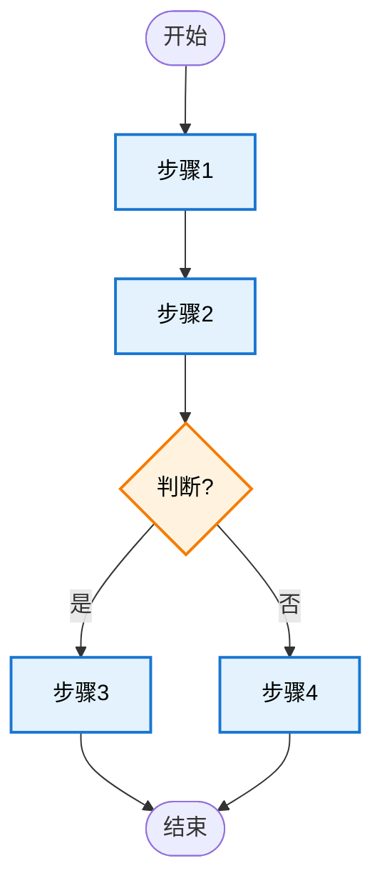

# 文档输出模板

## 文档结构概览

```
gientech/wiki/
├── README.md                          # 知识库索引
├── 00-项目概述.md                      # 项目整体概述
├── 01-业务模块-{模块名}.md             # 业务模块详解
├── 02-文件关系-核心业务链路.md         # 核心业务调用链
├── 02-文件关系-外部集成链路.md         # 外部系统集成链路
├── 02-文件关系-数据流动分析.md         # 数据流动分析
└── 99-项目规范.md                      # 项目编码规范
```

---

## 00-项目概述.md 模板

```markdown
# 项目概述

## 项目介绍 (预估约 X 行)

**项目名称**: {项目名称}

**核心价值**: {解决的核心问题}

**技术栈**: {主要技术栈}

来源：`{配置文件}` ({file_path}:{line_number})

---

## 服务定位 (预估约 X 行)

### 使用场景

**场景1**: {场景描述}
- 哪些系统/模块会依赖该服务
- 服务的典型使用流程和时机

**场景2**: {场景描述}
- ...

来源：`{ServiceName}` ({file_path}:{line_number})

### 职责边界

**核心职责**:
- {职责1}
- {职责2}

**不属于此服务**:
- {非职责1}
- {非职责2}

来源：`{ServiceName}` ({file_path}:{line_number})

---

## 对外接口 (预估约 X 行)

### 接口清单

| 接口路径 | 功能描述 | 文件位置 |
|---------|---------|---------|
| `/api/xxx` | {功能描述} | {file_path}:{line_number} |
| ... | ... | ... |

### 接口详细说明

#### {接口名称}

**接口路径**: `/api/xxx`

**功能描述**: {功能描述}

**请求参数**:
```json
{
  "param1": "类型 - 说明",
  "param2": "类型 - 说明"
}
```

**响应格式**:
```json
{
  "code": 200,
  "message": "success",
  "data": {}
}
```

**使用场景**: {使用场景说明}

来源：`{ControllerName}.{methodName}()` ({file_path}:{line_number})

---

## 数据模型 (预估约 X 行)

### 数据模型清单

| 模型名称 | 字段说明 | 关系 | 文件位置 |
|---------|---------|------|---------|
| `{ModelName}` | {字段说明} | {关系} | {file_path}:{line_number} |

### 模型详细说明

#### {ModelName}

**表名**: `{table_name}`

**字段说明**:
| 字段名 | 类型 | 说明 | 约束 |
|-------|------|------|------|
| `field1` | 类型 | 说明 | 约束 |
| ... | ... | ... | ... |

**数据关系**:
- 一对一: `{RelatedModel}` (通过 `{field}`)
- 一对多: `{RelatedModel}` (通过 `{field}`)
- 多对多: `{RelatedModel}` (通过 `{join_table}`)

来源：`{ModelName}` ({file_path}:{line_number})

### 数据访问层

#### {RepositoryName}

**功能描述**: {功能描述}

**方法清单**:
| 方法名 | 功能 | 使用场景 | 文件位置 |
|-------|------|---------|---------|
| `method1()` | {功能} | {场景} | {file_path}:{line_number} |

来源：`{RepositoryName}` ({file_path}:{line_number})

---

## 业务模块 (预估约 X 行)

### 模块清单

| 模块名称 | 核心组件 | 职责 | 文件位置 |
|---------|---------|------|---------|
| `{ModuleName}` | {组件列表} | {职责} | {file_path}:{line_number} |

### 模块详细说明

#### {ModuleName}

**核心组件**:
- `{ComponentName1}`: {职责说明}
- `{ComponentName2}`: {职责说明}

**主要方法**:
| 方法名 | 功能 | 使用场景 | 文件位置 |
|-------|------|---------|---------|
| `method1()` | {功能} | {场景} | {file_path}:{line_number} |

来源：`{ModuleName}` ({file_path}:{line_number})

---

## 适配器层 (预估约 X 行)

### 外部服务依赖

| 服务名称 | 功能说明 | 依赖接口 | 文件位置 |
|---------|---------|---------|---------|
| `{ServiceName}` | {功能} | {接口清单} | {file_path}:{line_number} |

### 服务详细说明

#### {ServiceName}

**功能说明**: {功能说明}

**依赖接口**:
| 接口名称 | 功能 | 参数说明 | 文件位置 |
|---------|------|---------|---------|
| `api1()` | {功能} | {参数} | {file_path}:{line_number} |

**使用场景**: {使用场景说明}

来源：`{AdapterName}` ({file_path}:{line_number})

---

## 中间件 (预估约 X 行)

### 中间件清单

| 中间件 | 用途 | 调用方法 | 文件位置 |
|-------|------|---------|---------|
| `{Middleware}` | {用途} | {方法清单} | {file_path}:{line_number} |

### 中间件详细说明

#### {Middleware}

**用途说明**: {用途说明}

**调用方法**:
| 方法名 | 功能 | 使用场景 | 文件位置 |
|-------|------|---------|---------|
| `method1()` | {功能} | {场景} | {file_path}:{line_number} |

来源：`{配置文件}` ({file_path}:{line_number})
```

---

## 01-业务模块-{模块名}.md 模板

```markdown
# {模块名称}

## 模块概述 (预估约 X 行)

**模块职责**: {模块职责}

**核心组件**:
- `{ComponentName1}`: {职责}
- `{ComponentName2}`: {职责}

**输入输出**:
- 输入: {输入说明}
- 输出: {输出说明}

来源：`{ModuleName}` ({file_path}:{line_number})

---

## 核心流程 (预估约 X 行)



**流程说明**:
1. **步骤1**: {说明}
   - 来源：`{ComponentName.methodName}()` ({file_path}:{line_number})
2. **步骤2**: {说明}
   - 来源：`{ComponentName.methodName}()` ({file_path}:{line_number})
3. **判断**: {判断条件}
   - 来源：`{ComponentName.methodName}()` ({file_path}:{line_number})
4. **步骤3**: {说明}
   - 来源：`{ComponentName.methodName}()` ({file_path}:{line_number})
5. **步骤4**: {说明}
   - 来源：`{ComponentName.methodName}()` ({file_path}:{line_number})

---

## 流程节点详解 (预估约 X 行)

### 节点1: {节点名称}

**功能描述**: {功能描述}

**子流程**:
1. {子流程1}
   - 来源：`{ComponentName.methodName}()` ({file_path}:{line_number})
2. {子流程2}
   - 来源：`{ComponentName.methodName}()` ({file_path}:{line_number})

**规则逻辑**:
- {规则1}
  - 来源：`{ComponentName.methodName}()` ({file_path}:{line_number})
- {规则2}
  - 来源：`{ComponentName.methodName}()` ({file_path}:{line_number})

**数据转换**:
- 输入: `{InputType}` → 输出: `{OutputType}`
- 转换规则: {规则}
- 来源：`{ComponentName.methodName}()` ({file_path}:{line_number})

**异常处理**:
- 异常类型: `{ExceptionType}`
- 处理策略: {策略}
- 来源：`{ComponentName.methodName}()` ({file_path}:{line_number})

---

## 规则逻辑 (预估约 X 行)

### 规则1: {规则名称}

**规则描述**: {规则描述}

**规则表达式**: {表达式}

**使用场景**: {使用场景}

来源：`{ComponentName.methodName}()` ({file_path}:{line_number})

### 规则2: {规则名称}

...

---

## 使用示例 (预估约 X 行)

### 示例1: {场景名称}

**使用场景**: {场景描述}

```{language}
// 示例代码
{code_snippet}
```

**预期结果**: {结果说明}

来源：`{ComponentName.methodName}()` ({file_path}:{line_number})

### 示例2: {场景名称}

...

---

## 来源追溯

- 模块定义: `{ModuleName}` ({file_path}:{line_number})
- 核心流程:
  - 步骤1: `{ComponentName.methodName}()` ({file_path}:{line_number})
  - 步骤2: `{ComponentName.methodName}()` ({file_path}:{line_number})
  - ...
- 规则逻辑:
  - 规则1: `{ComponentName.methodName}()` ({file_path}:{line_number})
  - ...
```

---

## 02-文件关系-核心业务链路.md 模板

```markdown
# 文件关系 - 核心业务链路

## 链路概述 (预估约 X 行)

**链路名称**: {链路名称}

**业务场景**: {业务场景描述}

**入口**: `{ControllerName}.{methodName}()` ({file_path}:{line_number})

**出口**: `{RepositoryName}.{methodName}()` ({file_path}:{line_number})

**涉及文件数**: {数量}

**预估复杂度**: {简单/中等/复杂}

---

## 完整调用链路图 (预估约 X 行)

```mermaid
sequenceDiagram
    participant C as Controller<br/>({file_path}:{line_number})
    participant S as Service<br/>({file_path}:{line_number})
    participant R as Repository<br/>({file_path}:{line_number})
    
    C->>S: method1(param1)
    activate S
    S->>R: method2(param2)
    activate R
    R-->>S: result
    deactivate R
    S-->>C: response
    deactivate C
```

---

## 每个节点详解 (预估约 X 行)

### 节点1: {ControllerName}

**文件位置**: `{file_path}:{line_number}`

**方法**: `{methodName}()`

**功能**: {功能描述}

**输入参数**:
| 参数名 | 类型 | 说明 |
|-------|------|------|
| `param1` | 类型 | 说明 |

**返回值**: `{ReturnType}`

**调用关系**:
- 调用: `{ServiceName}.{methodName}()` ({file_path}:{line_number})

**异常处理**:
- 异常: `{ExceptionType}`
- 处理: {处理策略}

---

### 节点2: {ServiceName}

**文件位置**: `{file_path}:{line_number}`

**方法**: `{methodName}()`

**功能**: {功能描述}

**输入参数**:
| 参数名 | 类型 | 说明 |
|-------|------|------|
| `param1` | 类型 | 说明 |

**返回值**: `{ReturnType}`

**调用关系**:
- 调用: `{RepositoryName}.{methodName}()` ({file_path}:{line_number})

**异常处理**:
- 异常: `{ExceptionType}`
- 处理: {处理策略}

---

### 节点3: {RepositoryName}

**文件位置**: `{file_path}:{line_number}`

**方法**: `{methodName}()`

**功能**: {功能描述}

**输入参数**:
| 参数名 | 类型 | 说明 |
|-------|------|------|
| `param1` | 类型 | 说明 |

**返回值**: `{ReturnType}`

**数据操作**:
- 操作: {CRUD操作}
- 表: `{table_name}`

---

## 数据流动分析 (预估约 X 行)

### 数据转换流程

```
DTO (Data Transfer Object)
  ↓
Entity (Domain Entity)
  ↓
DO (Data Object)
  ↓
Database
```

### 转换详细说明

#### 转换1: DTO → Entity

**转换位置**: `{MapperName}.toEntity()` ({file_path}:{line_number})

**转换规则**:
- `dto.field1` → `entity.field1`
- `dto.field2` → `entity.field2`

**验证规则**:
- {验证规则1}
- {验证规则2}

#### 转换2: Entity → DO

**转换位置**: `{MapperName}.toDO()` ({file_path}:{line_number})

**转换规则**:
- `entity.field1` → `do.field1`
- `entity.field2` → `do.field2`

---

## 异常处理机制 (预估约 X 行)

### 异常类型

| 异常类型 | 触发条件 | 处理位置 | 处理策略 |
|---------|---------|---------|---------|
| `{ExceptionType1}` | {条件} | {file}:{line} | {策略} |
| `{ExceptionType2}` | {条件} | {file}:{line} | {策略} |

### 异常传播链

```
{ExceptionType}
  ↓ {ControllerName} ({file}:{line})
  ↓ {ServiceName} ({file}:{line})
  ↓ {RepositoryName} ({file}:{line})
  ↓ 用户响应
```

---

## 性能考虑 (预估约 X 行)

### 性能瓶颈

| 位置 | 问题 | 优化建议 |
|------|------|---------|
| `{MethodName}` ({file}:{line}) | {问题} | {建议} |

### 优化建议

1. {优化建议1}
2. {优化建议2}

---

## 来源追溯

- 调用链路:
  - Controller: `{ControllerName}` ({file_path}:{line_number})
  - Service: `{ServiceName}` ({file_path}:{line_number})
  - Repository: `{RepositoryName}` ({file_path}:{line_number})
- 数据转换:
  - DTO→Entity: `{MapperName}.toEntity()` ({file_path}:{line_number})
  - Entity→DO: `{MapperName}.toDO()` ({file_path}:{line_number})
```

---

## 99-项目规范.md 模板

```markdown
# 项目规范

## 编码规范 (预估约 X 行)

### 命名规范

#### 类/模块命名
- **模式**: {命名模式}
- **示例**: `{ClassName1}`, `{ClassName2}`
- **来源**: 命名模式分析 ({file_path}:{line_number})

#### 方法/函数命名
- **模式**: {命名模式}
- **示例**: `{methodName1}()`, `{methodName2}()`
- **来源**: 命名模式分析 ({file_path}:{line_number})

#### 变量命名
- **模式**: {命名模式}
- **示例**: `variable1`, `variable2`
- **来源**: 命名模式分析 ({file_path}:{line_number})

### 代码结构

#### 目录组织
```
{project_root}/
├── src/          # 源码目录
├── test/         # 测试目录
├── config/       # 配置目录
└── docs/         # 文档目录
```
**来源**: 目录结构分析 ({file_path}:{line_number})

#### 模块划分
- {模块1}: {职责}
- {模块2}: {职责}
**来源**: 代码结构分析 ({file_path}:{line_number})

### 注释风格

#### 类/模块级注释
```{language}
/**
 * {类描述}
 * 
 * @author {作者}
 * @since {日期}
 */
```
**来源**: 注释模式分析 ({file_path}:{line_number})

#### 方法/函数级注释
```{language}
/**
 * {方法描述}
 * 
 * @param {参数名} {参数说明}
 * @return {返回值说明}
 */
```
**来源**: 注释模式分析 ({file_path}:{line_number})

### 错误处理

#### 异常类型
| 异常类型 | 用途 | 示例 |
|---------|------|------|
| `{ExceptionType}` | {用途} | {示例} |

#### 异常捕获模式
```{language}
try {
    // 代码
} catch ({ExceptionType} e) {
    // 处理
}
```
**来源**: 错误处理模式分析 ({file_path}:{line_number})

### 测试规范

#### 测试文件组织
- 位置: `test/` 或 `tests/`
- 命名: `{ClassName}Test.{ext}`
**来源**: 测试文件分析 ({file_path}:{line_number})

#### 测试命名规范
- 模式: `{methodName}_{scenario}_{expectedResult}`
- 示例: `createUser_success_returnsUser`
**来源**: 测试命名分析 ({file_path}:{line_number})

---

## 设计原则 (预估约 X 行)

### 架构模式

**识别模式**: {架构模式名称}

**特征**:
- {特征1}
- {特征2}

**证据**: {证据说明}
**来源**: 架构分析 ({file_path}:{line_number})

### 设计模式

**识别模式**: {设计模式名称}

**使用位置**: `{ClassName}.{methodName}()` ({file_path}:{line_number})

**实现说明**: {实现说明}

### SOLID 原则

#### 单一职责原则 (SRP)
- **遵循情况**: {是/否}
- **证据**: {证据}
- **来源**: 类设计分析 ({file_path}:{line_number})

#### 开闭原则 (OCP)
- **遵循情况**: {是/否}
- **证据**: {证据}
- **来源**: 类设计分析 ({file_path}:{line_number})

#### 里氏替换原则 (LSP)
- **遵循情况**: {是/否}
- **证据**: {证据}
- **来源**: 类设计分析 ({file_path}:{line_number})

#### 接口隔离原则 (ISP)
- **遵循情况**: {是/否}
- **证据**: {证据}
- **来源**: 类设计分析 ({file_path}:{line_number})

#### 依赖倒置原则 (DIP)
- **遵循情况**: {是/否}
- **证据**: {证据}
- **来源**: 类设计分析 ({file_path}:{line_number})

---

## 最佳实践 (预估约 X 行)

### 项目特有约定

**约定1**: {约定描述}
- **来源**: 项目配置 ({file_path}:{line_number})

**约定2**: {约定描述}
- **来源**: 项目配置 ({file_path}:{line_number})

### 代码示例

#### 示例1: {场景名称}

```{language}
// 示例代码
{code_snippet}
```

**说明**: {说明}
**来源**: `{ClassName}.{methodName}()` ({file_path}:{line_number})

---

## 代码审查清单 (预估约 X 行)

### 必检项

- [ ] 所有类/方法都有来源标注
- [ ] 所有功能都有使用示例
- [ ] 所有流程图都有节点详解
- [ ] 所有数据转换都有说明
- [ ] 所有异常都有处理策略

### 推荐项

- [ ] 代码符合命名规范
- [ ] 注释清晰准确
- [ ] 错误处理完善
- [ ] 测试覆盖充分

---

## 来源追溯

- 命名规范: 命名模式分析 ({file_path}:{line_number})
- 代码结构: 目录结构分析 ({file_path}:{line_number})
- 注释风格: 注释模式分析 ({file_path}:{line_number})
- 错误处理: 错误处理模式分析 ({file_path}:{line_number})
- 测试规范: 测试文件分析 ({file_path}:{line_number})
- 架构模式: 架构分析 ({file_path}:{line_number})
- 设计模式: 代码实现分析 ({file_path}:{line_number})
```

---

## README.md 模板

```markdown
# 项目知识库

## 版本信息

- **生成时间**: {生成时间}
- **基于 Commit**: {commit_hash}
- **生成者**: {git config user.email}

---

## 文档目录

### 00-项目概述.md
{文档简介}

### 业务模块文档

- `01-业务模块-{模块名1}.md`: {简介}
- `01-业务模块-{模块名2}.md`: {简介}

### 文件关系分析

- `02-文件关系-核心业务链路.md`: {简介}
- `02-文件关系-外部集成链路.md`: {简介}
- `02-文件关系-数据流动分析.md`: {简介}

### 99-项目规范.md
{文档简介}

---

## 文档关联关系

```
00-项目概述.md
  ├─→ 01-业务模块-*.md
  ├─→ 02-文件关系-*.md
  └─→ 99-项目规范.md
```

---

## 使用指南

1. 从 `00-项目概述.md` 开始了解项目整体
2. 根据需要查阅对应的业务模块文档
3. 使用文件关系分析文档理解调用链路
4. 参考 `99-项目规范.md` 了解编码规范

---

## 更新说明

- 本知识库基于代码事实生成，100%可追溯
- 所有内容标注了来源文件路径和行号
- 如需更新，请重新运行知识库生成工具
```