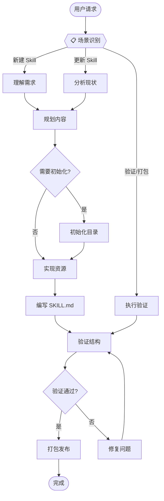

# Skill Creator

将专家知识系统化封装为可复用的能力包。

## Application Layer



**MANDATORY**: 每次任务必须先执行场景识别，明确告知用户当前模式。

---

## Domain Layer

### S1[理解需求]

**场景说明**: 通过对话收集 Skill 的核心功能和使用场景。

#### 1. 需求收集 (Workflow)

1. **Step 1**: 询问核心功能
   - "这个 Skill 应支持什么功能？"
   - "用户会说什么来触发这个 Skill？"

2. **Step 2**: 收集使用示例
   - "能给我一些使用示例吗？"
   - 避免一次问太多问题

3. **CRITICAL**: 必须获得清晰的功能理解后才能进入下一步

#### 2. 输出确认

- 输出格式参考：`references/output-confirmation-template.md`

```
🔍 **需求理解完成**
- 核心功能：{功能列表}
- 触发场景：{场景描述}
✅ 可以开始规划内容
```

---

### Plan[规划内容]

**场景说明**: 基于需求理解，生成 Skill 架构规划配置，包括细粒度参考文件规划。

#### 1. 执行规划 (Workflow)

**Step 1: Agent 解析需求为结构化 JSON**（需要 Agent 理解用户意图）
- 从 S1[理解需求] 收集的信息中提取：
  - `description`: 功能描述（做什么 + 何时使用）
  - `examples`: 用户提供的使用示例列表
  - `name`: skill 名称（小写字母、数字、连字符）
- 基础字段规范参考：`references/skill-config-schema-basic.md`
- 构建 JSON 输入：
  ```json
  {
    "description": "<从需求中提取的功能描述>",
    "examples": ["<示例1>", "<示例2>"],
    "name": "<skill-name>"
  }
  ```

**Step 2: 脚本执行规划分析**（确定性逻辑，无需 Agent 介入）
```bash
echo '<Step1构建的JSON>' | python scripts/analyze_requirements.py
```

脚本自动完成：
- 场景识别与分类（基于关键词模式匹配）
- **细粒度参考文件规划**（按优先级分类）：
  - `required`: 必需创建的参考文件
  - `recommended`: 推荐创建的参考文件
  - `optional`: 可选的参考文件
- 脚本需求识别（含功能描述）
- 生成 `generate_skill.py` 所需的配置 JSON

**Step 3: Agent 审核参考文件规划**（需要 Agent 判断）
- 审核脚本输出的 `infrastructure_plan.references`
- 确认 `required` 文件是否都必要
- 评估 `recommended` 文件是否需要提升为 `required`
- 根据业务复杂度决定是否需要 `optional` 文件
- **CRITICAL**: 每个参考文件应聚焦单一职责
  - ✅ 正确：`calculation-formulas.md`（仅包含公式定义）
  - ❌ 错误：`all-rules.md`（混合多种规则）

**Step 4: Agent 审核场景与脚本规划**（需要 Agent 判断）
- 确认场景划分是否合理
- 场景配置格式参考：`references/skill-config-schema-scenarios.md`
- 评估确定性逻辑与 Agent 思考的边界
- 确定性逻辑识别规则参考：`references/deterministic-logic-rules.md`
- 补充脚本遗漏的业务细节
- **CRITICAL**: 应用确定性逻辑识别原则
  - 三个问题都答"否" → 封装为脚本
    - 需要理解上下文？
    - 需要做判断？
    - 需要生成内容？

#### 2. 输出确认

```
📋 **规划完成**

**场景规划**:
- 场景数量：{count}
- 场景列表：{scenarios}

**参考文件规划**:
- 必需 (required): {required_refs}
- 推荐 (recommended): {recommended_refs}
- 可选 (optional): {optional_refs}

**脚本规划**:
- 脚本列表：{scripts_with_desc}

✅ 可以开始实现
```

---

### InitSkill[初始化目录]

**场景说明**: 使用脚本创建标准目录结构。

#### 1. 执行初始化 (Workflow)

1. **Step 1**: 运行初始化脚本
   ```bash
   python scripts/init_skill.py <skill-name> --path <output-directory>
   ```

2. **Step 2**: 确认生成结构
   - 架构概览参考：`references/architecture-overview.md`
   ```
   skill-name/
   ├── SKILL.md
   ├── scripts/
   ├── references/
   └── assets/
   ```

#### 2. 输出确认

```
✅ **目录初始化完成**
- 位置：{skill_path}
- 结构：标准 DDD 四层
```

---

### Impl[实现资源]

**场景说明**: 实现 Infrastructure 层资源，优先实现确定性脚本。

#### 1. 确定性逻辑识别（Agent 分析）

**Step 1: 识别确定性逻辑**（需要 Agent 判断）
- 判断规则参考：`references/deterministic-logic-rules.md`
- 对每个步骤问三个问题：
  1. 需要 Agent 理解上下文吗？
  2. 需要 Agent 做判断吗？
  3. 需要 Agent 生成内容吗？
- **三个问题都答"否" → 封装为脚本**

#### 2. 脚本开发（确定性实现）

**Step 2: 编写脚本**
- 标准模板参考：`references/script-standard-template.md`
- 命名规范参考：`references/script-naming-rules.md`
- **CRITICAL**: 输入输出必须使用 stdin/stdout JSON 格式
  - I/O 标准参考：`references/script-io-standard.md`
  ```python
  # 输入：从 stdin 读取 JSON
  input_data = json.loads(sys.stdin.read())
  
  # 输出：JSON 到 stdout
  print(json.dumps(result, ensure_ascii=False))
  ```

**Step 3: 测试脚本**
- 测试清单参考：`references/script-testing-checklist.md`
- **CRITICAL**: 脚本必须实际运行测试，确保无错误
- 验证 JSON 输入输出格式正确

#### 3. 参考资料组织

**Step 4: 按优先级创建参考文件**（需要 Agent 判断内容）
- 基于 Plan[规划内容] 输出的 `infrastructure_plan.references`
- **创建顺序**：required → recommended → optional
- 不缺省原则参考：`references/anti-simplification-rules.md`

**必需文件 (required)** - 必须创建：
- 核心业务规则定义
- 关键数据格式规范
- 主要计算公式

**推荐文件 (recommended)** - 建议创建：
- 输出示例集合
- 通用步骤说明
- 错误处理指南

**可选文件 (optional)** - 按需创建：
- 扩展功能说明
- 高级配置选项
- 边界情况处理

**Step 5: 创建参考文件**
- 命名规范：kebab-case（如 `api-reference.md`）
- **CRITICAL**: 每个文件聚焦单一职责
- 超过 100 行应包含目录
- 文件内容应可被具体步骤引用

#### 4. 输出确认

```
🔧 **资源实现完成**
- 脚本数量：{count}
- 参考文件：{files}
- 测试状态：{passed/failed}
✅ 可以开始编写 SKILL.md
```

---

### Write[编写 SKILL.md]

**场景说明**: 按 DDD 架构编写核心指令文件。

#### 1. 快速生成框架（脚本执行，确定性逻辑）

**Step 1: Agent 准备配置 JSON**（需要 Agent 整合信息）
- 从 Plan[规划内容] 的输出中获取配置
- 根据需求补充 tasks 详细定义
- Tasks 配置格式参考：`references/skill-config-schema-tasks.md`
- 构建完整的配置 JSON

**Step 2: 脚本生成 SKILL.md 框架**（确定性逻辑，无需 Agent 介入）
```bash
echo '<配置JSON>' | python scripts/generate_skill.py > SKILL.md
```

脚本自动完成：
- YAML frontmatter 生成
- Mermaid 工作流图生成
- Domain 层 Task 框架生成
- 标准化格式和结构

#### 2. Agent 补充细节（需要 Agent 理解和创作）

**Step 3: 完善 Interface 层**
- Interface 层规范参考：`references/interface-layer-spec.md`
```yaml
---
name: skill-name
description: 做什么 + 何时使用的完整描述
---
```
- **CRITICAL**: description 必须包含所有触发场景，最大 1024 字符

**Step 4: 完善 Application 层**
- Application 层规范参考：`references/application-layer-spec.md`
- 审核 Mermaid 工作流图是否准确反映业务流程
- 调整节点命名和分支逻辑
- **MANDATORY**: 确保场景识别强制声明存在

**Step 5: 完善 Domain 层**
- Domain 层规范参考：`references/domain-layer-spec.md`
- 为每个 Task 补充详细的执行步骤
- 明确哪些步骤调用脚本（确定性）vs 需要 Agent 思考
- **CRITICAL**: 确定性步骤必须调用脚本
  - ✅ 正确：`执行脚本：python scripts/calc.py`
  - ❌ 错误：在指令中描述计算逻辑
- **CRITICAL**: Infrastructure 资源引用必须内嵌在步骤中
  - 反模式警告参考：`references/anti-patterns.md`
  - ✅ 正确：`调用脚本：python scripts/calc.py`
  - ❌ 错误：独立 `## Scripts` 章节列出

#### 3. 统一强调标记

- 标记规范参考：`references/emphasis-markers.md`

| 标记 | 用途 |
|------|------|
| **CRITICAL** | 必须严格遵守的红线规则 |
| **MANDATORY** | 必需执行的操作步骤 |
| **IMPORTANT** | 关键的质量建议 |
| **WARNING** | 潜在的错误或风险 |

---

### Validate[验证结构]

**场景说明**: 验证 Skill 结构和质量。

#### 1. 自动验证 (Workflow)

1. **Step 1**: 运行验证脚本
   ```bash
   python scripts/quick_validate.py <skill-path>
   ```

2. **Step 2**: 检查验证结果
   - YAML frontmatter 格式
   - name/description 规范
   - 目录结构完整性

#### 2. 手动检查清单 (Dimensions)

1. **Dimension 1: 架构完整性**
   - 架构概览参考：`references/architecture-overview.md`
   - [ ] Application 层节点与 Domain 层 Task 对应
   - [ ] 资源引用内嵌在步骤中

2. **Dimension 2: 确定性逻辑分离**
   - 确定性逻辑规则参考：`references/deterministic-logic-rules.md`
   - [ ] 计算逻辑已抽取为脚本
   - [ ] 脚本已测试通过
   - [ ] 指令仅包含需要 Agent 思考的内容

3. **Dimension 3: 内容质量**
   - 不缺省原则参考：`references/anti-simplification-rules.md`
   - 反模式警告参考：`references/anti-patterns.md`
   - [ ] 无辅助文档（README.md 等）
   - [ ] 无信息重复
   - [ ] 路径使用正斜杠 `/`

4. **Dimension 4: 性能优化**
   - [ ] Body 控制在 500 行以内
   - [ ] 详细文档移到 references/

---

### Package[打包发布]

**场景说明**: 打包 Skill 为可分发文件。

#### 1. 执行打包 (Workflow)

1. **Step 1**: 运行打包脚本
   ```bash
   python scripts/package_skill.py <skill-path> [output-dir]
   ```

2. **Step 2**: 确认输出
   - 生成 `skill-name.skill` 文件
   - 实际为 zip 格式

#### 2. 输出确认

```
📦 **打包完成**
- 文件：{skill-name}.skill
- 位置：{output-path}
✅ 可以分发给用户
```

---

## 反模式警告

**CRITICAL**: 避免以下错误做法。详细说明参考：`references/anti-patterns.md`

### 1. 确定性逻辑写在指令中

```markdown
# ❌ 错误：在指令中描述计算步骤
Step 1: 计算 ROE = 净利润 / 股东权益

# ✅ 正确：调用脚本执行计算
Step 1: 执行财务比率计算
- 调用脚本：`echo '{"net_income": 1000, "equity": 5000}' | python scripts/calculate_ratios.py`
```

### 2. Agent 执行批量操作

```markdown
# ❌ 错误：Agent 逐个处理
Step 1: 循环处理每个视频

# ✅ 正确：Agent 解析，脚本执行
Step 1: Agent 解析录制列表为 JSON（需要理解用户输入）
Step 2: 脚本执行批量下载（确定性逻辑）
```

**关键原则**：Agent 负责理解和解析，脚本负责执行和处理

### 3. 独立章节列出资源

```markdown
# ❌ 错误
## References
- references/api.md

# ✅ 正确：内嵌在步骤中
2. **执行计算**: 调用 `python scripts/calc.py`
```

### 4. 其他反模式

- ❌ 创建辅助文档（README.md, CHANGELOG.md）
- ❌ Windows 路径格式（`references\api.md`）
- ✅ 使用正斜杠（`references/api-reference.md`）
