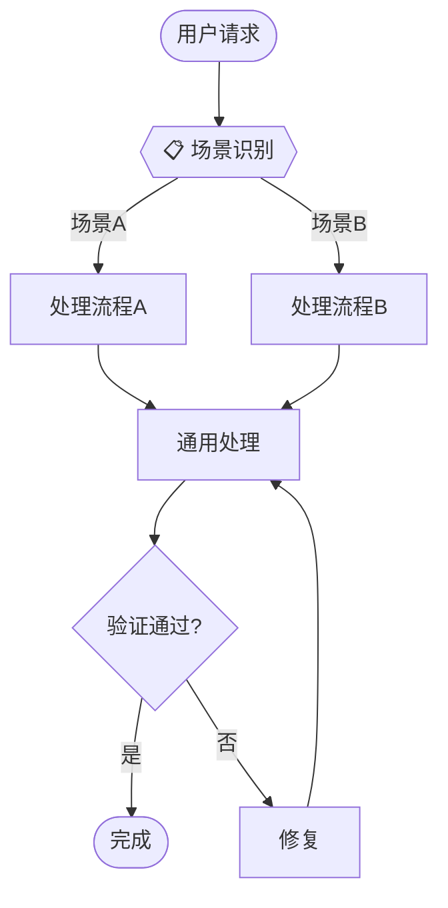

# Application 层规范

Mermaid 工作流图的编写规范。

## Mermaid 节点类型

| 类型 | 语法 | 用途 | 示例 |
|------|------|------|------|
| 开始/结束 | `([State])` | 流程起止点 | `START([用户请求])` |
| 场景识别 | `{{Decision}}` | 多场景分支入口 | `SR{{📋 场景识别}}` |
| 逻辑判断 | `{Condition}` | 条件分支 | `Check{验证通过?}` |
| 任务步骤 | `[Task]` | 具体任务节点 | `Gen[生成代码]` |

## 标准模板



## 节点命名规范

- 场景识别节点：`SR{{📋 场景识别}}`
- 场景节点：`S1[场景名称]`, `S2[场景名称]`
- 通用处理：`Common[处理名称]`
- 验证节点：`Check{条件?}`
- 修复节点：`Fix[修复问题]`

## 强制声明

**MANDATORY**: 每个 Application 层必须包含场景识别节点，并在执行时明确告知用户当前模式。

```markdown
**MANDATORY**: 每次任务必须先执行场景识别，明确告知用户当前模式。
```
