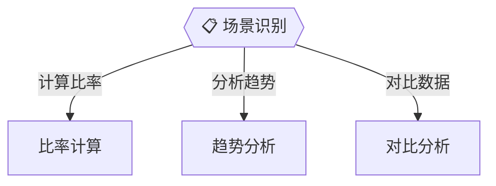

# Skill 配置 Schema - Scenarios 定义

场景列表配置，定义 Application 层的分支。

## 字段说明

| 字段 | 类型 | 必需 | 说明 |
|------|------|------|------|
| id | string | 是 | 节点 ID，如 S1, S2 |
| name | string | 是 | 场景名称，显示在节点中 |
| trigger | string | 是 | 触发条件，显示在连线上 |

## 格式

```json
{
    "scenarios": [
        {
            "id": "S1",
            "name": "场景名称",
            "trigger": "触发条件描述"
        }
    ]
}
```

## 示例

### 财务分析场景

```json
{
    "scenarios": [
        {"id": "S1", "name": "比率计算", "trigger": "计算比率"},
        {"id": "S2", "name": "趋势分析", "trigger": "分析趋势"},
        {"id": "S3", "name": "对比分析", "trigger": "对比数据"}
    ]
}
```

### PDF 编辑场景

```json
{
    "scenarios": [
        {"id": "S1", "name": "旋转页面", "trigger": "旋转"},
        {"id": "S2", "name": "合并文件", "trigger": "合并"},
        {"id": "S3", "name": "拆分文件", "trigger": "拆分"}
    ]
}
```

## 生成效果

配置会生成 Mermaid 图中的分支：


