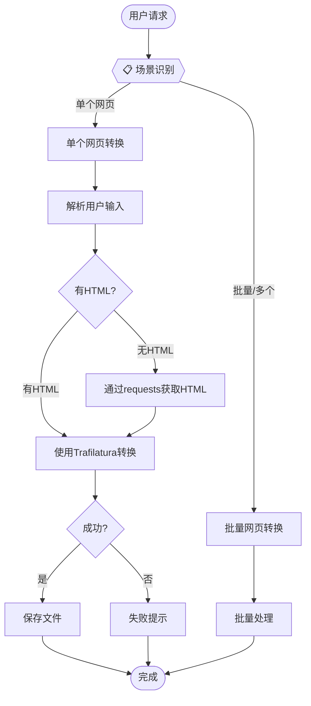

# Web To Markdown

将网页内容智能转换为 Markdown 格式，基于 Trafilatura 实现高效的正文提取和元数据获取。

## Application Layer



**MANDATORY**: 每次任务必须先执行场景识别，明确告知用户当前模式。

---

## Domain Layer

### S1[单个网页转换]

**场景说明**: 将单个网页转换为 Markdown 格式并保存到文件。

#### 1. 执行工作流

1. **Step 1: 解析用户输入**（Agent 负责理解）
   - 从用户消息中提取 URL 或 HTML 内容
   - 提取可选的保存路径（如"保存到 /path/to/"）
   - 提取可选的文件名（如有指定）
   - **CRITICAL**: 必须确保 URL 或 HTML 至少有一个

2. **Step 2: 获取 HTML 内容**（如需要）
   - 如果用户提供 URL 且无 HTML：
     - 使用 Python requests 库获取页面内容
     - 设置合理的超时时间（默认 30 秒）
     - 处理常见的 HTTP 错误（404、500 等）

3. **Step 3: 使用 Trafilatura 转换为 Markdown**
   - 调用脚本：`echo '{"html": "HTML内容", "url": "原始URL"}' | python scripts/convert_with_trafilatura.py`
   - 参考资料：`references/trafilatura-examples.md`

4. **Step 4: 保存到文件**
   - 调用脚本：`echo '{"markdown": "Markdown内容", "title": "标题", "url": "原URL", "output_path": "保存路径(可选)", "filename": "文件名(可选)"}' | python scripts/save_to_file.py`

#### 2. 输出确认

```
🔍 **网页转换完成**
- 网址: {原始URL}
- 标题: {页面标题}
- 文件: {保存路径}
- 长度: {字符数}
✅ 已保存到文件
```

---

### S2[批量网页转换]

**场景说明**: 批量转换多个网页为 Markdown 格式（预留功能，非重点）。

#### 1. 执行工作流

1. **Step 1: 解析用户输入**
   - 从用户消息中提取多个 URL
   - 提取可选的保存目录

2. **Step 2: 循环处理每个 URL**
   - 对每个 URL 执行 S1[单个网页转换] 的流程
   - 记录每个 URL 的处理结果

3. **Step 3: 汇总结果**

#### 2. 输出确认

```
🔍 **批量转换完成**
- 总数: {总数}
- 成功: {成功数}
- 失败: {失败数}
✅ 结果已汇总
```

---

## Infrastructure Layer

### scripts/convert_with_trafilatura.py

使用 Trafilatura 进行 HTML 内容提取和 Markdown 转换。

**功能**:
- 自动提取网页正文（智能过滤广告、导航等无关内容）
- 提取元数据（标题、作者、日期、描述等）
- 支持多种输出格式（Markdown、JSON、XML、纯文本）

**输入格式**:
```json
{
  "html": "<html>...</html>",
  "url": "https://example.com",
  "output_format": "markdown/json/xml/txt (可选，默认 markdown)",
  "include_metadata": true/false (可选，默认 true)
}
```

**输出格式**:
```json
{
  "status": "success",
  "content": "# 标题\n\n正文内容...",
  "metadata": {
    "title": "标题",
    "author": "作者",
    "date": "日期",
    "description": "描述",
    "url": "https://example.com"
  }
}
```

### scripts/save_to_file.py

将 Markdown 内容保存到文件。

**输入格式**:
```json
{
  "markdown": "Markdown 内容",
  "title": "标题（用于生成文件名）",
  "url": "原始URL（用于生成文件名）",
  "output_path": "输出路径（可选，默认当前目录）",
  "filename": "自定义文件名（可选）"
}
```

**输出格式**:
```json
{
  "status": "success",
  "file_path": "保存的文件完整路径",
  "content_length": "内容长度"
}
```

### references/trafilatura-examples.md

Trafilatura 使用示例和最佳实践。

### references/installation-guide.md

依赖安装指南。

---

## 反模式警告

**CRITICAL**: 避免以下错误做法。

### 1. 确定性逻辑写在指令中

```markdown
# ❌ 错误：在指令中描述 HTML 获取逻辑
Step 2: 使用 requests.get(url) 获取 HTML

# ✅ 正确：直接使用 requests 库获取
Step 2: 使用 Python requests 库获取页面内容
```

### 2. 使用多个提取策略

```markdown
# ❌ 错误：使用多个工具转换 HTML
if trafilatura 失败:
    尝试 markdownify
    尝试其他方法

# ✅ 正确：只使用 trafilatura
Step 3: 使用 Trafilatura 转换为 Markdown
```

### 3. 策略选择逻辑写在指令中

```markdown
# ❌ 错误：在指令中描述策略选择
if 网站类型 == wechat:
    使用 Playwright
elif 网站类型 == normal:
    使用 requests

# ✅ 正确：统一使用 trafilatura
Step 3: 使用 Trafilatura 转换为 Markdown
Trafilatura 会自动处理不同类型网站
```
