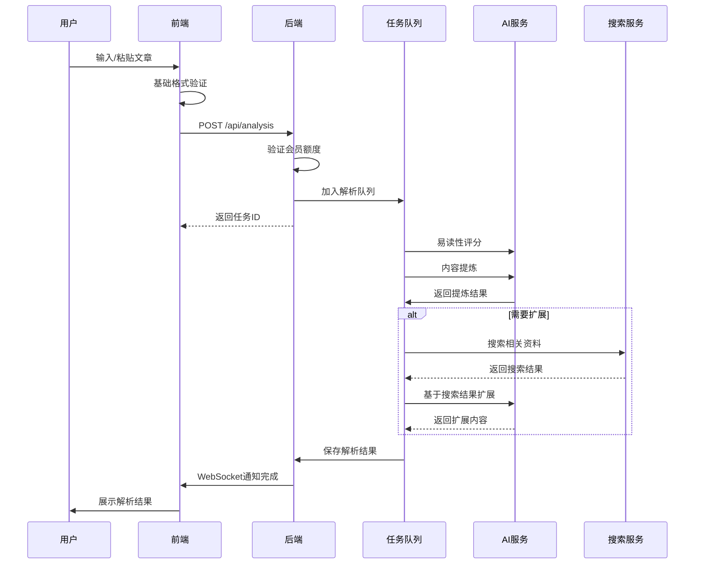
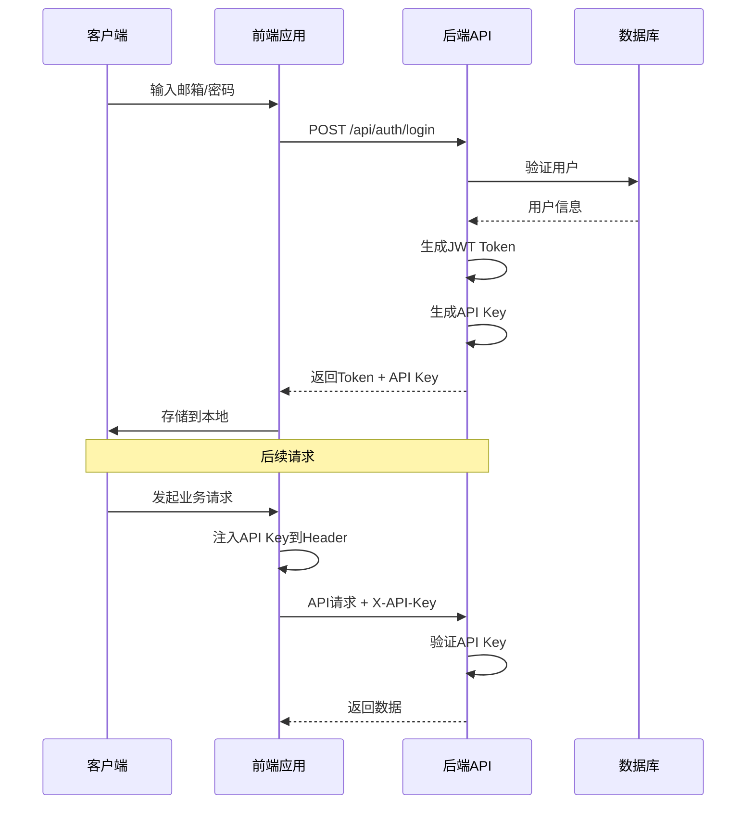
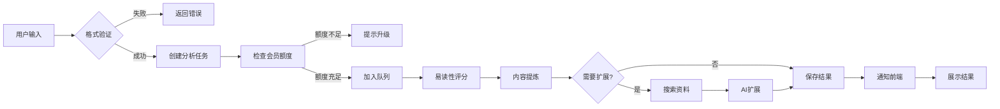
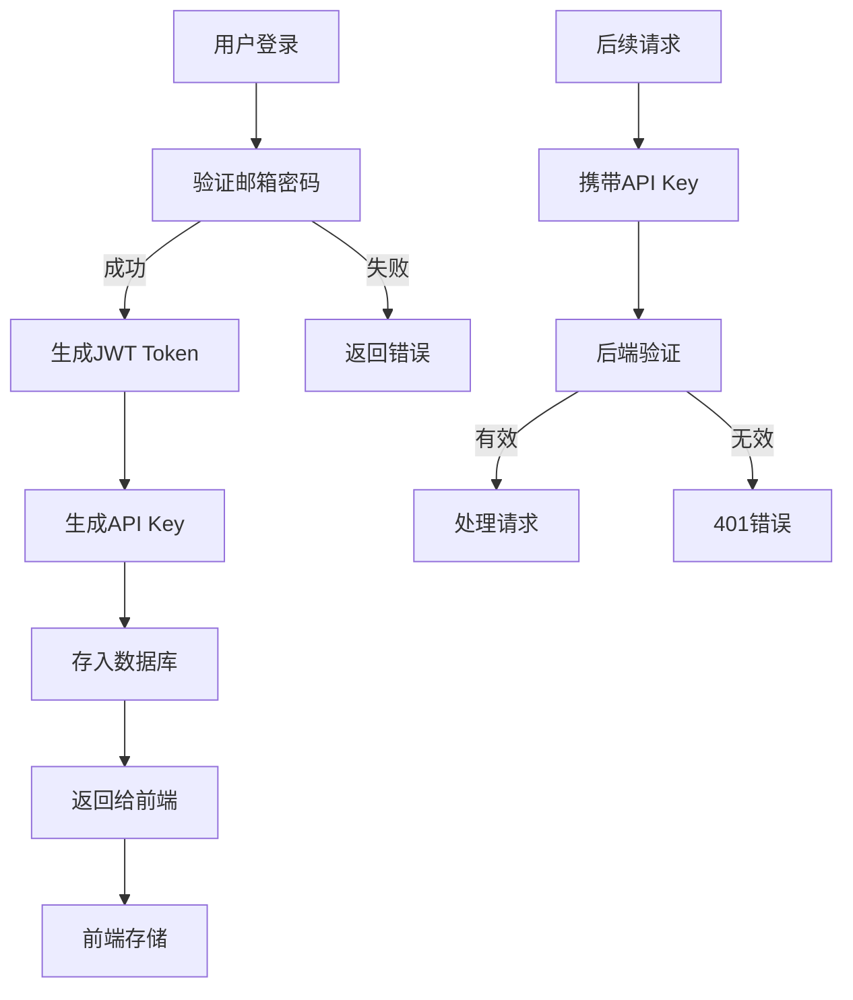

# 系统架构设计

## 整体架构

AI-NoteBook 采用前后端分离的微服务架构，确保系统的高性能、可扩展性和可维护性。

```
┌─────────────────────────────────────────────────────────┐
│                     Frontend (Vue 3)                     │
│  ┌──────────┐  ┌──────────┐  ┌──────────┐  ┌────────┐  │
│  │  文本粘贴 │  │ 文件上传 │  │ 历史记录 │  │ 充值 │  │
│  └──────────┘  └──────────┘  └──────────┘  └────────┘  │
└────────────────────┬────────────────────────────────────┘
                     │ HTTP + API Key
┌────────────────────▼────────────────────────────────────┐
│              Backend (NestJS)                            │
│  ┌──────────────┐  ┌──────────────┐  ┌──────────────┐  │
│  │  Auth模块    │  │  AI模块      │  │  支付模块    │  │
│  │  - JWT       │  │  - 单篇解析  │  │  - 充值      │  │
│  │  - API Key   │  │  - 批量解析  │  │  - 订单      │  │
│  └──────────────┘  └──────────────┘  └──────────────┘  │
│  ┌──────────────┐  ┌──────────────┐  ┌──────────────┐  │
│  │  任务队列    │  │  搜索模块    │  │  用户模块    │  │
│  │  - BullMQ    │  │  - Web Search│  │  - CRUD      │  │
│  │  - Redis     │  │  - 数据校验  │  │  - 权限      │  │
│  └──────────────┘  └──────────────┘  └──────────────┘  │
└────────────────────┬────────────────────────────────────┘
                     │
         ┌───────────┼───────────┐
         │           │           │
┌────────▼──┐  ┌────▼────┐  ┌───▼────┐
│PostgreSQL │  │ Redis   │  │ AI API │
│           │  │         │  │        │
└───────────┘  └─────────┘  └────────┘
```

## 前端架构

### 技术栈

```typescript
Vue 3 Ecosystem
├── 核心框架: Vue 3.4+ (Composition API)
├── 开发语言: TypeScript 5.0+
├── 构建工具: Vite 5.0+
├── UI组件库: Naive UI
├── 状态管理: Pinia
├── 路由管理: Vue Router 4.x
├── HTTP客户端: Axios
├── Markdown处理:
│   ├── 编辑器: Vditor
│   ├── 渲染器: markdown-it
│   └── 代码高亮: highlight.js
└── 文档导出:
    ├── PDF: html2pdf.js
    ├── Word: docx + file-saver
    └── Markdown: file-saver
```

### 目录结构

```
frontend/
├── src/
│   ├── assets/          # 静态资源
│   ├── components/      # 通用组件
│   │   ├── common/      # 通用基础组件
│   │   │   ├── MarkdownEditor.vue
│   │   │   ├── MarkdownViewer.vue
│   │   │   ├── ExportButton.vue
│   │   │   └── LoadingSpinner.vue
│   │   └── analysis/    # 分析相关组件
│   │       ├── ReadabilityCard.vue
│   │       ├── RefinedContent.vue
│   │       ├── ExpansionPanel.vue
│   │       └── SourceList.vue
│   ├── views/           # 页面视图
│   │   ├── Home.vue
│   │   ├── Analyze.vue
│   │   ├── History.vue
│   │   ├── Pricing.vue
│   │   ├── Settings.vue
│   │   └── Login.vue
│   ├── api/             # API接口封装
│   │   ├── analysis.ts
│   │   ├── auth.ts
│   │   ├── payment.ts
│   │   └── request.ts   # axios实例配置
│   ├── stores/          # Pinia状态管理
│   │   ├── user.ts
│   │   ├── analysis.ts
│   │   └── app.ts
│   ├── router/          # 路由配置
│   │   └── index.ts
│   ├── utils/           # 工具函数
│   │   ├── export.ts    # 导出功能
│   │   ├── format.ts    # 格式化工具
│   │   └── validate.ts  # 验证工具
│   ├── types/           # TypeScript类型定义
│   │   └── index.ts
│   ├── App.vue
│   └── main.ts
├── public/
├── index.html
├── vite.config.ts
├── tsconfig.json
└── package.json
```

### 核心流程

#### 1. 文章解析流程



#### 2. API Key认证流程



## 后端架构

### 技术栈

```typescript
NestJS + TypeScript
├── 核心框架: NestJS 10.x
├── 运行时: Node.js 20.x
├── ORM: Prisma 5.x
├── 数据库: PostgreSQL 15+
├── 缓存: Redis 7.x
├── 任务队列: BullMQ
├── 认证鉴权:
│   ├── JWT: @nestjs/jwt
│   ├── Passport: @nestjs/passport
│   └── API Key: 自定义Guard
├── 数据验证: class-validator + class-transformer
├── API文档: Swagger (@nestjs/swagger)
├── 日志: Winston
├── 文件处理: Multer
└── 支付集成:
    ├── 支付宝: alipay-sdk
    └── 微信支付: wechatpay-node-v3
```

### 目录结构

```
backend/
├── src/
│   ├── modules/           # 业务模块
│   │   ├── auth/          # 认证模块
│   │   │   ├── auth.controller.ts
│   │   │   ├── auth.service.ts
│   │   │   ├── auth.module.ts
│   │   │   ├── guards/
│   │   │   │   ├── jwt-auth.guard.ts
│   │   │   │   ├── api-key.guard.ts
│   │   │   │   └── membership.guard.ts
│   │   │   ├── strategies/
│   │   │   │   └── jwt.strategy.ts
│   │   │   └── dto/
│   │   │       ├── login.dto.ts
│   │   │       └── register.dto.ts
│   │   ├── analysis/      # 文章解析模块
│   │   │   ├── analysis.controller.ts
│   │   │   ├── analysis.service.ts
│   │   │   ├── analysis.module.ts
│   │   │   ├── processors/
│   │   │   │   └── analyze.processor.ts
│   │   │   ├── dto/
│   │   │   │   ├── analyze.dto.ts
│   │   │   │   └── batch-analyze.dto.ts
│   │   │   └── queues/
│   │   │       └── analysis.queue.ts
│   │   ├── ai/            # AI集成模块
│   │   │   ├── ai.service.ts
│   │   │   ├── ai.module.ts
│   │   │   ├── providers/
│   │   │   │   ├── volcengine.provider.ts
│   │   │   │   ├── openai.provider.ts
│   │   │   │   └── qianwen.provider.ts
│   │   │   └── dto/
│   │   │       └── ai-request.dto.ts
│   │   ├── search/        # 搜索服务模块
│   │   │   ├── search.service.ts
│   │   │   ├── search.module.ts
│   │   │   └── providers/
│   │   │       └── quark.provider.ts
│   │   ├── payment/       # 支付模块
│   │   │   ├── payment.controller.ts
│   │   │   ├── payment.service.ts
│   │   │   ├── payment.module.ts
│   │   │   ├── providers/
│   │   │   │   ├── alipay.provider.ts
│   │   │   │   └── wechat.provider.ts
│   │   │   └── dto/
│   │   │       └── payment.dto.ts
│   │   └── user/          # 用户模块
│   │       ├── user.controller.ts
│   │       ├── user.service.ts
│   │       ├── user.module.ts
│   │       └── dto/
│   │           └── update-user.dto.ts
│   ├── common/            # 通用模块
│   │   ├── decorators/    # 装饰器
│   │   │   ├── user.decorator.ts
│   │   │   └── membership.decorator.ts
│   │   ├── filters/       # 异常过滤器
│   │   │   └── http-exception.filter.ts
│   │   ├── interceptors/  # 拦截器
│   │   │   ├── logging.interceptor.ts
│   │   │   └── transform.interceptor.ts
│   │   ├── pipes/         # 管道
│   │   │   └── validation.pipe.ts
│   │   └── guards/        # 守卫
│   │       └── throttle.guard.ts
│   ├── database/          # 数据库相关
│   │   ├── prisma.service.ts
│   │   └── migrations/
│   ├── config/            # 配置文件
│   │   ├── app.config.ts
│   │   ├── database.config.ts
│   │   └── ai.config.ts
│   ├── app.module.ts
│   └── main.ts
├── prisma/
│   ├── schema.prisma
│   └── migrations/
├── test/
├── .env.example
├── nest-cli.json
├── tsconfig.json
└── package.json
```

## 数据流设计

### 1. 文章处理流水线



### 2. 用户认证流程



## 部署架构

### 开发环境

```yaml
services:
  frontend:
    image: node:20-alpine
    ports: ["5173:5173"]
    volumes: ["./frontend:/app"]

  backend:
    image: node:20-alpine
    ports: ["3000:3000"]
    environment:
      - DATABASE_URL=postgresql://db:5432/ainotebook
      - REDIS_URL=redis://redis:6379
    depends_on: [db, redis]

  db:
    image: postgres:15-alpine
    ports: ["5432:5432"]
    environment:
      - POSTGRES_DB=ainotebook
      - POSTGRES_USER=postgres
      - POSTGRES_PASSWORD=postgres
    volumes: ["postgres_data:/var/lib/postgresql/data"]

  redis:
    image: redis:7-alpine
    ports: ["6379:6379"]

volumes:
  postgres_data:
```

### 生产环境

- **前端**: Nginx + 静态资源CDN
- **后端**: PM2集群模式 + Docker容器
- **数据库**: PostgreSQL主从复制
- **缓存**: Redis哨兵模式
- **队列**: Redis + BullMQ
- **监控**: Prometheus + Grafana
- **日志**: ELK Stack (Elasticsearch + Logstash + Kibana)

## 安全设计

### 认证机制

1. **JWT Token**
   - Access Token: 15分钟有效期
   - Refresh Token: 7天有效期
   - 存储在HttpOnly Cookie

2. **API Key**
   - 随机生成的UUID
   - 可手动刷新
   - 支持权限范围限制

### 数据安全

- 密码使用bcrypt加密 (cost=10)
- 敏感数据使用AES-256加密
- API Key使用SHA-256哈希存储
- HTTPS强制加密传输

### 限流保护

- IP级别限流: 100请求/分钟
- 用户级别限流: 根据会员等级不同
- API Key级别限流: 防止滥用

## 性能优化

### 前端优化

- 路由懒加载
- 组件按需引入
- 图片懒加载和WebP格式
- Gzip压缩
- CDN静态资源

### 后端优化

- Redis缓存热点数据
- 数据库查询优化和索引
- 异步任务处理
- 连接池管理
- 响应数据分页

### 数据库优化

- 合理的索引设计
- 查询优化和N+1问题避免
- 读写分离
- 定期VACUUM清理

## 扩展性设计

### 水平扩展

- 无状态服务设计
- Redis共享Session
- 数据库主从复制
- 负载均衡 (Nginx/HAProxy)

### 垂直扩展

- 微服务架构
- 模块化设计
- 插件系统
- 中间件机制

## 监控与日志

### 应用监控

- 性能指标 (响应时间、吞吐量)
- 错误率监控
- 资源使用率 (CPU、内存)

### 日志系统

- 结构化日志 (JSON格式)
- 日志级别管理
- 日志轮转和归档
- 集中式日志管理

详细技术栈选择请查看 [技术栈文档](/guide/tech-stack)
