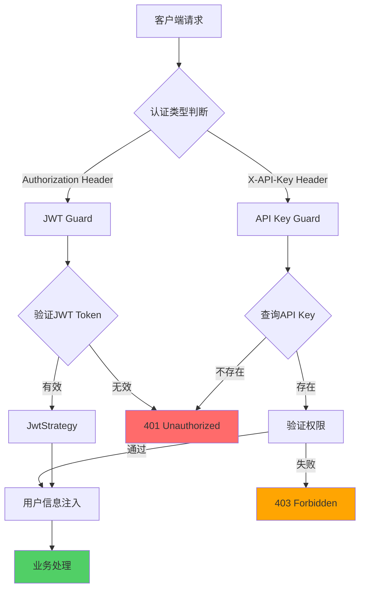
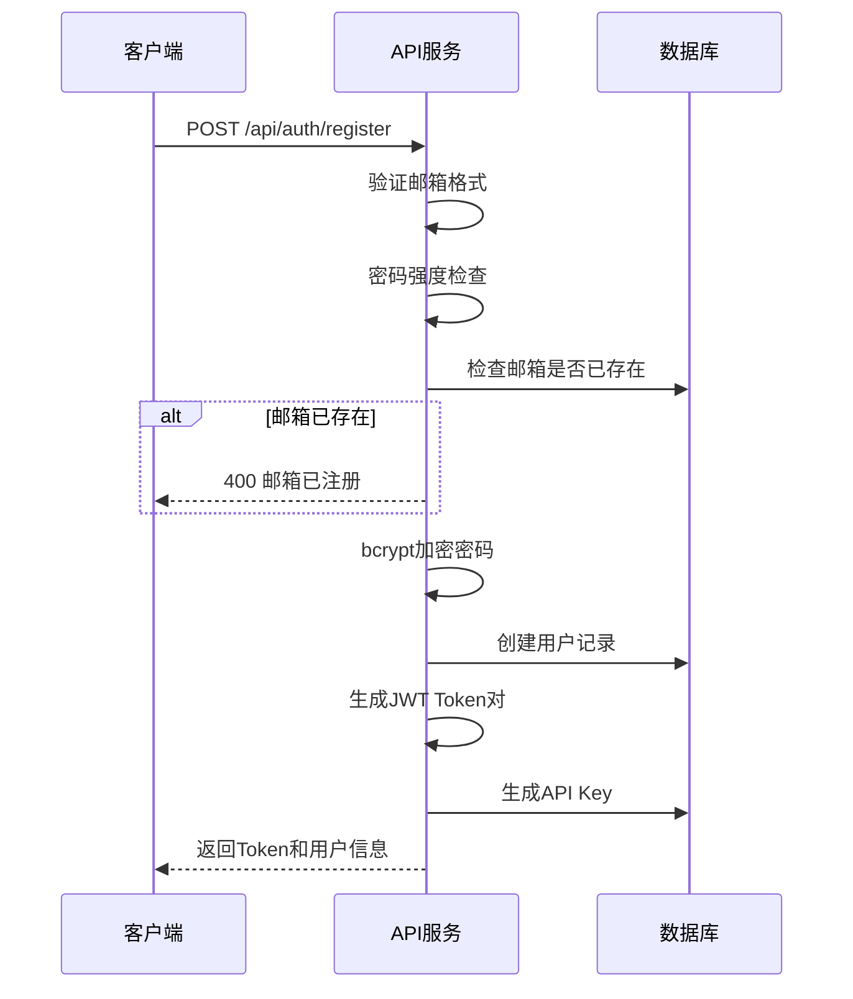

# 认证鉴权设计

本文档详细说明 AI-NoteBook 系统的认证鉴权机制设计。

## 概述

AI-NoteBook 采用**双重认证机制**，支持不同场景的使用需求：

1. **JWT Token 认证**：用于前端 Web 应用，提供无状态的会话管理
2. **API Key 认证**：用于浏览器扩展和第三方应用，提供持久的访问凭证

## 认证架构



## 一、JWT Token 认证

### 1.1 Token 设计

#### Access Token

用于短期访问，包含必要的用户信息：

```typescript
interface JwtPayload {
  sub: string          // 用户ID (UUID)
  email: string        // 用户邮箱
  membership: string   // 会员等级
  iat: number          // 签发时间
  exp: number          // 过期时间
}
```

**配置参数**：
- 有效期：15分钟
- 算法：HS256
- 密钥来源：`process.env.JWT_SECRET`

#### Refresh Token

用于刷新 Access Token，避免频繁登录：

```typescript
interface RefreshTokenPayload {
  sub: string          // 用户ID
  tokenVersion: number // Token版本（用于失效旧Token）
  iat: number
  exp: number
}
```

**配置参数**：
- 有效期：7天
- 算法：HS256
- 密钥来源：`process.env.JWT_REFRESH_SECRET`
- 存储位置：HttpOnly Cookie

### 1.2 JWT 策略实现

#### JwtStrategy (src/modules/auth/strategies/jwt.strategy.ts)

```typescript
import { Injectable, UnauthorizedException } from '@nestjs/common'
import { PassportStrategy } from '@nestjs/passport'
import { ExtractJwt, Strategy } from 'passport-jwt'
import { ConfigService } from '@nestjs/config'
import { PrismaService } from '@/database/prisma.service'

@Injectable()
export class JwtStrategy extends PassportStrategy(Strategy) {
  constructor(
    private configService: ConfigService,
    private prisma: PrismaService
  ) {
    super({
      jwtFromRequest: ExtractJwt.fromAuthHeaderAsBearerToken(),
      ignoreExpiration: false,
      secretOrKey: configService.get<string>('JWT_SECRET'),
    })
  }

  async validate(payload: JwtPayload) {
    // 查询用户完整信息
    const user = await this.prisma.user.findUnique({
      where: { id: payload.sub },
      select: {
        id: true,
        email: true,
        username: true,
        membership: true,
        balance: true,
        apiKey: true,
      }
    })

    if (!user) {
      throw new UnauthorizedException('用户不存在')
    }

    // 检查会员是否过期
    if (user.membership !== Membership.FREE) {
      // TODO: 添加会员过期检查逻辑
    }

    return user
  }
}
```

### 1.3 认证流程

#### 用户注册



**代码实现**：

```typescript
// src/modules/auth/auth.service.ts
async register(dto: RegisterDto) {
  // 1. 验证邮箱格式
  if (!this.isValidEmail(dto.email)) {
    throw new BadRequestException('邮箱格式不正确')
  }

  // 2. 检查邮箱是否已存在
  const existingUser = await this.prisma.user.findUnique({
    where: { email: dto.email }
  })

  if (existingUser) {
    throw new ConflictException('邮箱已被注册')
  }

  // 3. 加密密码
  const hashedPassword = await bcrypt.hash(dto.password, 10)

  // 4. 创建用户
  const user = await this.prisma.user.create({
    data: {
      email: dto.email,
      password: hashedPassword,
      username: dto.username,
      apiKey: this.generateApiKey(),
      membership: Membership.FREE
    }
  })

  // 5. 生成Token
  const tokens = await this.generateTokens(user)

  // 6. 记录API日志
  await this.logApiCall(user.id, '/api/auth/register', 'POST', 201)

  return {
    user: this.sanitizeUser(user),
    tokens
  }
}
```

#### 用户登录

```typescript
async login(dto: LoginDto) {
  // 1. 查找用户
  const user = await this.prisma.user.findUnique({
    where: { email: dto.email }
  })

  if (!user) {
    throw new UnauthorizedException('邮箱或密码错误')
  }

  // 2. 验证密码
  const isPasswordValid = await bcrypt.compare(
    dto.password,
    user.password
  )

  if (!isPasswordValid) {
    throw new UnauthorizedException('邮箱或密码错误')
  }

  // 3. 生成Token
  const tokens = await this.generateTokens(user)

  // 4. 记录登录日志
  await this.logApiCall(user.id, '/api/auth/login', 'POST', 200)

  return {
    user: this.sanitizeUser(user),
    tokens
  }
}
```

#### Token刷新

```typescript
async refreshToken(refreshToken: string) {
  try {
    // 1. 验证Refresh Token
    const payload = this.jwtService.verify(refreshToken, {
      secret: this.configService.get('JWT_REFRESH_SECRET')
    })

    // 2. 查询用户
    const user = await this.prisma.user.findUnique({
      where: { id: payload.sub }
    })

    if (!user) {
      throw new UnauthorizedException('用户不存在')
    }

    // 3. 生成新的Access Token
    const newAccessToken = this.jwtService.sign({
      sub: user.id,
      email: user.email,
      membership: user.membership
    })

    return {
      accessToken: newAccessToken
    }
  } catch (error) {
    throw new UnauthorizedException('Refresh Token无效或已过期')
  }
}
```

### 1.4 Guard 实现

#### JWT Guard (src/modules/auth/guards/jwt-auth.guard.ts)

```typescript
import { Injectable, ExecutionContext } from '@nestjs/common'
import { AuthGuard } from '@nestjs/passport'
import { Reflector } from '@nestjs/core'

@Injectable()
export class JwtAuthGuard extends AuthGuard('jwt') {
  constructor(private reflector: Reflector) {
    super()
  }

  canActivate(context: ExecutionContext) {
    // 检查是否标记为公开接口
    const isPublic = this.reflector.get<boolean>(
      'isPublic',
      context.getHandler()
    )

    if (isPublic) {
      return true
    }

    return super.canActivate(context)
  }
}
```

**使用示例**：

```typescript
@Controller('analysis')
export class AnalysisController {
  @Get('public')
  @Public() // 自定义装饰器，标记为公开接口
  async publicData() {
    return { message: '无需认证' }
  }

  @Post()
  @UseGuards(JwtAuthGuard)
  async create(@ReqUser() user: User) {
    // user已注入到请求中
    return this.analysisService.create(user.id)
  }
}
```

## 二、API Key 认证

### 2.1 API Key 设计

#### 格式规范

```typescript
// API Key格式：ainb_<UUID>
// 示例：ainb_550e8400-e29b-41d4-a716-446655440000

const API_KEY_PREFIX = 'ainb_'
const API_KEY_REGEX = /^ainb_[0-9a-f]{8}-[0-9a-f]{4}-[0-9a-f]{4}-[0-9a-f]{4}-[0-9a-f]{12}$/i
```

#### 数据库存储

```prisma
model User {
  // ...
  apiKey     String?   @unique  // 存储完整API Key
  apiKeyHash String?             // 可选：存储SHA-256哈希值
}
```

**安全建议**：
- 生产环境应存储 API Key 的哈希值而非明文
- 使用 SHA-256 或更强的哈希算法
- 添加盐值增强安全性

### 2.2 API Key Guard 实现

```typescript
// src/modules/auth/guards/api-key.guard.ts
import { Injectable, CanActivate, ExecutionContext, UnauthorizedException } from '@nestjs/common'
import { PrismaService } from '@/database/prisma.service'

@Injectable()
export class ApiKeyGuard implements CanActivate {
  constructor(private prisma: PrismaService) {}

  async canActivate(context: ExecutionContext): Promise<boolean> {
    const request = context.switchToHttp().getRequest()
    const apiKey = this.extractApiKey(request)

    if (!apiKey) {
      throw new UnauthorizedException('缺少API Key')
    }

    // 验证格式
    if (!this.isValidApiKeyFormat(apiKey)) {
      throw new UnauthorizedException('API Key格式无效')
    }

    // 查询用户
    const user = await this.prisma.user.findUnique({
      where: { apiKey },
      select: {
        id: true,
        email: true,
        membership: true,
        balance: true,
      }
    })

    if (!user) {
      throw new UnauthorizedException('API Key无效')
    }

    // 注入用户信息到请求
    request.user = user
    request.apiKeyAuthenticated = true

    return true
  }

  private extractApiKey(request: any): string | undefined {
    // 从Header中提取
    return request.headers['x-api-key']
  }

  private isValidApiKeyFormat(apiKey: string): boolean {
    return /^ainb_[0-9a-f]{8}-[0-9a-f]{4}-[0-9a-f]{4}-[0-9a-f]{4}-[0-9a-f]{12}$/i.test(apiKey)
  }
}
```

### 2.3 API Key 生成与刷新

```typescript
// src/modules/auth/auth.service.ts
import { v4 as uuidv4 } from 'uuid'

async generateApiKey(userId: string) {
  // 1. 生成新的API Key
  const newApiKey = `ainb_${uuidv4()}`

  // 2. 更新数据库
  await this.prisma.user.update({
    where: { id: userId },
    data: { apiKey: newApiKey }
  })

  // 3. 返回（仅此一次机会查看完整Key）
  return {
    apiKey: newApiKey,
    warning: '请妥善保管API Key，关闭窗口后将无法再次查看'
  }
}

async rotateApiKey(userId: string, oldApiKey: string) {
  // 1. 验证旧Key
  const user = await this.prisma.user.findUnique({
    where: { id: userId }
  })

  if (user.apiKey !== oldApiKey) {
    throw new UnauthorizedException('旧API Key不正确')
  }

  // 2. 生成新Key
  return this.generateApiKey(userId)
}
```

### 2.4 双重认证支持

```typescript
// src/modules/auth/guards/dual-auth.guard.ts
import { Injectable, ExecutionContext } from '@nestjs/common'
import { AuthGuard } from '@nestjs/passport'

@Injectable()
export class DualAuthGuard extends AuthGuard('jwt') {
  constructor(private apiKeyGuard: ApiKeyGuard) {
    super()
  }

  async canActivate(context: ExecutionContext): Promise<boolean> {
    const request = context.switchToHttp().getRequest()
    const hasJwt = !!request.headers['authorization']
    const hasApiKey = !!request.headers['x-api-key']

    if (hasApiKey) {
      // 使用API Key认证
      return this.apiKeyGuard.canActivate(context)
    } else if (hasJwt) {
      // 使用JWT认证
      return super.canActivate(context) as boolean
    }

    throw new UnauthorizedException('请提供JWT Token或API Key')
  }
}
```

## 三、权限控制

### 3.1 会员等级权限

```typescript
// src/modules/auth/guards/membership.guard.ts
import { Injectable, CanActivate, ExecutionContext } from '@nestjs/common'
import { Reflector } from '@nestjs/core'
import { Membership } from '@prisma/client'

@Injectable()
export class MembershipGuard implements CanActivate {
  constructor(private reflector: Reflector) {}

  canActivate(context: ExecutionContext): boolean {
    const requiredMembership = this.reflector.get<Membership>(
      'requiredMembership',
      context.getHandler()
    )

    if (!requiredMembership) {
      return true
    }

    const request = context.switchToHttp().getRequest()
    const user = request.user

    if (!user) {
      return false
    }

    return this.checkMembership(user.membership, requiredMembership)
  }

  private checkMembership(
    userMembership: Membership,
    required: Membership
  ): boolean {
    const levels = {
      FREE: 1,
      PRO: 2,
      ENTERPRISE: 3
    }

    return levels[userMembership] >= levels[required]
  }
}
```

**使用装饰器**：

```typescript
// src/common/decorators/membership.decorator.ts
import { SetMetadata } from '@nestjs/common'
import { Membership } from '@prisma/client'

export const RequireMembership = (membership: Membership) =>
  SetMetadata('requiredMembership', membership)
```

**应用示例**：

```typescript
@Controller('analysis')
export class AnalysisController {
  @Post('batch')
  @RequireMembership(Membership.PRO)
  @UseGuards(JwtAuthGuard, MembershipGuard)
  async batchAnalyze(@ReqUser() user: User) {
    // 仅PRO及以上会员可访问
  }

  @Post('advanced')
  @RequireMembership(Membership.ENTERPRISE)
  @UseGuards(JwtAuthGuard, MembershipGuard)
  async advancedAnalysis(@ReqUser() user: User) {
    // 仅企业会员可访问
  }
}
```

### 3.2 资源所有权验证

```typescript
// src/modules/auth/guards/ownership.guard.ts
import { Injectable, CanActivate, ExecutionContext, ForbiddenException } from '@nestjs/common'
import { PrismaService } from '@/database/prisma.service'

@Injectable()
export class OwnershipGuard implements CanActivate {
  constructor(private prisma: PrismaService) {}

  async canActivate(context: ExecutionContext): Promise<boolean> {
    const request = context.switchToHttp().getRequest()
    const user = request.user
    const analysisId = request.params.id

    // 查询资源
    const analysis = await this.prisma.analysis.findUnique({
      where: { id: analysisId }
    })

    if (!analysis) {
      throw new ForbiddenException('资源不存在')
    }

    // 验证所有权
    if (analysis.userId !== user.id) {
      throw new ForbiddenException('无权访问此资源')
    }

    // 注入资源到请求
    request.analysis = analysis

    return true
  }
}
```

## 四、限流控制

### 4.1 基于Redis的限流

```typescript
// src/modules/auth/guards/throttle.guard.ts
import { Injectable, CanActivate, ExecutionContext } from '@nestjs/common'
import { InjectRedis } from '@nestjs-modules/ioredis'
import Redis from 'ioredis'

@Injectable()
export class ThrottleGuard implements CanActivate {
  constructor(@InjectRedis() private redis: Redis) {}

  async canActivate(context: ExecutionContext): Promise<boolean> {
    const request = context.switchToHttp().getRequest()
    const user = request.user
    const endpoint = request.route.path
    const now = Date.now()
    const window = 60 * 1000 // 1分钟窗口

    // 根据会员等级设置限流
    const limits = {
      FREE: 10,
      PRO: 50,
      ENTERPRISE: 200
    }

    const limit = limits[user.membership] || limits.FREE

    // Redis计数器
    const key = `throttle:${user.id}:${endpoint}:${Math.floor(now / window)}`
    const current = await this.redis.incr(key)

    if (current === 1) {
      await this.redis.expire(key, 60)
    }

    if (current > limit) {
      throw new ThrottlerException('请求过于频繁，请稍后再试')
    }

    return true
  }
}
```

### 4.2 API调用额度管理

```typescript
// src/modules/auth/guards/quota.guard.ts
@Injectable()
export class QuotaGuard implements CanActivate {
  constructor(
    @InjectRedis() private redis: Redis,
    private prisma: PrismaService
  ) {}

  async canActivate(context: ExecutionContext): Promise<boolean> {
    const request = context.switchToHttp().getRequest()
    const user = request.user
    const today = new Date().toISOString().split('T')[0]

    // 今日已用额度
    const dailyKey = `quota:${user.id}:${today}`
    const dailyUsed = parseInt(await this.redis.get(dailyKey) || '0')

    // 获取会员额度配置
    const quotas = {
      FREE: 100,
      PRO: 1000,
      ENTERPRISE: -1 // -1表示无限制
    }

    const maxQuota = quotas[user.membership]

    if (maxQuota !== -1 && dailyUsed >= maxQuota) {
      throw new QuotaExceededException(
        '今日额度已用完，请升级会员或明日再试'
      )
    }

    // 增加使用计数
    await this.redis.incr(dailyKey)
    await this.redis.expire(dailyKey, 86400)

    return true
  }
}
```

## 五、安全最佳实践

### 5.1 Token存储策略

#### 前端存储

```typescript
// 推荐方案
// Access Token: 内存 (Vuex/Pinia Store)
// Refresh Token: HttpOnly Cookie

// 不推荐方案
// ❌ LocalStorage存储Token (易受XSS攻击)
// ❌ Cookie存储Access Token (易受CSRF攻击)

// 正确示例
async function login(credentials: LoginDto) {
  const { tokens } = await authApi.login(credentials)

  // Access Token存储在内存
  store.setAccessToken(tokens.accessToken)

  // Refresh Token存储在HttpOnly Cookie (由后端设置)
}
```

#### 后端Cookie配置

```typescript
// src/modules/auth/auth.controller.ts
@Post('login')
async login(@Body() dto: LoginDto, @Res({ passthrough: true }) response: Response) {
  const { tokens } = await this.authService.login(dto)

  // 设置HttpOnly Cookie
  response.cookie('refresh_token', tokens.refreshToken, {
    httpOnly: true,
    secure: process.env.NODE_ENV === 'production', // 生产环境启用HTTPS
    sameSite: 'strict',
    maxAge: 7 * 24 * 60 * 60 * 1000, // 7天
    path: '/'
  })

  return { accessToken: tokens.accessToken }
}
```

### 5.2 密码安全

```typescript
// src/modules/auth/auth.service.ts
import * as bcrypt from 'bcrypt'

// 密码强度验证
private validatePasswordStrength(password: string): void {
  if (password.length < 8) {
    throw new BadRequestException('密码至少8位')
  }

  if (!/[A-Z]/.test(password)) {
    throw new BadRequestException('密码必须包含大写字母')
  }

  if (!/[a-z]/.test(password)) {
    throw new BadRequestException('密码必须包含小写字母')
  }

  if (!/[0-9]/.test(password)) {
    throw new BadRequestException('密码必须包含数字')
  }
}

// 密码加密
async hashPassword(password: string): Promise<string> {
  return bcrypt.hash(password, 10) // cost factor = 10
}

// 密码验证
async verifyPassword(
  password: string,
  hashedPassword: string
): Promise<boolean> {
  return bcrypt.compare(password, hashedPassword)
}
```

### 5.3 防止暴力破解

```typescript
// src/modules/auth/guards/rate-limit.guard.ts
@Injectable()
export class LoginRateLimitGuard implements CanActivate {
  constructor(@InjectRedis() private redis: Redis) {}

  async canActivate(context: ExecutionContext): Promise<boolean> {
    const request = context.switchToHttp().getRequest()
    const ip = request.ip
    const email = request.body?.email

    // IP级别限流：每分钟最多5次登录尝试
    const ipKey = `login:ip:${ip}`
    const ipAttempts = parseInt(await this.redis.get(ipKey) || '0')

    if (ipAttempts >= 5) {
      throw new ThrottlerException('登录尝试过于频繁，请15分钟后再试')
    }

    // 邮箱级别限流：每分钟最多3次尝试
    if (email) {
      const emailKey = `login:email:${email}`
      const emailAttempts = parseInt(await this.redis.get(emailKey) || '0')

      if (emailAttempts >= 3) {
        throw new ThrottlerException('该邮箱登录尝试过于频繁')
      }

      await this.redis.incr(emailKey)
      await this.redis.expire(emailKey, 60)
    }

    await this.redis.incr(ipKey)
    await this.redis.expire(ipKey, 60)

    return true
  }
}
```

### 5.4 CSRF防护

```typescript
// src/modules/auth/csrf/csrf.middleware.ts
import { Injectable, NestMiddleware } from '@nestjs/common'
import { Request, Response, NextFunction } from 'express'
import * as crypto from 'crypto'

@Injectable()
export class CsrfMiddleware implements NestMiddleware {
  use(req: Request, res: Response, next: NextFunction) {
    // 生成CSRF Token
    const csrfToken = crypto.randomBytes(32).toString('hex')

    // 存储到Session
    req.session.csrfToken = csrfToken

    // 设置到Cookie
    res.cookie('csrf_token', csrfToken, {
      httpOnly: false,
      secure: process.env.NODE_ENV === 'production',
      sameSite: 'strict'
    })

    next()
  }
}
```

### 5.5 安全头配置

```typescript
// src/main.ts
import helmet from 'helmet'

async function bootstrap() {
  const app = await NestFactory.create(AppModule)

  // 安全头配置
  app.use(
    helmet({
      contentSecurityPolicy: {
        directives: {
          defaultSrc: ["'self'"],
          styleSrc: ["'self'", "'unsafe-inline'"],
          scriptSrc: ["'self'"],
          imgSrc: ["'self'", 'data:', 'https:'],
        },
      },
      hsts: {
        maxAge: 31536000,
        includeSubDomains: true,
        preload: true
      }
    })
  )

  // CORS配置
  app.enableCors({
    origin: process.env.FRONTEND_URL,
    credentials: true,
    methods: ['GET', 'POST', 'PUT', 'DELETE', 'PATCH'],
    allowedHeaders: ['Content-Type', 'Authorization', 'X-API-Key']
  })

  await app.listen(3000)
}
```

## 六、会话管理

### 6.1 会话状态监控

```typescript
// src/modules/auth/auth.service.ts
async getActiveSessions(userId: string) {
  // 从Redis获取所有活跃会话
  const sessions = await this.redis.keys(`session:${userId}:*`)

  return Promise.all(
    sessions.map(async (key) => {
      const session = await this.redis.get(key)
      return JSON.parse(session)
    })
  )
}

async revokeAllSessions(userId: string, excludeSessionId?: string) {
  const sessions = await this.redis.keys(`session:${userId}:*`)

  for (const session of sessions) {
    if (excludeSessionId && session.includes(excludeSessionId)) {
      continue
    }
    await this.redis.del(session)
  }
}
```

### 6.2 强制登出

```typescript
async logout(userId: string, sessionId: string) {
  // 删除Refresh Token
  await this.redis.del(`refresh:${userId}:${sessionId}`)

  // 清除会话数据
  await this.redis.del(`session:${userId}:${sessionId}`)

  return { message: '登出成功' }
}
```

## 七、审计日志

### 7.1 安全事件记录

```typescript
// src/modules/auth/audit/audit.service.ts
@Injectable()
export class AuditService {
  constructor(
    private prisma: PrismaService,
    @InjectRedis() private redis: Redis
  ) {}

  async logSecurityEvent(data: {
    userId: string
    eventType: 'login' | 'logout' | 'password_change' | 'api_key_rotation'
    ipAddress: string
    userAgent: string
    success: boolean
    details?: any
  }) {
    // 存储到数据库
    await this.prisma.securityEvent.create({
      data: {
        userId: data.userId,
        eventType: data.eventType,
        ipAddress: data.ipAddress,
        userAgent: data.userAgent,
        success: data.success,
        details: data.details,
        timestamp: new Date()
      }
    })

    // 异步告警
    if (!data.success) {
      await this.alertSuspiciousActivity(data)
    }
  }

  private async alertSuspiciousActivity(data: any) {
    // 检查是否为可疑行为
    const recentFailures = await this.prisma.securityEvent.count({
      where: {
        userId: data.userId,
        success: false,
        timestamp: {
          gte: new Date(Date.now() - 15 * 60 * 1000) // 15分钟内
        }
      }
    })

    if (recentFailures >= 5) {
      // 发送告警邮件或通知
      await this.notifyUser(data.userId, '检测到多次登录失败')
    }
  }
}
```

## 八、测试用例

### 8.1 单元测试

```typescript
// src/modules/auth/auth.service.spec.ts
describe('AuthService', () => {
  let service: AuthService
  let prisma: DeepMockProxy<PrismaService>

  beforeEach(async () => {
    const module: TestingModule = await Test.createTestingModule({
      providers: [
        AuthService,
        {
          provide: PrismaService,
          useValue: createMock<PrismaService>()
        }
      ]
    }).compile()

    service = module.get<AuthService>(AuthService)
    prisma = module.get(PrismaService)
  })

  describe('login', () => {
    it('should return tokens for valid credentials', async () => {
      const mockUser = {
        id: 'uuid',
        email: 'test@example.com',
        password: await bcrypt.hash('password123', 10),
        membership: Membership.FREE
      }

      prisma.user.findUnique.mockResolvedValue(mockUser)

      const result = await service.login({
        email: 'test@example.com',
        password: 'password123'
      })

      expect(result.tokens.accessToken).toBeDefined()
      expect(result.tokens.refreshToken).toBeDefined()
    })

    it('should throw UnauthorizedException for invalid password', async () => {
      const mockUser = {
        id: 'uuid',
        email: 'test@example.com',
        password: await bcrypt.hash('password123', 10)
      }

      prisma.user.findUnique.mockResolvedValue(mockUser)

      await expect(
        service.login({
          email: 'test@example.com',
          password: 'wrongpassword'
        })
      ).rejects.toThrow(UnauthorizedException)
    })
  })
})
```

### 8.2 集成测试

```typescript
// test/auth.e2e-spec.ts
describe('Authentication (e2e)', () => {
  let app: INestApplication

  beforeAll(async () => {
    const moduleFixture: TestingModule = await Test.createTestingModule({
      imports: [AppModule]
    }).compile()

    app = moduleFixture.createNestApplication()
    await app.init()
  })

  describe('/api/auth/register (POST)', () => {
    it('should register a new user', () => {
      return request(app.getHttpServer())
        .post('/api/auth/register')
        .send({
          email: 'test@example.com',
          password: 'Password123',
          username: 'testuser'
        })
        .expect(201)
        .expect((res) => {
          expect(res.body.data.user.email).toBe('test@example.com')
          expect(res.body.data.tokens.accessToken).toBeDefined()
          expect(res.body.data.user.apiKey).toMatch(/^ainb_/)
        })
    })

    it('should reject duplicate email', () => {
      return request(app.getHttpServer())
        .post('/api/auth/register')
        .send({
          email: 'test@example.com',
          password: 'Password123'
        })
        .expect(409)
    })
  })

  describe('/api/auth/login (POST)', () => {
    it('should login with valid credentials', () => {
      return request(app.getHttpServer())
        .post('/api/auth/login')
        .send({
          email: 'test@example.com',
          password: 'Password123'
        })
        .expect(200)
        .expect((res) => {
          expect(res.body.data.tokens.accessToken).toBeDefined()
        })
    })
  })

  afterAll(async () => {
    await app.close()
  })
})
```

## 九、部署配置

### 9.1 环境变量

```bash
# .env.production
JWT_SECRET=your-super-secret-jwt-key-change-this
JWT_REFRESH_SECRET=your-super-secret-refresh-key-change-this
JWT_EXPIRATION=15m
JWT_REFRESH_EXPIRATION=7d

API_KEY_PREFIX=ainb_

# Redis配置
REDIS_HOST=redis.example.com
REDIS_PORT=6379
REDIS_PASSWORD=your-redis-password

# Cookie配置
COOKIE_DOMAIN=.ainotebook.com
COOKIE_SECURE=true
COOKIE_SAME_SITE=strict

# 限流配置
RATE_LIMIT_TTL=60
RATE_LIMIT_MAX_FREE=10
RATE_LIMIT_MAX_PRO=50
RATE_LIMIT_MAX_ENTERPRISE=200
```

### 9.2 Nginx配置

```nginx
# /etc/nginx/sites-available/ainotebook
server {
    listen 443 ssl http2;
    server_name api.ainotebook.com;

    ssl_certificate /etc/ssl/certs/ainotebook.crt;
    ssl_certificate_key /etc/ssl/private/ainotebook.key;

    # 安全头
    add_header Strict-Transport-Security "max-age=31536000; includeSubDomains" always;
    add_header X-Frame-Options "SAMEORIGIN" always;
    add_header X-Content-Type-Options "nosniff" always;
    add_header X-XSS-Protection "1; mode=block" always;

    location /api {
        proxy_pass http://localhost:3000;
        proxy_http_version 1.1;
        proxy_set_header Upgrade $http_upgrade;
        proxy_set_header Connection 'upgrade';
        proxy_set_header Host $host;
        proxy_set_header X-Real-IP $remote_addr;
        proxy_set_header X-Forwarded-For $proxy_add_x_forwarded_for;
        proxy_set_header X-Forwarded-Proto $scheme;
        proxy_cache_bypass $http_upgrade;

        # 限制请求体大小
        client_max_body_size 10M;
    }
}
```

## 十、故障排查

### 10.1 常见问题

**Q: JWT Token突然失效？**

A: 检查以下几点：
1. Token是否过期（`exp`字段）
2. `JWT_SECRET`是否与生成时一致
3. 系统时间是否正确
4. 用户是否被删除或禁用

**Q: API Key验证失败？**

A: 确认：
1. API Key格式正确（`ainb_`前缀 + UUID）
2. 数据库中存在该Key
3. 用户状态正常

**Q: 限流过于严格？**

A: 调整Redis中的限流配置：
```bash
# 查看当前限流状态
redis-cli GET throttle:user123:/api/analysis:timestamp

# 重置限流
redis-cli DEL throttle:user123:/api/analysis:timestamp
```

### 10.2 性能优化

```typescript
// 使用JWT缓存减少数据库查询
@Injectable()
export class JwtCacheService {
  private cache = new Map<string, any>()

  async validateToken(token: string) {
    // 先查缓存
    if (this.cache.has(token)) {
      return this.cache.get(token)
    }

    // 解析Token
    const payload = this.jwtService.decode(token)
    const user = await this.prisma.user.findUnique({
      where: { id: payload.sub }
    })

    // 缓存（5分钟过期）
    this.cache.set(token, user)
    setTimeout(() => this.cache.delete(token), 5 * 60 * 1000)

    return user
  }
}
```

## 相关文档

- [API文档](/guide/api)
- [数据库设计](/guide/database)
- [任务队列](/guide/queue)
- [系统架构](/guide/architecture)
