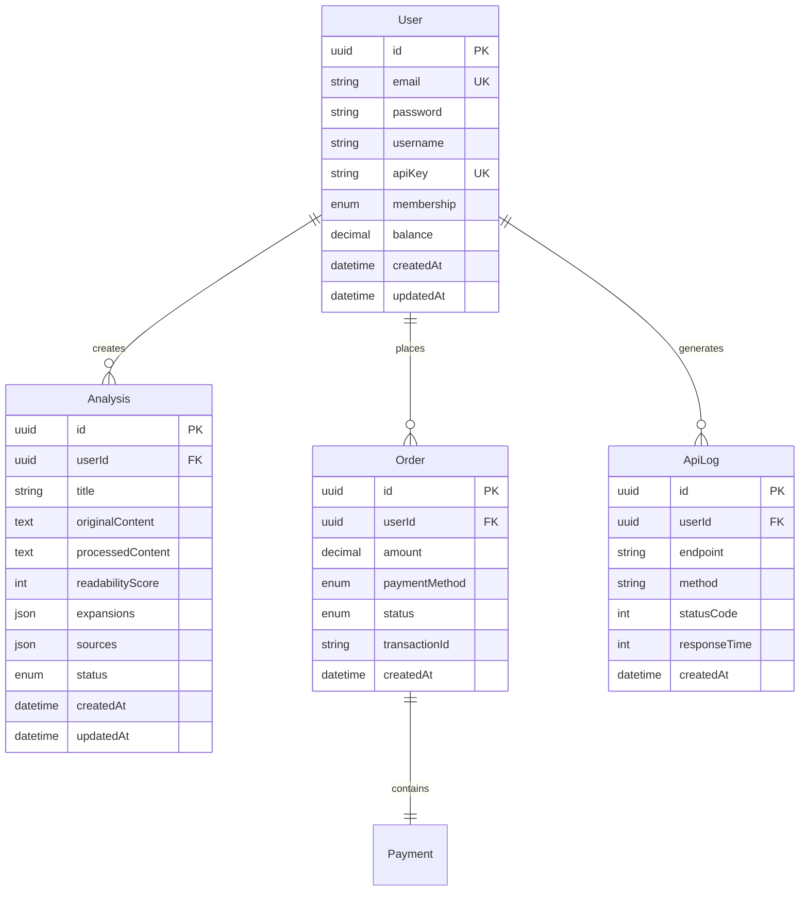

# 数据库设计

本文档详细说明AI-NoteBook系统的数据库设计，使用Prisma ORM和PostgreSQL数据库。

## ER图



## 数据表设计

### 1. User (用户表)

存储用户基本信息和会员状态。

```prisma
model User {
  id         String    @id @default(uuid())
  email      String    @unique
  password   String    // bcrypt加密
  username   String?
  apiKey     String?   @unique  // API Key (UUID)
  membership Membership @default(FREE)
  balance    Decimal   @default(0) @db.Decimal(10, 2)

  // 时间戳
  createdAt  DateTime  @default(now())
  updatedAt  DateTime  @updatedAt

  // 关联关系
  analyses   Analysis[]
  orders     Order[]
  apiLogs    ApiLog[]

  @@index([email])
  @@map("users")
}

enum Membership {
  FREE        // 免费版：1篇并发，100篇存储
  PRO         // 专业版：5篇并发，1000篇存储
  ENTERPRISE  // 企业版：20篇并发，无限存储
}
```

**字段说明**：

- `id`: 用户唯一标识，UUID格式
- `email`: 登录邮箱，唯一索引
- `password`: 密码哈希值 (bcrypt, cost=10)
- `username`: 用户昵称（可选）
- `apiKey`: API访问密钥，UUID格式（可选，首次API调用时生成）
- `membership`: 会员等级
- `balance`: 账户余额（元），支持充值消费

**索引设计**：
- 主键索引: `id`
- 唯一索引: `email`, `apiKey`
- 时间索引: `createdAt` (用于用户注册统计)

### 2. Analysis (文章解析记录表)

存储文章解析的所有相关信息。

```prisma
model Analysis {
  id                String   @id @default(uuid())
  userId            String
  user              User     @relation(fields: [userId], references: [id], onDelete: Cascade)

  // 文章基本信息
  title             String
  originalContent   Text     @db.Text
  processedContent  Text     @db.Text

  // 分析结果
  readabilityScore  Int      // 1-5分
  readabilityDetail Json?    // 详细评分说明

  // 扩展内容
  expansions        Json?    // 智能扩展内容
  sources           Json?    // 引用来源列表

  // 元数据
  wordCount         Int      @default(0)  // 字数统计
  readingTime       Int      @default(0)  // 预计阅读时间(分钟)
  tags              String[] // 标签数组

  // 状态管理
  status            AnalysisStatus @default(PENDING)
  errorMessage      String?

  // 任务队列
  jobId             String?  // BullMQ任务ID

  // 时间戳
  createdAt         DateTime @default(now())
  updatedAt         DateTime @updatedAt

  @@index([userId])
  @@index([status])
  @@index([createdAt])
  @@map("analyses")
}

enum AnalysisStatus {
  PENDING      // 待处理
  PROCESSING   // 处理中
  COMPLETED    // 已完成
  FAILED       // 失败
}
```

**字段说明**：

- `originalContent`: 原始Markdown内容
- `processedContent`: AI提炼后的内容（Markdown格式）
- `readabilityScore`: 易读性评分 (1-5)
- `readabilityDetail`: 详细评分说明（JSON）
  ```json
  {
    "vocabulary": 4,      // 词汇难度
    "sentence": 3,        // 句式结构
    "logic": 4,           // 逻辑深度
    "overall": 4,         // 综合评分
    "comment": "适合有一定技术背景的读者"
  }
  ```
- `expansions`: 扩展内容（JSON）
  ```json
  {
    "keyPoints": [
      {
        "original": "原始重点内容",
        "expansion": "扩展说明",
        "sources": ["url1", "url2"]
      }
    ]
  }
  ```
- `sources`: 引用来源（JSON）
  ```json
  [
    {
      "title": "文章标题",
      "url": "https://example.com",
      "snippet": "相关片段",
      " credibility": 0.9
    }
  ]
  ```

**索引设计**：
- 主键索引: `id`
- 外键索引: `userId`
- 状态索引: `status` (用于任务队列查询)
- 复合索引: `(userId, createdAt)` (用于用户历史记录查询)

### 3. Order (订单表)

存储充值和订单信息。

```prisma
model Order {
  id             String        @id @default(uuid())
  userId         String
  user           User          @relation(fields: [userId], references: [id], onDelete: Cascade)

  // 订单信息
  orderNo        String        @unique  // 订单号
  amount         Decimal       @db.Decimal(10, 2)
  membership     Membership    // 购买的会员类型
  duration       Int           // 有效期(天)

  // 支付信息
  paymentMethod  PaymentMethod
  status         OrderStatus   @default(PENDING)
  transactionId  String?       // 第三方交易ID

  // 支付时间
  paidAt         DateTime?

  // 时间戳
  createdAt      DateTime      @default(now())
  updatedAt      DateTime      @updatedAt

  @@index([userId])
  @@index([orderNo])
  @@index([status])
  @@map("orders")
}

enum PaymentMethod {
  ALIPAY   // 支付宝
  WECHAT   // 微信支付
  STRIPE   // 信用卡(国际)
}

enum OrderStatus {
  PENDING  // 待支付
  PAID     // 已支付
  FAILED   // 支付失败
  REFUNDED // 已退款
}
```

**字段说明**：

- `orderNo`: 订单号，格式: `AIN{timestamp}{random}`
- `amount`: 订单金额（元）
- `membership`: 购买的会员等级
- `duration`: 有效期（天）
- `transactionId`: 第三方支付平台的交易ID

**索引设计**：
- 主键索引: `id`
- 唯一索引: `orderNo`
- 外键索引: `userId`
- 状态索引: `status` (用于查询待支付订单)

### 4. ApiLog (API调用日志表)

记录API调用情况，用于统计和限流。

```prisma
model ApiLog {
  id           String   @id @default(uuid())
  userId       String
  user         User     @relation(fields: [userId], references: [id], onDelete: Cascade)

  // 请求信息
  endpoint     String   // API端点
  method       String   // HTTP方法
  statusCode   Int      // 响应状态码
  responseTime Int      // 响应时间(ms)

  // 元数据
  userAgent    String?
  ipAddress    String?

  // 时间戳
  createdAt    DateTime @default(now())

  @@index([userId])
  @@index([createdAt])
  @@map("api_logs")
}
```

**字段说明**：

- `endpoint`: API端点路径，如 `/api/analysis`
- `method`: HTTP方法，如 `GET`, `POST`
- `statusCode`: HTTP状态码
- `responseTime`: 响应时间（毫秒）
- `userAgent`: 用户代理
- `ipAddress`: 客户端IP地址

**索引设计**：
- 主键索引: `id`
- 外键索引: `userId`
- 时间索引: `createdAt` (用于按时间统计)

### 5. Payment (支付记录表)

存储第三方支付平台的回调信息。

```prisma
model Payment {
  id             String       @id @default(uuid())
  orderId        String       @unique
  order          Order        @relation(fields: [orderId], references: [id])

  // 支付平台信息
  provider       PaymentMethod
  providerTransactionId String @unique  // 支付平台交易ID

  // 回调数据
  callbackData   Json         // 支付平台回调的完整数据

  // 时间戳
  createdAt      DateTime     @default(now())

  @@index([provider])
  @@map("payments")
}
```

## 数据库优化

### 1. 分区表

对于数据量大的表（如`api_logs`），可以使用分区表：

```sql
-- 按月分区
CREATE TABLE api_logs (
  id UUID,
  user_id UUID,
  -- 其他字段
  created_at TIMESTAMP
) PARTITION BY RANGE (created_at);

-- 创建分区
CREATE TABLE api_logs_2026_01 PARTITION OF api_logs
  FOR VALUES FROM ('2026-01-01') TO ('2026-02-01');
```

### 2. 视图

创建常用查询视图：

```sql
-- 用户统计视图
CREATE VIEW user_stats AS
SELECT
  u.id,
  u.username,
  u.membership,
  COUNT(a.id) as total_analyses,
  COUNT(CASE WHEN a.status = 'COMPLETED' THEN 1 END) as completed_analyses,
  SUM(o.amount) as total_spent
FROM users u
LEFT JOIN analyses a ON u.id = a.user_id
LEFT JOIN orders o ON u.id = o.user_id AND o.status = 'PAID'
GROUP BY u.id;
```

### 3. 存储过程

```sql
-- 创建或更新用户API Key
CREATE OR REPLACE FUNCTION generate_api_key(user_id UUID)
RETURNS UUID AS $$
DECLARE
  new_api_key UUID := gen_random_uuid();
BEGIN
  UPDATE users
  SET api_key = new_api_key
  WHERE id = user_id
  RETURNING api_key INTO new_api_key;

  RETURN new_api_key;
END;
$$ LANGUAGE plpgsql;
```

### 4. 触发器

```sql
-- 自动更新字数统计
CREATE OR REPLACE FUNCTION update_word_count()
RETURNS TRIGGER AS $$
BEGIN
  NEW.word_count := length(NEW.original_content);
  NEW.reading_time := CEIL(NEW.word_count / 500.0);  // 假设500字/分钟
  RETURN NEW;
END;
$$ LANGUAGE plpgsql;

CREATE TRIGGER trigger_update_word_count
  BEFORE INSERT ON analyses
  FOR EACH ROW
  EXECUTE FUNCTION update_word_count();
```

## 数据迁移

Prisma支持声明式迁移：

```bash
# 创建迁移
npx prisma migrate dev --name init

# 应用迁移
npx prisma migrate deploy

# 重置数据库
npx prisma migrate reset

# 生成客户端
npx prisma generate
```

**迁移示例**：

```prisma
// 添加新字段
model Analysis {
  // ...现有字段
  category    String?  // 新增：文章分类
}
```

```bash
npx prisma migrate dev --name add_category_to_analysis
```

## 数据备份

### 1. 定期备份

```bash
# 每日全量备份
pg_dump -U postgres -d ainotebook > backup_$(date +%Y%m%d).sql

# 仅备份schema
pg_dump -U postgres -d ainotebook --schema-only > schema_$(date +%Y%m%d).sql
```

### 2. 恢复数据

```bash
psql -U postgres -d ainotebook < backup_20260120.sql
```

### 3. Point-in-Time Recovery (PITR)

PostgreSQL支持WAL归档和时间点恢复：

```bash
# 配置归档
archive_mode = on
archive_command = 'cp %p /pgarchive/%f'
```

## 性能监控

### 1. 慢查询日志

```sql
-- 配置慢查询阈值
ALTER DATABASE ainotebook SET log_min_duration_statement = 1000;  -- 1秒

-- 查看慢查询
SELECT * FROM pg_stat_statements
ORDER BY mean_exec_time DESC
LIMIT 10;
```

### 2. 索引使用情况

```sql
-- 查看未使用的索引
SELECT
  schemaname,
  tablename,
  indexname,
  idx_scan
FROM pg_stat_user_indexes
WHERE idx_scan = 0
AND indexname NOT LIKE '%_pkey';
```

### 3. 表大小统计

```sql
-- 查看表大小
SELECT
  tablename,
  pg_size_pretty(pg_total_relation_size(schemaname||'.'||tablename)) AS size
FROM pg_tables
WHERE schemaname = 'public'
ORDER BY pg_total_relation_size(schemaname||'.'||tablename) DESC;
```

## 安全措施

### 1. 行级安全策略 (RLS)

```sql
-- 启用RLS
ALTER TABLE analyses ENABLE ROW LEVEL SECURITY;

-- 用户只能查看自己的分析记录
CREATE POLICY user_analyses ON analyses
  FOR SELECT
  USING (user_id = current_user_id());

-- 用户只能插入自己的分析记录
CREATE POLICY user_insert_analyses ON analyses
  FOR INSERT
  WITH CHECK (user_id = current_user_id());
```

### 2. 数据加密

```sql
-- 使用pgcrypto加密敏感数据
CREATE EXTENSION IF NOT EXISTS pgcrypto;

-- 加密存储
INSERT INTO users (email, password)
VALUES (
  'user@example.com',
  pgp_sym_encrypt('raw_password', 'encryption_key')
);

-- 解密查询
SELECT
  email,
  pgp_sym_decrypt(password::bytea, 'encryption_key') as password
FROM users;
```

## 数据清理策略

### 1. 自动清理过期数据

```typescript
// 清理30天前的API日志
async function cleanupOldLogs() {
  const thirtyDaysAgo = new Date()
  thirtyDaysAgo.setDate(thirtyDaysAgo.getDate() - 30)

  await prisma.apiLog.deleteMany({
    where: {
      createdAt: { lt: thirtyDaysAgo }
    }
  })
}
```

### 2. 定期任务

```typescript
// 使用node-cron定时清理
import * as cron from 'node-cron'

// 每天凌晨2点执行
cron.schedule('0 2 * * *', async () => {
  await cleanupOldLogs()
  await vacuumDatabase()
})
```

详细API设计请查看 [API文档](/guide/api)
