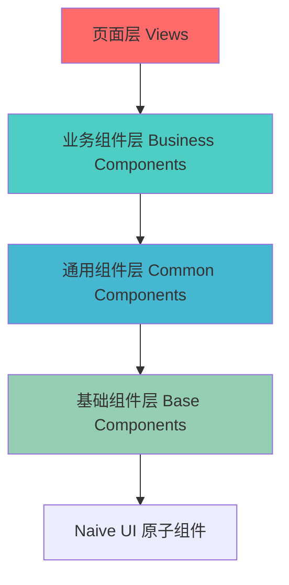

# 前端架构设计

本文档详细说明 AI-NoteBook 前端系统的整体架构设计。

## 概述

AI-NoteBook 前端采用 **Vue 3 生态 + TypeScript** 构建，遵循组件化、模块化的开发理念，提供流畅的用户体验。

### 核心设计理念

- **组件化开发**：高度可复用的组件设计
- **类型安全**：TypeScript 全栈类型覆盖
- **响应式优先**：移动端适配和响应式布局
- **性能优化**：按需加载和缓存策略
- **用户体验**：流畅的交互和实时反馈

## 技术栈

### 核心框架

```typescript
Vue 3 Ecosystem
├── Vue 3.4+                 # 核心框架 (Composition API)
├── TypeScript 5.0+          # 类型系统
├── Vite 5.0+               # 构建工具
└── Vue Router 4.x           # 路由管理
```

### UI 组件库

```typescript
Naive UI
├── 60+ 高质量组件           # 开箱即用
├── 完整 TypeScript 支持     # 类型提示友好
├── 主题定制系统             # 灵活的样式定制
└── 暗黑模式支持             # 现代化体验
```

### 状态管理

```typescript
Pinia
├── Vue 3 官方推荐           # 替代 Vuex
├── Composition API 风格     # 代码更简洁
├── DevTools 集成            # 调试友好
└── 模块化设计               # 天然支持代码分割
```

### 其他核心库

| 类别 | 技术选型 | 用途 |
|------|---------|------|
| HTTP 客户端 | Axios | API 请求 |
| WebSocket | Socket.io-client | 实时通信 |
| Markdown 编辑器 | Vditor | 内容编辑 |
| Markdown 渲染 | markdown-it | 内容展示 |
| 代码高亮 | highlight.js | 代码块高亮 |
| 文件导出 | html2pdf.js, docx | PDF/Word 导出 |
| 工具库 | lodash-es | 工具函数 |

## 项目结构

### 目录组织

```
frontend/
├── public/                      # 静态资源
│   ├── favicon.ico
│   └── logo.png
├── src/
│   ├── assets/                  # 资源文件
│   │   ├── images/             # 图片
│   │   ├── icons/              # SVG 图标
│   │   └── styles/             # 全局样式
│   │       ├── index.scss      # 样式入口
│   │       ├── variables.scss  # CSS 变量
│   │       └── mixins.scss     # Sass 混入
│   │
│   ├── components/              # 组件
│   │   ├── common/             # 通用组件
│   │   │   ├── MarkdownEditor.vue
│   │   │   ├── MarkdownViewer.vue
│   │   │   ├── ExportButton.vue
│   │   │   ├── LoadingSpinner.vue
│   │   │   └── EmptyState.vue
│   │   │
│   │   └── analysis/           # 分析相关组件
│   │       ├── ReadabilityCard.vue
│   │       ├── RefinedContent.vue
│   │       ├── ExpansionPanel.vue
│   │       ├── SourceList.vue
│   │       └── ProgressIndicator.vue
│   │
│   ├── views/                   # 页面视图
│   │   ├── Home.vue            # 首页
│   │   ├── Analyze.vue         # 分析页面
│   │   ├── History.vue         # 历史记录
│   │   ├── Pricing.vue         # 价格页面
│   │   ├── Settings.vue        # 设置
│   │   └── Login.vue           # 登录
│   │
│   ├── api/                     # API 封装
│   │   ├── request.ts          # Axios 实例
│   │   ├── analysis.ts         # 分析相关 API
│   │   ├── auth.ts             # 认证 API
│   │   ├── payment.ts          # 支付 API
│   │   └── websocket.ts        # WebSocket 管理
│   │
│   ├── stores/                  # Pinia 状态管理
│   │   ├── user.ts             # 用户状态
│   │   ├── analysis.ts         # 分析状态
│   │   ├── app.ts              # 应用状态
│   │   └── index.ts            # Store 入口
│   │
│   ├── router/                  # 路由配置
│   │   ├── index.ts            # 路由定义
│   │   ├── guards.ts           # 路由守卫
│   │   └── routes.ts           # 路由常量
│   │
│   ├── composables/             # 组合式函数
│   │   ├── useAnalysis.ts      # 分析逻辑
│   │   ├── useAuth.ts          # 认证逻辑
│   │   ├── useWebSocket.ts     # WebSocket 逻辑
│   │   └── useExport.ts        # 导出逻辑
│   │
│   ├── utils/                   # 工具函数
│   │   ├── format.ts           # 格式化工具
│   │   ├── validate.ts         # 验证工具
│   │   ├── export.ts           # 导出工具
│   │   ├── storage.ts          # 存储工具
│   │   └── constants.ts        # 常量定义
│   │
│   ├── types/                   # TypeScript 类型
│   │   ├── index.ts            # 类型导出
│   │   ├── api.ts              # API 类型
│   │   ├── analysis.ts         # 分析类型
│   │   └── user.ts             # 用户类型
│   │
│   ├── App.vue                  # 根组件
│   └── main.ts                  # 应用入口
│
├── index.html
├── vite.config.ts              # Vite 配置
├── tsconfig.json               # TypeScript 配置
├── .env.development            # 开发环境变量
├── .env.production             # 生产环境变量
└── package.json
```

### 命名规范

#### 文件命名

```typescript
// 组件文件：PascalCase
MarkdownEditor.vue
ReadabilityCard.vue

// 工具文件：camelCase
format.ts
validate.ts

// 类型文件：camelCase
user.ts
analysis.ts

// 样式文件：kebab-case
markdown-viewer.scss
variables.scss
```

#### 变量命名

```typescript
// 组件名：PascalCase
export default defineComponent({
  name: 'MarkdownEditor'
})

// 变量/函数：camelCase
const userName = ref('')
const getUserInfo = () => {}

// 常量：UPPER_SNAKE_CASE
const API_BASE_URL = 'https://api.example.com'
const MAX_FILE_SIZE = 5 * 1024 * 1024

// 类型/接口：PascalCase
interface UserInfo {}
type AnalysisStatus = 'pending' | 'processing' | 'completed'

// 私有变量：下划线前缀（不推荐，使用闭包）
const _privateVar = 'value'
```

## 核心架构设计

### 1. 组件化架构

#### 组件分层



#### 组件设计原则

1. **单一职责**：每个组件只负责一个功能
2. **可复用性**：通过 props 实现灵活配置
3. **可组合性**：组件之间可以自由组合
4. **状态提升**：共享状态提升到父组件或 Store

#### 组件通信

```typescript
// 1. Props Down / Events Up
// 父组件
<template>
  <MarkdownEditor
    v-model:value="content"
    :height="500"
    :readonly="false"
    @change="handleChange"
    @save="handleSave"
  />
</template>

// 子组件
interface Props {
  value: string
  height?: number
  readonly?: boolean
}

const props = withDefaults(defineProps<Props>(), {
  height: 400,
  readonly: false
})

const emit = defineEmits<{
  change: [value: string]
  save: [value: string]
}>()

// 2. Provide / Inject（跨层级通信）
// 祖先组件
provide('apiKey', computed(() => userStore.apiKey))

// 后代组件
const apiKey = inject<ComputedRef<string>>('apiKey')

// 3. Pinia Store（全局状态）
const analysisStore = useAnalysisStore()
analysisStore.createAnalysis(data)
```

### 2. 路由设计

#### 路由结构

```typescript
// src/router/routes.ts
export const routes: RouteRecordRaw[] = [
  {
    path: '/',
    name: 'Home',
    component: () => import('@/views/Home.vue'),
    meta: {
      title: '首页',
      keepAlive: false
    }
  },
  {
    path: '/analyze',
    name: 'Analyze',
    component: () => import('@/views/Analyze.vue'),
    meta: {
      title: '文章分析',
      requiresAuth: true,
      keepAlive: true
    }
  },
  {
    path: '/history',
    name: 'History',
    component: () => import('@/views/History.vue'),
    meta: {
      title: '历史记录',
      requiresAuth: true
    }
  },
  {
    path: '/pricing',
    name: 'Pricing',
    component: () => import('@/views/Pricing.vue'),
    meta: {
      title: '会员定价'
    }
  },
  {
    path: '/settings',
    name: 'Settings',
    component: () => import('@/views/Settings.vue'),
    meta: {
      title: '设置',
      requiresAuth: true
    }
  },
  {
    path: '/login',
    name: 'Login',
    component: () => import('@/views/Login.vue'),
    meta: {
      title: '登录',
      hideFromMenu: true
    }
  },
  {
    path: '/:pathMatch(.*)*',
    name: 'NotFound',
    component: () => import('@/views/NotFound.vue'),
    meta: {
      title: '404'
    }
  }
]
```

#### 路由守卫

```typescript
// src/router/guards.ts
import { Router } from 'vue-router'
import { useUserStore } from '@/stores/user'

export function setupRouterGuards(router: Router) {
  // 前置守卫
  router.beforeEach((to, from, next) => {
    // 设置页面标题
    document.title = `${to.meta.title || 'AI-NoteBook'} - AI智能笔记`

    // 认证检查
    const userStore = useUserStore()

    if (to.meta.requiresAuth && !userStore.isLoggedIn) {
      // 需要登录但未登录，跳转到登录页
      next({
        name: 'Login',
        query: { redirect: to.fullPath } // 登录后返回
      })
    } else if (to.name === 'Login' && userStore.isLoggedIn) {
      // 已登录用户访问登录页，跳转到首页
      next({ name: 'Home' })
    } else {
      next()
    }
  })

  // 后置钩子
  router.afterEach((to, from) => {
    // 页面访问统计
    if (to.meta.requiresAuth) {
      trackPageView(to.path)
    }
  })

  // 错误处理
  router.onError((error) => {
    console.error('Router error:', error)
  })
}
```

### 3. HTTP 请求封装

#### Axios 实例配置

```typescript
// src/api/request.ts
import axios, { AxiosError, AxiosRequestConfig, AxiosResponse } from 'axios'
import { useUserStore } from '@/stores/user'

// 创建 Axios 实例
const service = axios.create({
  baseURL: import.meta.env.VITE_API_BASE_URL,
  timeout: 30000,
  headers: {
    'Content-Type': 'application/json'
  }
})

// 请求拦截器
service.interceptors.request.use(
  (config) => {
    const userStore = useUserStore()

    // 注入 API Key
    if (userStore.apiKey) {
      config.headers['X-API-Key'] = userStore.apiKey
    }

    // 注入 JWT Token（如果有）
    const token = userStore.accessToken
    if (token) {
      config.headers['Authorization'] = `Bearer ${token}`
    }

    // 添加时间戳防止缓存
    if (config.method === 'get') {
      config.params = {
        ...config.params,
        _t: Date.now()
      }
    }

    return config
  },
  (error) => {
    console.error('Request error:', error)
    return Promise.reject(error)
  }
)

// 响应拦截器
service.interceptors.response.use(
  (response: AxiosResponse) => {
    const res = response.data

    // 二进制数据直接返回
    if (response.request.responseType === 'blob') {
      return res
    }

    // 业务成功
    if (res.success) {
      return res.data
    }

    // 业务失败
    showError(res.error?.message || '请求失败')

    return Promise.reject(new Error(res.error?.message || '请求失败'))
  },
  (error: AxiosError) => {
    // 网络错误
    if (!error.response) {
      showError('网络连接失败，请检查网络')
      return Promise.reject(error)
    }

    const { status } = error.response

    switch (status) {
      case 401:
        // 未授权，清除用户信息并跳转登录
        const userStore = useUserStore()
        userStore.clearUserData()
        window.location.href = '/login'
        break
      case 403:
        showError('权限不足')
        break
      case 404:
        showError('请求的资源不存在')
        break
      case 429:
        showError('请求过于频繁，请稍后再试')
        break
      case 500:
        showError('服务器错误，请稍后再试')
        break
      default:
        showError('请求失败')
    }

    return Promise.reject(error)
  }
)

// 错误提示
function showError(message: string) {
  // 使用 Naive UI 的 message 组件
  window.$message?.error(message)
}

// 导出实例
export default service

// 导出常用方法
export function get<T = any>(url: string, config?: AxiosRequestConfig) {
  return service.get<T>(url, config)
}

export function post<T = any>(url: string, data?: any, config?: AxiosRequestConfig) {
  return service.post<T>(url, data, config)
}

export function put<T = any>(url: string, data?: any, config?: AxiosRequestConfig) {
  return service.put<T>(url, data, config)
}

export function del<T = any>(url: string, config?: AxiosRequestConfig) {
  return service.delete<T>(url, config)
}
```

#### API 模块化

```typescript
// src/api/analysis.ts
import { get, post } from './request'
import type {
  AnalyzeDto,
  AnalyzeResponse,
  AnalysisDetail,
  AnalysisHistory
} from '@/types/analysis'

export const analysisApi = {
  // 创建分析任务
  create(data: AnalyzeDto) {
    return post<AnalyzeResponse>('/analysis', data)
  },

  // 批量分析
  batch(articles: Array<{ content: string; title?: string }>) {
    return post<{ batchId: string; taskIds: string[] }>('/analysis/batch', {
      articles
    })
  },

  // 获取分析结果
  getOne(id: string) {
    return get<AnalysisDetail>(`/analysis/${id}`)
  },

  // 获取历史记录
  getHistory(params: {
    page?: number
    limit?: number
    status?: string
  }) {
    return get<AnalysisHistory>('/analysis/history', { params })
  },

  // 删除记录
  delete(id: string) {
    return post(`/analysis/${id}/delete`)
  }
}

// src/api/auth.ts
export const authApi = {
  // 登录
  login(email: string, password: string) {
    return post<{
      user: UserInfo
      tokens: { accessToken: string; refreshToken: string }
    }>('/auth/login', { email, password })
  },

  // 注册
  register(email: string, password: string, username?: string) {
    return post('/auth/register', { email, password, username })
  },

  // 刷新 Token
  refreshToken(refreshToken: string) {
    return post<{ accessToken: string }>('/auth/refresh', { refreshToken })
  },

  // 生成 API Key
  generateApiKey() {
    return post<{ apiKey: string }>('/auth/api-key')
  }
}
```

### 4. WebSocket 连接管理

#### WebSocket 封装

```typescript
// src/api/websocket.ts
import { io, Socket } from 'socket.io-client'
import type { DefaultEventsMap } from 'socket.io-client'
import { useUserStore } from '@/stores/user'

class WebSocketService {
  private socket: Socket | null = null
  private reconnectAttempts = 0
  private maxReconnectAttempts = 5

  connect() {
    const userStore = useUserStore()
    const token = userStore.accessToken

    if (!token) {
      console.warn('No access token, cannot connect to WebSocket')
      return
    }

    this.socket = io(import.meta.env.VITE_WS_URL, {
      auth: { token },
      transports: ['websocket'],
      reconnection: true,
      reconnectionDelay: 1000,
      reconnectionDelayMax: 5000,
      reconnectionAttempts: this.maxReconnectAttempts
    })

    this.setupEventListeners()
  }

  private setupEventListeners() {
    if (!this.socket) return

    this.socket.on('connect', () => {
      console.log('WebSocket connected')
      this.reconnectAttempts = 0
    })

    this.socket.on('disconnect', (reason) => {
      console.log('WebSocket disconnected:', reason)

      if (reason === 'io server disconnect') {
        // 服务器主动断开，需要重连
        this.socket?.connect()
      }
    })

    this.socket.on('connect_error', (error) => {
      console.error('WebSocket connect error:', error)
      this.reconnectAttempts++

      if (this.reconnectAttempts >= this.maxReconnectAttempts) {
        console.error('Max reconnect attempts reached')
        window.$message?.error('实时连接失败，请刷新页面')
      }
    })

    // 监听分析进度更新
    this.socket.on('analysis:progress', (data: { taskId: string; progress: number; message: string }) => {
      // 触发全局事件或更新 Store
      window.dispatchEvent(new CustomEvent('analysis:progress', { detail: data }))
    })

    // 监听分析完成
    this.socket.on('analysis:completed', (data: { taskId: string; result: any }) => {
      window.dispatchEvent(new CustomEvent('analysis:completed', { detail: data }))
    })
  }

  // 订阅特定任务的进度
  subscribeToAnalysis(taskId: string, callback: (data: any) => void) {
    this.socket?.emit('subscribe:analysis', taskId)

    const handler = (data: any) => {
      if (data.taskId === taskId) {
        callback(data)
      }
    }

    this.socket?.on(`analysis:${taskId}:progress`, handler)

    // 返回取消订阅函数
    return () => {
      this.socket?.emit('unsubscribe:analysis', taskId)
      this.socket?.off(`analysis:${taskId}:progress`, handler)
    }
  }

  disconnect() {
    this.socket?.disconnect()
    this.socket = null
  }

  emit(event: string, ...args: any[]) {
    this.socket?.emit(event, ...args)
  }

  on(event: string, callback: (...args: any[]) => void) {
    this.socket?.on(event, callback)
  }

  off(event: string, callback?: (...args: any[]) => void) {
    this.socket?.off(event, callback)
  }
}

export const wsService = new WebSocketService()

// 在应用启动时连接
export function setupWebSocket() {
  const userStore = useUserStore()

  watch(
    () => userStore.isLoggedIn,
    (isLoggedIn) => {
      if (isLoggedIn) {
        wsService.connect()
      } else {
        wsService.disconnect()
      }
    },
    { immediate: true }
  )
}
```

### 5. 组合式函数（Composables）

#### useAnalysis

```typescript
// src/composables/useAnalysis.ts
import { ref, computed } from 'vue'
import { analysisApi } from '@/api/analysis'
import { useUserStore } from '@/stores/user'
import type { AnalyzeDto, AnalysisDetail } from '@/types/analysis'

export function useAnalysis() {
  const userStore = useUserStore()
  const loading = ref(false)
  const error = ref<string | null>(null)
  const currentAnalysis = ref<AnalysisDetail | null>(null)

  // 创建分析任务
  const createAnalysis = async (dto: AnalyzeDto) => {
    loading.value = true
    error.value = null

    try {
      // 检查并发限制
      const activeCount = await checkActiveAnalysisCount()
      const maxConcurrent = userStore.maxConcurrent

      if (activeCount >= maxConcurrent) {
        throw new Error(`当前已有 ${activeCount} 个任务在处理，已达会员上限`)
      }

      // 创建任务
      const result = await analysisApi.create(dto)

      window.$message?.success('分析任务已创建')

      return result
    } catch (err: any) {
      error.value = err.message
      window.$message?.error(err.message || '创建失败')
      throw err
    } finally {
      loading.value = false
    }
  }

  // 获取分析结果
  const getAnalysis = async (id: string) => {
    loading.value = true
    error.value = null

    try {
      const data = await analysisApi.getOne(id)
      currentAnalysis.value = data
      return data
    } catch (err: any) {
      error.value = err.message
      throw err
    } finally {
      loading.value = false
    }
  }

  // 检查当前活跃任务数
  const checkActiveAnalysisCount = async () => {
    const history = await analysisApi.getHistory({
      status: 'PROCESSING',
      limit: 100
    })

    return history.items.length
  }

  return {
    loading: computed(() => loading.value),
    error: computed(() => error.value),
    currentAnalysis: computed(() => currentAnalysis.value),
    createAnalysis,
    getAnalysis
  }
}
```

#### useAuth

```typescript
// src/composables/useAuth.ts
import { computed } from 'vue'
import { useUserStore } from '@/stores/user'
import { authApi } from '@/api/auth'
import { useRouter } from 'vue-router'

export function useAuth() {
  const userStore = useUserStore()
  const router = useRouter()

  const isLoggedIn = computed(() => userStore.isLoggedIn)
  const userInfo = computed(() => userStore.user)

  // 登录
  const login = async (email: string, password: string) => {
    const data = await authApi.login(email, password)

    // 保存到 Store
    userStore.setUserData(data.user)
    userStore.setTokens(data.tokens)

    // 保存 API Key 到 localStorage
    localStorage.setItem('apiKey', data.user.apiKey)

    window.$message?.success('登录成功')

    // 跳转到原页面或首页
    const redirect = router.currentRoute.value.query.redirect as string
    router.push(redirect || '/')
  }

  // 注册
  const register = async (email: string, password: string, username?: string) => {
    const data = await authApi.register(email, password, username)

    userStore.setUserData(data.user)
    userStore.setTokens(data.tokens)

    localStorage.setItem('apiKey', data.user.apiKey)

    window.$message?.success('注册成功')

    router.push('/')
  }

  // 登出
  const logout = async () => {
    userStore.clearUserData()
    localStorage.removeItem('apiKey')

    window.$message?.success('已登出')

    router.push('/login')
  }

  // 刷新 Token
  const refreshToken = async () => {
    const data = await authApi.refreshToken(userStore.refreshToken!)
    userStore.setAccessToken(data.accessToken)
  }

  return {
    isLoggedIn,
    userInfo,
    login,
    register,
    logout,
    refreshToken
  }
}
```

### 6. 类型系统

#### 类型定义

```typescript
// src/types/index.ts
// 统一导出所有类型

// src/types/api.ts
// API 响应类型
export interface ApiResponse<T = any> {
  success: boolean
  data: T
  error?: {
    code: string
    message: string
    details?: any
  }
}

export interface PaginationParams {
  page: number
  limit: number
}

export interface PaginationResponse<T> {
  items: T[]
  pagination: {
    page: number
    limit: number
    total: number
    totalPages: number
  }
}

// src/types/analysis.ts
export enum AnalysisStatus {
  PENDING = 'PENDING',
  PROCESSING = 'PROCESSING',
  COMPLETED = 'COMPLETED',
  FAILED = 'FAILED'
}

export interface AnalyzeDto {
  content: string
  title?: string
  enableExpansion: boolean
}

export interface ReadabilityScore {
  overall: number
  vocabulary: number
  sentence: number
  logic: number
  comment: string
}

export interface AnalysisDetail {
  id: string
  userId: string
  title: string
  originalContent: string
  processedContent: string
  readabilityScore: ReadabilityScore
  expansions: any
  sources: any[]
  status: AnalysisStatus
  createdAt: string
  updatedAt: string
}

// src/types/user.ts
export enum Membership {
  FREE = 'FREE',
  PRO = 'PRO',
  ENTERPRISE = 'ENTERPRISE'
}

export interface User {
  id: string
  email: string
  username?: string
  membership: Membership
  balance: number
  apiKey: string
  createdAt: string
}

export interface LoginDto {
  email: string
  password: string
}

export interface RegisterDto {
  email: string
  password: string
  username?: string
}
```

### 7. 构建配置

#### Vite 配置

```typescript
// vite.config.ts
import { defineConfig } from 'vite'
import vue from '@vitejs/plugin-vue'
import { resolve } from 'path'

export default defineConfig({
  plugins: [vue()],

  resolve: {
    alias: {
      '@': resolve(__dirname, 'src')
    }
  },

  server: {
    port: 5173,
    host: true,
    proxy: {
      '/api': {
        target: 'http://localhost:3000',
        changeOrigin: true
      },
      '/ws': {
        target: 'ws://localhost:3000',
        ws: true
      }
    }
  },

  build: {
    target: 'es2015',
    outDir: 'dist',
    assetsDir: 'assets',
    sourcemap: false,
    minify: 'terser',
    terserOptions: {
      compress: {
        drop_console: true,
        drop_debugger: true
      }
    },
    rollupOptions: {
      output: {
        manualChunks: {
          'vue-vendor': ['vue', 'vue-router', 'pinia'],
          'ui-library': ['naive-ui'],
          'markdown': ['markdown-it', 'highlight.js'],
          'editor': ['vditor']
        }
      }
    },
    chunkSizeWarningLimit: 1500
  },

  css: {
    preprocessorOptions: {
      scss: {
        additionalData: `@use "@/assets/styles/variables.scss" as *;`
      }
    }
  }
})
```

## 开发规范

### 代码风格

```typescript
// 使用 ESLint + Prettier
// .eslintrc.js
module.exports = {
  extends: [
    'plugin:vue/vue3-recommended',
    'plugin:@typescript-eslint/recommended'
  ],
  rules: {
    'vue/multi-word-component-names': 'off',
    '@typescript-eslint/no-explicit-any': 'warn',
    '@typescript-eslint/no-unused-vars': ['error', { argsIgnorePattern: '^_' }]
  }
}
```

### Git 提交规范

```bash
# 提交信息格式
<type>(<scope>): <subject>

# type 类型
feat: 新功能
fix: 修复 bug
docs: 文档更新
style: 代码格式调整
refactor: 重构代码
perf: 性能优化
test: 测试相关
chore: 构建/工具链更新

# 示例
feat(analysis): 添加批量分析功能
fix(auth): 修复 token 过期处理
docs(readme): 更新部署文档
```

### 注释规范

```typescript
/**
 * 创建分析任务
 * @param dto 分析数据
 * @returns 任务ID和状态
 * @throws {Error} 当并发数超限时抛出错误
 */
async function createAnalysis(dto: AnalyzeDto): Promise<AnalyzeResponse> {
  // 实现...
}
```

## 性能优化

### 1. 路由懒加载

```typescript
const routes = [
  {
    path: '/analyze',
    component: () => import('@/views/Analyze.vue') // 懒加载
  }
]
```

### 2. 组件懒加载

```vue
<script setup lang="ts">
import { defineAsyncComponent } from 'vue'

const HeavyComponent = defineAsyncComponent(() =>
  import('./HeavyComponent.vue')
)
</script>
```

### 3. 虚拟滚动

```vue
<template>
  <n-virtual-list
    :items="largeList"
    :item-size="50"
    :item-resizable="true"
  >
    <template #default="{ item }">
      <div>{{ item }}</div>
    </template>
  </n-virtual-list>
</template>
```

### 4. 防抖节流

```typescript
import { debounce } from 'lodash-es'

const search = debounce((keyword: string) => {
  // 搜索逻辑
}, 300)
```

## 相关文档

- [组件设计](/guide/frontend-components)
- [状态管理](/guide/frontend-state-management)
- [样式主题](/guide/frontend-theming)
- [部署指南](/guide/deployment)
