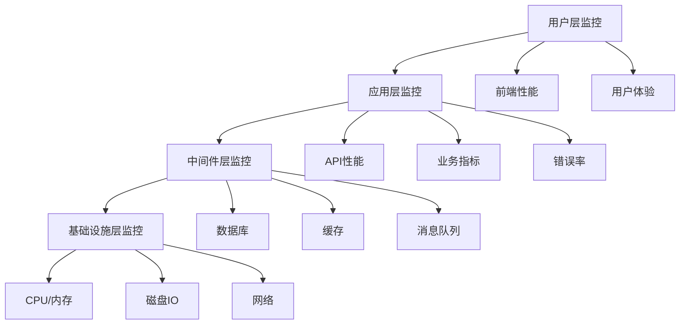
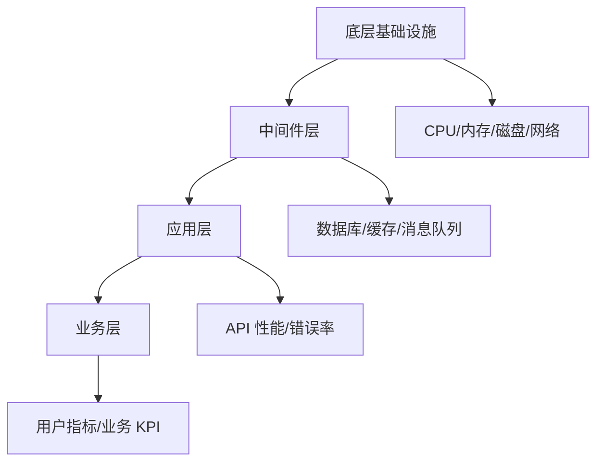

# 监控与日志

本文档说明 AI-NoteBook 系统的监控和日志管理方案，确保生产环境的稳定性和可观测性。

## 监控体系概述

### 监控层级



### 监控指标分类

**1. RED 方法**
- **R**ate（速率）：每秒请求数
- **E**rrors（错误）：错误率
- **D**uration（持续时间）：响应时间

**2. USE 方法**
- **U**tilization（利用率）：资源使用百分比
- **S**aturation（饱和度）：资源排队程度
- **E**rrors（错误）：错误数量

## 日志系统

### 日志类型

#### 1. 应用日志

使用 Winston 结构化日志：

```typescript
// logger.config.ts
import * as winston from 'winston'
import * as fs from 'fs'
import * as path from 'path'

// 创建日志目录
const logDir = 'logs'
if (!fs.existsSync(logDir)) {
  fs.mkdirSync(logDir)
}

// 自定义日志格式
const customFormat = winston.format.combine(
  winston.format.timestamp({ format: 'YYYY-MM-DD HH:mm:ss' }),
  winston.format.errors({ stack: true }),
  winston.format.printf(({ timestamp, level, message, context, trace }) => {
    let log = `${timestamp} [${level.toUpperCase()}]`

    if (context) {
      log += ` [${context}]`
    }

    log += `: ${message}`

    if (trace) {
      log += `\nStack Trace: ${trace}`
    }

    return log
  })
)

// 日志配置
export const logger = winston.createLogger({
  level: process.env.LOG_LEVEL || 'info',
  format: customFormat,
  transports: [
    // 错误日志
    new winston.transports.File({
      filename: path.join(logDir, 'error.log'),
      level: 'error',
      maxsize: 10 * 1024 * 1024, // 10MB
      maxFiles: 10,
      tailable: true
    }),

    // 警告日志
    new winston.transports.File({
      filename: path.join(logDir, 'warn.log'),
      level: 'warn',
      maxsize: 10 * 1024 * 1024,
      maxFiles: 5,
      tailable: true
    }),

    // 综合日志
    new winston.transports.File({
      filename: path.join(logDir, 'combined.log'),
      maxsize: 50 * 1024 * 1024, // 50MB
      maxFiles: 20,
      tailable: true
    }),

    // 按日期分割的日志
    new winston.transports.DailyRotateFile({
      filename: path.join(logDir, 'application-%DATE%.log'),
      datePattern: 'YYYY-MM-DD',
      maxSize: '20m',
      maxFiles: '30d'
    })
  ],

  // 异常处理
  exceptionHandlers: [
    new winston.transports.File({
      filename: path.join(logDir, 'exceptions.log')
    })
  ],

  // 未捕获的 Promise 拒绝
  rejectionHandlers: [
    new winston.transports.File({
      filename: path.join(logDir, 'rejections.log')
    })
  ]
})

// 开发环境添加控制台输出
if (process.env.NODE_ENV !== 'production') {
  logger.add(new winston.transports.Console({
    format: winston.format.combine(
      winston.format.colorize(),
      winston.format.simple()
    )
  }))
}

// 日志级别辅助方法
export class LoggerService {
  constructor(private context?: string) {}

  debug(message: string, meta?: any) {
    logger.debug(message, { context: this.context, ...meta })
  }

  log(message: string, meta?: any) {
    logger.info(message, { context: this.context, ...meta })
  }

  info(message: string, meta?: any) {
    logger.info(message, { context: this.context, ...meta })
  }

  warn(message: string, meta?: any) {
    logger.warn(message, { context: this.context, ...meta })
  }

  error(message: string, trace?: string, meta?: any) {
    logger.error(message, { context: this.context, trace, ...meta })
  }

  verbose(message: string, meta?: any) {
    logger.verbose(message, { context: this.context, ...meta })
  }
}
```

#### 2. 访问日志

Nginx 访问日志配置：

```nginx
http {
  # 自定义日志格式
  log_format main '$remote_addr - $remote_user [$time_local] '
                  '"$request" $status $body_bytes_sent '
                  '"$http_referer" "$http_user_agent" '
                  '$request_time $upstream_response_time '
                  '$http_x_forwarded_for';

  log_format detailed '$remote_addr - $remote_user [$time_local] '
                     '"$request" $status $body_bytes_sent '
                     '"$http_referer" "$http_user_agent" '
                     '$request_time $upstream_response_time '
                     '$upstream_addr $upstream_status '
                     '$http_x_forwarded_for';

  # 访问日志
  access_log /var/log/nginx/access.log main buffer=32k flush=5s;
  access_log /var/log/nginx/access_detailed.log detailed buffer=32k flush=5s;

  # 错误日志
  error_log /var/log/nginx/error.log warn;
}
```

#### 3. 数据库日志

PostgreSQL 日志配置：

```ini
# /etc/postgresql/15/main/postgresql.conf

# 启用日志
logging_collector = on
log_directory = 'pg_log'
log_filename = 'postgresql-%Y-%m-%d_%H%M%S.log'

# 日志轮转
log_rotation_age = 1d
log_rotation_size = 100MB

# 日志级别
log_min_duration_statement = 1000  # 记录超过1秒的查询
log_line_prefix = '%t [%p]: [%l-1] user=%u,db=%d,app=%a,client=%h '
log_checkpoints = on
log_connections = on
log_disconnections = on
log_lock_waits = on

# 慢查询日志
log_min_duration_statement = 1000  # 1秒
```

#### 4. Redis 日志

```ini
# /etc/redis/redis.conf

# 日志级别: debug, verbose, notice, warning
loglevel notice

# 日志文件
logfile /var/log/redis/redis-server.log

# 慢查询日志
slowlog-log-slower-than 10000  # 10秒
slowlog-max-len 128
```

### 日志级别定义

| 级别 | 用途 | 示例场景 |
|------|------|----------|
| **ERROR** | 错误事件，需要立即关注 | API 失败、数据库连接错误 |
| **WARN** | 警告事件，可能需要关注 | 降级服务、重试操作 |
| **INFO** | 重要业务事件 | 用户登录、订单创建、任务完成 |
| **DEBUG** | 调试信息 | 详细的执行流程、中间变量 |
| **VERBOSE** | 更详细的调试信息 | 函数入口/出口、详细参数 |

### 日志最佳实践

#### 1. 结构化日志

```typescript
// ❌ 不好的做法
logger.log('User logged in: ' + userId + ' from ' + ip)

// ✅ 好的做法
logger.info('User logged in', {
  userId,
  ip,
  userAgent: req.headers['user-agent'],
  timestamp: new Date().toISOString()
})
```

#### 2. 关键操作日志

```typescript
// API 请求日志
app.use((req, res, next) => {
  const startTime = Date.now()

  res.on('finish', () => {
    const duration = Date.now() - startTime
    logger.info('API Request', {
      method: req.method,
      url: req.url,
      status: res.statusCode,
      duration,
      ip: req.ip,
      userAgent: req.headers['user-agent']
    })
  })

  next()
})

// 数据库查询日志
prisma.$use(async (params, next) => {
  const before = Date.now()
  const result = await next(params)
  const after = Date.now()

  logger.log(`Query ${params.model}.${params.action}`, {
    duration: after - before,
    params: params.args
  })

  return result
})
```

#### 3. 敏感信息过滤

```typescript
// 敏感字段脱敏
function sanitizeData(data: any): any {
  const sensitiveFields = ['password', 'token', 'secret', 'apiKey']

  if (typeof data !== 'object' || data === null) {
    return data
  }

  const sanitized = { ...data }

  for (const field of sensitiveFields) {
    if (field in sanitized) {
      sanitized[field] = '***REDACTED***'
    }
  }

  return sanitized
}

// 使用
logger.info('User update', sanitizeData(userData))
```

#### 4. 关联追踪 ID

```typescript
import { v4 as uuidv4 } from 'uuid'

// 生成请求 ID
app.use((req, res, next) => {
  req.id = req.headers['x-request-id'] || uuidv4()
  res.setHeader('X-Request-ID', req.id)
  next()
})

// 在日志中使用
logger.info('Processing request', {
  requestId: req.id,
  userId: req.user?.id,
  action: 'process_article'
})
```

## 性能监控

### Prometheus + Grafana

#### 1. 安装 Prometheus

```bash
# 下载 Prometheus
wget https://github.com/prometheus/prometheus/releases/download/v2.45.0/prometheus-2.45.0.linux-amd64.tar.gz
tar xvfz prometheus-2.45.0.linux-amd64.tar.gz
cd prometheus-2.45.0.linux-amd64

# 配置 prometheus.yml
cat > prometheus.yml <<EOF
global:
  scrape_interval: 15s
  evaluation_interval: 15s

scrape_configs:
  - job_name: 'ainotebook-api'
    static_configs:
      - targets: ['localhost:3000']
    metrics_path: '/metrics'

  - job_name: 'postgres'
    static_configs:
      - targets: ['localhost:9187']

  - job_name: 'redis'
    static_configs:
      - targets: ['localhost:9121']

  - job_name: 'node'
    static_configs:
      - targets: ['localhost:9100']
EOF

# 启动 Prometheus
./prometheus --config.file=prometheus.yml
```

#### 2. 应用指标集成

```typescript
// metrics.service.ts
import { Counter, Histogram, Gauge, register, collectDefaultMetrics } from 'prom-client'

// 收集默认指标（CPU、内存等）
collectDefaultMetrics({ register })

// HTTP 请求耗时
export const httpRequestDuration = new Histogram({
  name: 'http_request_duration_seconds',
  help: 'Duration of HTTP requests in seconds',
  labelNames: ['method', 'route', 'status_code', 'user_id'],
  buckets: [0.001, 0.005, 0.01, 0.05, 0.1, 0.5, 1, 2, 5]
})

// HTTP 请求总数
export const httpRequestsTotal = new Counter({
  name: 'http_requests_total',
  help: 'Total number of HTTP requests',
  labelNames: ['method', 'route', 'status_code']
})

// AI 请求计数
export const aiRequestsTotal = new Counter({
  name: 'ai_requests_total',
  help: 'Total number of AI API requests',
  labelNames: ['provider', 'model', 'status']
})

// AI 请求耗时
export const aiRequestDuration = new Histogram({
  name: 'ai_request_duration_seconds',
  help: 'Duration of AI API requests in seconds',
  labelNames: ['provider', 'model'],
  buckets: [0.5, 1, 2, 5, 10, 30, 60]
})

// 数据库查询耗时
export const dbQueryDuration = new Histogram({
  name: 'db_query_duration_seconds',
  help: 'Duration of database queries in seconds',
  labelNames: ['model', 'operation'],
  buckets: [0.001, 0.005, 0.01, 0.05, 0.1, 0.5, 1]
})

// 在线用户数
export const onlineUsers = new Gauge({
  name: 'online_users_total',
  help: 'Number of online users'
})

// 队列任务数
export const queueJobsPending = new Gauge({
  name: 'queue_jobs_pending',
  help: 'Number of pending jobs in queue',
  labelNames: ['queue_name']
})

// 队列任务处理耗时
export const queueJobDuration = new Histogram({
  name: 'queue_job_duration_seconds',
  help: 'Duration of queue job processing',
  labelNames: ['queue_name', 'job_name', 'status'],
  buckets: [1, 5, 10, 30, 60, 300, 600]
})

// 自定义业务指标
export const articleProcessingTotal = new Counter({
  name: 'article_processing_total',
  help: 'Total number of articles processed',
  labelNames: ['status', 'source_type']
})

// 缓存命中率
export const cacheHits = new Counter({
  name: 'cache_hits_total',
  help: 'Total number of cache hits',
  labelNames: ['cache_type']
})

export const cacheMisses = new Counter({
  name: 'cache_misses_total',
  help: 'Total number of cache misses',
  labelNames: ['cache_type']
})
```

#### 3. 中间件集成

```typescript
// metrics.middleware.ts
import { Request, Response, NextFunction } from 'express'
import { httpRequestDuration, httpRequestsTotal } from './metrics.service'

export function metricsMiddleware(req: Request, res: Response, next: NextFunction) {
  const start = Date.now()

  res.on('finish', () => {
    const duration = Date.now() - start
    const route = req.route ? req.route.path : req.path

    // 记录请求总数
    httpRequestsTotal.inc({
      method: req.method,
      route,
      status_code: res.statusCode
    })

    // 记录请求耗时
    httpRequestDuration.observe({
      method: req.method,
      route,
      status_code: res.statusCode,
      user_id: req.user?.id || 'anonymous'
    }, duration / 1000)
  })

  next()
}
```

#### 4. 暴露指标端点

```typescript
// metrics.controller.ts
import { Controller, Get } from '@nestjs/common'
import { register } from 'prom-client'

@Controller('metrics')
export class MetricsController {
  @Get()
  async getMetrics() {
    return {
      contentType: register.contentType,
      body: await register.metrics()
    }
  }
}

// 在 main.ts 中设置
app.use('/metrics', async (req, res) => {
  res.set('Content-Type', register.contentType)
  res.end(await register.metrics())
})
```

### Grafana 仪表板

#### 1. 安装 Grafana

```bash
# Ubuntu/Debian
sudo wget -q -O - https://packages.grafana.com/gpg.key | sudo apt-key add -
sudo add-apt-repository "deb https://packages.grafana.com/oss/deb stable main"
sudo apt update
sudo apt install grafana

# 启动服务
sudo systemctl start grafana-server
sudo systemctl enable grafana-server

# 访问 http://localhost:3000
# 默认用户名/密码: admin/admin
```

#### 2. 配置数据源

在 Grafana 中添加 Prometheus 数据源：

```json
{
  "name": "Prometheus",
  "type": "prometheus",
  "url": "http://localhost:9090",
  "access": "proxy",
  "isDefault": true
}
```

#### 3. 关键仪表板面板

**API 性能监控**

```promql
# 请求速率（每秒请求数）
rate(http_requests_total[5m])

# P95 响应时间
histogram_quantile(0.95, rate(http_request_duration_seconds_bucket[5m]))

# P99 响应时间
histogram_quantile(0.99, rate(http_request_duration_seconds_bucket[5m]))

# 错误率
rate(http_requests_total{status_code=~"5.."}[5m]) / rate(http_requests_total[5m])
```

**AI 服务监控**

```promql
# AI 请求速率
rate(ai_requests_total[5m])

# AI 请求 P95 耗时
histogram_quantile(0.95, rate(ai_request_duration_seconds_bucket[5m]))

# AI 错误率
rate(ai_requests_total{status="error"}[5m]) / rate(ai_requests_total[5m])
```

**数据库监控**

```promql
# 查询速率
rate(db_query_duration_seconds_count[5m])

# 慢查询（>1s）
rate(db_query_duration_seconds_bucket{le="1.0"}[5m])

# 连接池使用率
pg_stat_database_numbackends / pg_settings_max_connections
```

**缓存监控**

```promql
# 缓存命中率
rate(cache_hits_total[5m]) / (rate(cache_hits_total[5m]) + rate(cache_misses_total[5m]))

# Redis 内存使用
redis_memory_used_bytes / redis_memory_max_bytes
```

### 应用性能监控 (APM)

#### 使用 New Relic

```typescript
// 安装
npm install newrelic

// 初始化
import newrelic from 'newrelic'

// 自动捕获 Express 请求
newrelic.instrumentLoadedModule(
  'express',
  require('express')
)

// 自定义事务
app.get('/api/process', (req, res) => {
  const transaction = newrelic.getTransaction()

  // 添加自定义属性
  transaction.addAttribute('userId', req.user.id)
  transaction.addAttribute('articleId', req.body.articleId)

  // 记录错误
  try {
    // 处理逻辑
  } catch (error) {
    newrelic.noticeError(error)
    throw error
  }
})
```

#### 使用 DataDog

```typescript
npm install dd-trace

import tracer from 'dd-trace'

tracer.init({
  service: 'ainotebook-api',
  env: process.env.NODE_ENV,
  logInjection: true,
  analytics: true
})

// 自动追踪 Express、HTTP、数据库
tracer.use('express', {
  middleware: true,
  controller: true
})

tracer.use('pg', {
  service: 'postgresql'
})

tracer.use('redis', {
  service: 'redis'
})
```

## 告警系统

### Alertmanager 配置

```yaml
# alertmanager.yml
global:
  resolve_timeout: 5m
  slack_api_url: 'https://hooks.slack.com/services/YOUR/SLACK/WEBHOOK'

route:
  group_by: ['alertname', 'cluster', 'service']
  group_wait: 10s
  group_interval: 10s
  repeat_interval: 12h
  receiver: 'default'

  routes:
    # 严重告警 -> 立即通知
    - match:
        severity: critical
      receiver: 'critical-alerts'
      group_wait: 0s
      repeat_interval: 5m

    # 警告级别 -> Slack
    - match:
        severity: warning
      receiver: 'slack-warnings'

receivers:
  - name: 'default'
    slack_configs:
      - channel: '#alerts'
        title: '{{ .GroupLabels.alertname }}'
        text: '{{ range .Alerts }}{{ .Annotations.description }}{{ end }}'

  - name: 'critical-alerts'
    slack_configs:
      - channel: '#critical-alerts'
        title: '🚨 CRITICAL: {{ .GroupLabels.alertname }}'
        text: '{{ range .Alerts }}{{ .Annotations.description }}{{ end }}'
        color: 'danger'

    email_configs:
      - to: 'oncall@ainotebook.com'
        subject: '🚨 Critical Alert: {{ .GroupLabels.alertname }}'

  - name: 'slack-warnings'
    slack_configs:
      - channel: '#warnings'
        title: '⚠️ WARNING: {{ .GroupLabels.alertname }}'
        text: '{{ range .Alerts }}{{ .Annotations.description }}{{ end }}'
        color: 'warning'
```

### 告警规则

```yaml
# alerts.yml
groups:
  - name: api_alerts
    interval: 30s
    rules:
      # 高错误率
      - alert: HighErrorRate
        expr: rate(http_requests_total{status_code=~"5.."}[5m]) / rate(http_requests_total[5m]) > 0.05
        for: 5m
        labels:
          severity: critical
          service: api
        annotations:
          summary: 'API 错误率过高'
          description: 'API 错误率 {{ $value | humanizePercentage }}（超过5%）'

      # 高响应时间
      - alert: HighResponseTime
        expr: histogram_quantile(0.95, rate(http_request_duration_seconds_bucket[5m])) > 2
        for: 10m
        labels:
          severity: warning
          service: api
        annotations:
          summary: 'API 响应时间过长'
          description: 'P95 响应时间 {{ $value }}秒（超过2秒）'

      # 服务不可用
      - alert: ServiceDown
        expr: up{job="ainotebook-api"} == 0
        for: 1m
        labels:
          severity: critical
          service: api
        annotations:
          summary: 'API 服务不可用'
          description: 'API 服务已宕机超过1分钟'

  - name: ai_service_alerts
    interval: 30s
    rules:
      # AI 服务失败率高
      - alert: HighAIFailureRate
        expr: rate(ai_requests_total{status="error"}[5m]) / rate(ai_requests_total[5m]) > 0.1
        for: 5m
        labels:
          severity: critical
          service: ai
        annotations:
          summary: 'AI 服务失败率过高'
          description: 'AI 服务失败率 {{ $value | humanizePercentage }}（超过10%）'

      # AI 服务响应慢
      - alert: SlowAIResponse
        expr: histogram_quantile(0.95, rate(ai_request_duration_seconds_bucket[5m])) > 30
        for: 10m
        labels:
          severity: warning
          service: ai
        annotations:
          summary: 'AI 服务响应缓慢'
          description: 'P95 响应时间 {{ $value }}秒（超过30秒）'

  - name: database_alerts
    interval: 30s
    rules:
      # 数据库连接数过高
      - alert: HighDatabaseConnections
        expr: pg_stat_database_numbackends / pg_settings_max_connections > 0.8
        for: 5m
        labels:
          severity: warning
          service: database
        annotations:
          summary: '数据库连接数过高'
          description: '数据库连接使用率 {{ $value | humanizePercentage }}（超过80%）'

      # 慢查询增多
      - alert: SlowQueryIncrease
        expr: rate(pg_stat_statement_calls_total{latency_ms > 1000}[5m]) > 10
        for: 5m
        labels:
          severity: warning
          service: database
        annotations:
          summary: '慢查询数量增加'
          description: '每秒超过10个慢查询（>1秒）'

  - name: system_alerts
    interval: 30s
    rules:
      # CPU 使用率过高
      - alert: HighCPUUsage
        expr: rate(process_cpu_seconds_total[5m]) > 0.8
        for: 10m
        labels:
          severity: warning
          service: system
        annotations:
          summary: 'CPU 使用率过高'
          description: 'CPU 使用率 {{ $value | humanizePercentage }}（超过80%）'

      # 内存使用率过高
      - alert: HighMemoryUsage
        expr: process_resident_memory_bytes / node_memory_MemTotal_bytes > 0.9
        for: 5m
        labels:
          severity: critical
          service: system
        annotations:
          summary: '内存使用率过高'
          description: '内存使用率 {{ $value | humanizePercentage }}（超过90%）'

      # 磁盘空间不足
      - alert: LowDiskSpace
        expr: (node_filesystem_avail_bytes / node_filesystem_size_bytes) < 0.1
        for: 5m
        labels:
          severity: critical
          service: system
        annotations:
          summary: '磁盘空间不足'
          description: '磁盘剩余空间 {{ $value | humanizePercentage }}（低于10%）'
```

### 通知渠道

#### 1. Slack 集成

```typescript
// slack.service.ts
import axios from 'axios'

export class SlackAlertService {
  private webhookUrl: string

  constructor() {
    this.webhookUrl = process.env.SLACK_WEBHOOK_URL
  }

  async sendAlert(alert: {
    title: string
    message: string
    severity: 'info' | 'warning' | 'error'
    metadata?: Record<string, any>
  }) {
    const colors = {
      info: '#36a64f',
      warning: '#ff9900',
      error: '#ff0000'
    }

    const attachment = {
      color: colors[alert.severity],
      title: alert.title,
      text: alert.message,
      fields: alert.metadata ? Object.entries(alert.metadata).map(([key, value]) => ({
        title: key,
        value: String(value),
        short: true
      })) : [],
      footer: 'AI-NoteBook Alerts',
      ts: Math.floor(Date.now() / 1000)
    }

    await axios.post(this.webhookUrl, { attachments: [attachment] })
  }
}
```

#### 2. 邮件通知

```typescript
// email.service.ts
import nodemailer from 'nodemailer'

export class EmailAlertService {
  private transporter: nodemailer.Transporter

  constructor() {
    this.transporter = nodemailer.createTransporter({
      host: process.env.SMTP_HOST,
      port: parseInt(process.env.SMTP_PORT),
      secure: true,
      auth: {
        user: process.env.SMTP_USER,
        pass: process.env.SMTP_PASS
      }
    })
  }

  async sendAlert(alert: {
    to: string[]
    subject: string
    text: string
    html?: string
  }) {
    await this.transporter.sendMail({
      from: process.env.SMTP_FROM,
      to: alert.to.join(', '),
      subject: alert.subject,
      text: alert.text,
      html: alert.html || alert.text
    })
  }
}
```

## 日志分析

### ELK Stack 集成

#### 1. Filebeat 配置

```yaml
# filebeat.yml
filebeat.inputs:
  - type: log
    enabled: true
    paths:
      - /var/www/ainotebook/backend/logs/*.log
    json.keys_under_root: true
    json.add_error_key: true
    fields:
      service: ainotebook-api
      environment: production

  - type: log
    enabled: true
    paths:
      - /var/log/nginx/access.log
    fields:
      service: nginx
      type: access

  - type: log
    enabled: true
    paths:
      - /var/log/nginx/error.log
    fields:
      service: nginx
      type: error

output.elasticsearch:
  hosts: ["localhost:9200"]
  index: "ainotebook-%{+yyyy.MM.dd}"

setup.kibana:
  host: "localhost:5601"

processors:
  - add_host_metadata:
      when.not.contains.tags: forwarded
  - add_cloud_metadata: ~
```

#### 2. Elasticsearch 索引模板

```json
PUT _index_template/ainotebook-logs
{
  "index_patterns": ["ainotebook-*"],
  "template": {
    "settings": {
      "number_of_shards": 1,
      "number_of_replicas": 1,
      "index.lifecycle.name": "logs-policy",
      "index.lifecycle.rollover_alias": "ainotebook"
    },
    "mappings": {
      "properties": {
        "@timestamp": { "type": "date" },
        "level": { "type": "keyword" },
        "message": { "type": "text" },
        "context": { "type": "keyword" },
        "userId": { "type": "keyword" },
        "requestId": { "type": "keyword" },
        "duration": { "type": "long" },
        "status": { "type": "keyword" }
      }
    }
  }
}
```

#### 3. Kibana 查询

```json
// 查找错误日志
{
  "query": {
    "bool": {
      "must": [
        { "match": { "level": "error" } },
        { "range": { "@timestamp": { "gte": "now-1h" } } }
      ]
    }
  }
}

// 查找慢查询
{
  "query": {
    "range": {
      "duration": { "gte": 1000 }
    }
  }
}

// 统计错误率
{
  "size": 0,
  "aggs": {
    "error_rate": {
      "terms": {
        "field": "level"
      }
    }
  }
}
```

### 日志查询示例

#### Kibana Query Language (KQL)

```
# 查找特定用户的操作
userId: "12345"

# 查找错误日志
level: "error"

# 查找慢 API 请求
duration: > 1000 AND service: "ainotebook-api"

# 查找特定时间范围的错误
level: "error" AND @timestamp: >= "2024-01-20T00:00:00"

# 查找特定请求 ID 的所有日志
requestId: "abc-123-def"

# 查找特定操作的日志
message: "Article processing" AND status: "failed"
```

## 监控最佳实践

### 1. 监控金字塔



### 2. 告警分级

| 级别 | 响应时间 | 示例 | 通知方式 |
|------|----------|------|----------|
| **P0 - Critical** | 立即（<5分钟） | 服务宕机、数据丢失 | 电话 + Slack + Email |
| **P1 - High** | 快速（<15分钟） | 错误率>10%、性能严重下降 | Slack + Email |
| **P2 - Medium** | 及时（<1小时） | 错误率>5%、响应变慢 | Slack |
| **P3 - Low** | 工作时间 | 资源使用>80%、警告 | Email / Ticket |

### 3. 监控覆盖率检查清单

**应用层面**
- [ ] API 响应时间（P50/P95/P99）
- [ ] API 错误率
- [ ] 请求速率（QPS）
- [ ] 业务指标（注册数、活跃用户、文章处理数）

**数据库层面**
- [ ] 查询性能
- [ ] 连接池使用率
- [ ] 慢查询数量
- [ ] 死锁检测

**缓存层面**
- [ ] 缓存命中率
- [ ] 内存使用率
- [ ] 键数量
- [ ] 过期策略

**系统层面**
- [ ] CPU 使用率
- [ ] 内存使用率
- [ ] 磁盘 I/O 和空间
- [ ] 网络流量

**AI 服务层面**
- [ ] API 调用成功率
- [ ] 响应时间
- [ ] Token 使用量
- [ ] 成本监控

### 4. 告警疲劳预防

```typescript
// 告警聚合和去重
class AlertManager {
  private alertBuffer = new Map<string, Alert>()
  private cooldownPeriod = 5 * 60 * 1000 // 5分钟冷却期

  shouldAlert(alert: Alert): boolean {
    const key = this.getAlertKey(alert)
    const lastAlert = this.alertBuffer.get(key)

    if (!lastAlert) {
      this.alertBuffer.set(key, alert)
      return true
    }

    const timeSinceLastAlert = Date.now() - lastAlert.timestamp

    // 首次告警或冷却期过后
    if (timeSinceLastAlert > this.cooldownPeriod) {
      this.alertBuffer.set(key, alert)
      return true
    }

    // 指标恶化，立即告警
    if (alert.severity > lastAlert.severity) {
      this.alertBuffer.set(key, alert)
      return true
    }

    return false
  }

  private getAlertKey(alert: Alert): string {
    return `${alert.type}:${alert.service}:${alert.instance}`
  }
}
```

### 5. 监控数据保留策略

```yaml
# Prometheus 数据保留
./prometheus \
  --storage.tsdb.retention.time=15d \
  --storage.tsdb.retention.size=50GB

# Elasticsearch 索引生命周期
PUT _ilm/policy/logs-policy
{
  "policy": {
    "phases": {
      "hot": {
        "actions": {
          "rollover": {
            "max_size": "50GB",
            "max_age": "1d"
          }
        }
      },
      "warm": {
        "min_age": "7d",
        "actions": {
          "shrink": {
            "number_of_shards": 1
          }
        }
      },
      "delete": {
        "min_age": "30d",
        "actions": {
          "delete": {}
        }
      }
    }
  }
}
```

## 故障排查指南

### 常见监控场景

#### 1. API 响应慢

```bash
# 查看 Prometheus 指标
curl http://localhost:9090/api/v1/query?query=http_request_duration_seconds

# 检查应用日志
tail -f logs/combined.log | grep "duration"

# 查看慢查询
tail -f logs/combined.log | grep "slow"

# 检查数据库性能
psql -c "SELECT * FROM pg_stat_statements ORDER BY total_time DESC LIMIT 10"
```

#### 2. 错误率突增

```bash
# 查看错误日志
tail -100 logs/error.log

# 统计错误类型
grep "ERROR" logs/combined.log | awk '{print $3}' | sort | uniq -c | sort -rn

# 检查外部服务
curl -w "@curl-format.txt" -o /dev/null -s "https://api.volcengine.com/health"

# 查看告警历史
curl http://localhost:9093/api/v1/alerts
```

#### 3. 内存泄漏

```bash
# 监控内存使用
watch -n 5 'ps aux | grep node | grep ainotebook'

# 生成 heap snapshot
kill -USR2 <pid>

# 分析 heap snapshot
node --heap-prof /path/to/heap-profile.heapsnapshot
```

### 监控面板推荐

#### 1. Node.js Exporter Dashboard

```json
{
  "dashboard": {
    "title": "Node.js 应用监控",
    "panels": [
      {
        "title": "CPU 使用率",
        "targets": [
          {
            "expr": "rate(process_cpu_seconds_total{job='ainotebook-api'}[5m])"
          }
        ]
      },
      {
        "title": "内存使用",
        "targets": [
          {
            "expr": "process_resident_memory_bytes{job='ainotebook-api'}"
          }
        ]
      },
      {
        "title": "事件循环延迟",
        "targets": [
          {
            "expr": "nodejs_eventloop_lag_seconds"
          }
        ]
      }
    ]
  }
}
```

#### 2. PostgreSQL Dashboard

```json
{
  "dashboard": {
    "title": "PostgreSQL 监控",
    "panels": [
      {
        "title": "连接数",
        "targets": [
          {
            "expr": "pg_stat_database_numbackends"
          }
        ]
      },
      {
        "title": "查询性能",
        "targets": [
          {
            "expr": "rate(pg_stat_statements_total_time_seconds[5m])"
          }
        ]
      },
      {
        "title": "缓存命中率",
        "targets": [
          {
            "expr": "pg_stat_database_blks_hit / (pg_stat_database_blks_hit + pg_stat_database_blks_read)"
          }
        ]
      }
    ]
  }
}
```

## 相关文档

- [部署指南](/guide/deployment) - 系统部署和配置
- [数据库文档](/guide/database) - 数据库优化和配置
- [架构文档](/guide/architecture) - 系统架构设计
