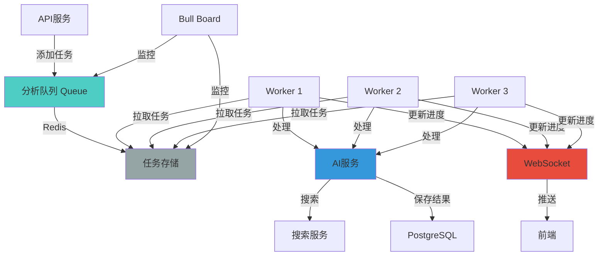
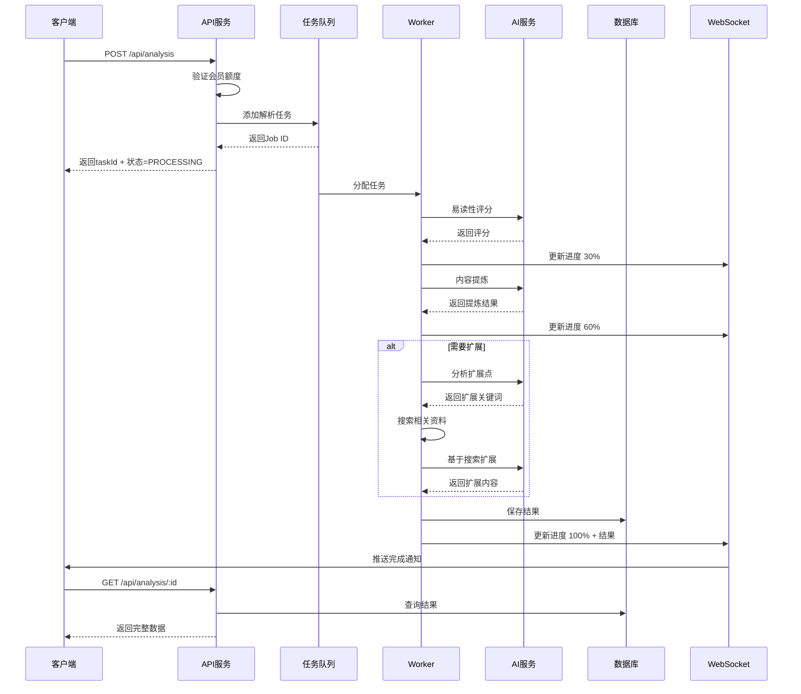

# 任务队列设计

本文档详细说明 AI-NoteBook 系统的异步任务队列设计。

## 概述

AI-NoteBook 使用 **BullMQ + Redis** 构建高性能、可靠的任务队列系统，用于处理耗时的 AI 文章解析任务。

### 核心特性

- ⚡ **异步处理**：避免阻塞主线程，提升API响应速度
- 🔄 **自动重试**：失败任务自动重试，提高成功率
- 📊 **进度追踪**：实时推送任务进度给前端
- ⏰ **延迟调度**：支持定时任务和延迟执行
- 🎯 **优先级队列**：VIP会员任务优先处理
- 🔍 **可视化监控**：Bull Board面板实时监控队列状态

## 架构设计

### 整体架构



### 数据流



## 一、队列设计

### 1.1 队列定义

```typescript
// src/modules/analysis/queues/analysis.queue.ts
import { Queue, QueueOptions } from 'bullmq'
import { InjectRedis } from '@nestjs-modules/ioredis'
import Redis from 'ioredis'

export interface AnalyzeJobData {
  userId: string
  analysisId: string
  content: string
  title?: string
  enableExpansion: boolean
  priority: number // 1-10, 10为最高优先级
}

export const ANALYSIS_QUEUE_NAME = 'analysis'

export class AnalysisQueue {
  private queue: Queue<AnalyzeJobData>

  constructor(@InjectRedis() private redis: Redis) {
    const options: QueueOptions = {
      connection: {
        host: process.env.REDIS_HOST,
        port: parseInt(process.env.REDIS_PORT),
        password: process.env.REDIS_PASSWORD
      },
      defaultJobOptions: {
        attempts: 3, // 失败重试3次
        backoff: {
          type: 'exponential',
          delay: 2000 // 初始延迟2秒
        },
        removeOnComplete: {
          count: 1000, // 保留最近1000个完成任务
          age: 7 * 24 * 3600 // 或7天内
        },
        removeOnFail: {
          count: 5000, // 保留最近5000个失败任务
          age: 30 * 24 * 3600 // 或30天内
        }
      }
    }

    this.queue = new Queue(ANALYSIS_QUEUE_NAME, options)
  }

  async addAnalyzeJob(data: AnalyzeJobData) {
    return this.queue.add('analyze-article', data, {
      jobId: data.analysisId, // 使用analysisId作为JobId，幂等性
      priority: data.priority
    })
  }

  async getJob(jobId: string) {
    return this.queue.getJob(jobId)
  }

  async getJobState(jobId: string) {
    return this.queue.getJobState(jobId)
  }

  // 获取队列统计信息
  async getQueueStats() {
    const [waiting, active, completed, failed, delayed] = await Promise.all([
      this.queue.getWaitingCount(),
      this.queue.getActiveCount(),
      this.queue.getCompletedCount(),
      this.queue.getFailedCount(),
      this.queue.getDelayedCount()
    ])

    return {
      waiting,
      active,
      completed,
      failed,
      delayed,
      total: waiting + active + completed + failed + delayed
    }
  }

  // 清理队列
  async clean() {
    await this.queue.clean(7 * 24 * 3600, 1000, 'completed')
    await this.queue.clean(30 * 24 * 3600, 5000, 'failed')
  }
}
```

### 1.2 队列配置

```typescript
// src/modules/analysis/queues/queue.config.ts
export const QUEUE_CONFIG = {
  // 并发配置
  concurrency: {
    FREE: 1,      // 免费用户：1个并发任务
    PRO: 5,       // 专业版：5个并发任务
    ENTERPRISE: 20 // 企业版：20个并发任务
  },

  // 优先级配置
  priority: {
    ENTERPRISE: 10, // 企业版优先级最高
    PRO: 5,         // 专业版中等
    FREE: 1         // 免费版最低
  },

  // 超时配置
  timeouts: {
    readability: 60000,      // 易读性评分：1分钟
    refinement: 120000,      // 内容提炼：2分钟
    expansion: 300000,       // 内容扩展：5分钟
    total: 600000            // 总超时：10分钟
  },

  // 重试配置
  retry: {
    maxAttempts: 3,
    backoffType: 'exponential',
    backoffDelay: 2000
  }
}
```

## 二、Worker实现

### 2.1 Worker基础配置

```typescript
// src/modules/analysis/workers/analyze.worker.ts
import { Worker, Job, WorkerOptions } from 'bullmq'
import { InjectRedis } from '@nestjs-modules/ioredis'
import Redis from 'ioredis'
import { Logger } from '@nestjs/common'
import { AnalyzeJobData, ANALYSIS_QUEUE_NAME } from '../queues/analysis.queue'
import { AiService } from '@/modules/ai/ai.service'
import { SearchService } from '@/modules/search/search.service'
import { PrismaService } from '@/database/prisma.service'

export class AnalyzeWorker {
  private worker: Worker<AnalyzeJobData>
  private logger = new Logger(AnalyzeWorker.name)

  constructor(
    @InjectRedis() private redis: Redis,
    private aiService: AiService,
    private searchService: SearchService,
    private prisma: PrismaService
  ) {
    const options: WorkerOptions = {
      connection: {
        host: process.env.REDIS_HOST,
        port: parseInt(process.env.REDIS_PORT),
        password: process.env.REDIS_PASSWORD
      },
      concurrency: parseInt(process.env.WORKER_CONCURRENCY || '5'),
      limiter: {
        max: 100, // 每分钟最多处理100个任务
        duration: 60000
      }
    }

    this.worker = new Worker(
      ANALYSIS_QUEUE_NAME,
      async (job: Job<AnalyzeJobData>) => this.process(job),
      options
    )

    this.setupEventListeners()
  }

  private setupEventListeners() {
    // 任务完成
    this.worker.on('completed', (job: Job) => {
      this.logger.log(`Job ${job.id} completed`)
    })

    // 任务失败
    this.worker.on('failed', (job: Job | undefined, error: Error) => {
      this.logger.error(
        `Job ${job?.id} failed: ${error.message}`,
        error.stack
      )
    })

    // 任务进度
    this.worker.on('progress', (job: Job, progress: number) => {
      this.logger.log(`Job ${job.id} progress: ${progress}%`)
    })
  }

  async process(job: Job<AnalyzeJobData>) {
    const { userId, analysisId, content, title, enableExpansion } = job.data

    try {
      // 更新状态为处理中
      await this.updateAnalysisStatus(analysisId, 'PROCESSING')

      // 步骤1: 易读性评分 (20%)
      job.updateProgress(20)
      const readabilityScore = await this.assessReadability(content)
      await this.updateAnalysisProgress(analysisId, 20, '正在评估易读性...')

      // 步骤2: 内容提炼 (40%)
      job.updateProgress(40)
      const refinedContent = await this.refineContent(content)
      await this.updateAnalysisProgress(analysisId, 40, '正在提炼内容...')

      // 步骤3: 智能扩展（可选）(60-90%)
      let expansions = null
      let sources = []

      if (enableExpansion) {
        await this.updateAnalysisProgress(analysisId, 60, '正在分析扩展点...')

        // AI分析需要扩展的点
        const keyPoints = await this.identifyKeyPoints(content, refinedContent)

        expansions = []
        for (let i = 0; i < keyPoints.length; i++) {
          const point = keyPoints[i]

          // 搜索相关资料
          await this.updateAnalysisProgress(
            analysisId,
            60 + (i / keyPoints.length) * 30,
            `正在扩展: ${point.substring(0, 20)}...`
          )

          const searchResults = await this.searchService.search(point, {
            limit: 3
          })

          // 基于搜索结果扩展
          const expansion = await this.aiService.expand(point, searchResults)

          expansions.push({
            keyPoint: point,
            expansion: expansion.content,
            sources: searchResults.map(r => r.url)
          })

          sources.push(...searchResults)
        }
      }

      // 步骤4: 保存结果 (100%)
      job.updateProgress(100)
      await this.saveResult(analysisId, {
        readabilityScore,
        processedContent: refinedContent,
        expansions,
        sources,
        status: 'COMPLETED'
      })

      await this.updateAnalysisProgress(analysisId, 100, '解析完成')

      this.logger.log(`Analysis ${analysisId} completed successfully`)

      return { success: true }
    } catch (error) {
      this.logger.error(
        `Analysis ${analysisId} failed: ${error.message}`,
        error.stack
      )

      // 保存错误信息
      await this.prisma.analysis.update({
        where: { id: analysisId },
        data: {
          status: 'FAILED',
          errorMessage: error.message
        }
      })

      throw error
    }
  }

  // 易读性评分
  private async assessReadability(content: string) {
    return this.aiService.assessReadability(content, {
      timeout: QUEUE_CONFIG.timeouts.readability
    })
  }

  // 内容提炼
  private async refineContent(content: string) {
    return this.aiService.refineContent(content, {
      timeout: QUEUE_CONFIG.timeouts.refinement
    })
  }

  // 识别关键点
  private async identifyKeyPoints(
    originalContent: string,
    refinedContent: string
  ): Promise<string[]> {
    return this.aiService.identifyKeyPoints(
      originalContent,
      refinedContent
    )
  }

  // 保存结果
  private async saveResult(
    analysisId: string,
    data: {
      readabilityScore: any
      processedContent: string
      expansions: any
      sources: any[]
      status: string
    }
  ) {
    await this.prisma.analysis.update({
      where: { id: analysisId },
      data: {
        readabilityScore: data.readabilityScore.overall,
        readabilityDetail: data.readabilityScore,
        processedContent: data.processedContent,
        expansions: data.expansions,
        sources: data.sources,
        status: data.status as any
      }
    })
  }

  // 更新解析状态
  private async updateAnalysisStatus(
    analysisId: string,
    status: 'PROCESSING' | 'COMPLETED' | 'FAILED'
  ) {
    await this.prisma.analysis.update({
      where: { id: analysisId },
      data: { status }
    })
  }

  // 更新解析进度
  private async updateAnalysisProgress(
    analysisId: string,
    progress: number,
    message: string
  ) {
    // 更新Redis
    await this.redis.setex(
      `analysis:progress:${analysisId}`,
      3600,
      JSON.stringify({ progress, message })
    )

    // 通过WebSocket推送
    // WebSocket服务会监听Redis的publish事件
    await this.redis.publish(
      `analysis:progress:${analysisId}`,
      JSON.stringify({ progress, message })
    )
  }

  // 优雅关闭
  async close() {
    await this.worker.close()
  }
}
```

### 2.2 Worker模块集成

```typescript
// src/modules/analysis/analysis.module.ts
import { Module } from '@nestjs/common'
import { BullModule } from '@nestjs/bullmq'
import { AnalysisController } from './analysis.controller'
import { AnalysisService } from './analysis.service'
import { AnalyzeWorker } from './workers/analyze.worker'
import { AnalysisQueue } from './queues/analysis.queue'
import { AiModule } from '@/modules/ai/ai.module'
import { SearchModule } from '@/modules/search/search.module'

@Module({
  imports: [
    BullModule.forRoot({
      connection: {
        host: process.env.REDIS_HOST,
        port: parseInt(process.env.REDIS_PORT),
        password: process.env.REDIS_PASSWORD
      }
    }),
    BullModule.registerQueue({
      name: 'analysis'
    }),
    AiModule,
    SearchModule
  ],
  controllers: [AnalysisController],
  providers: [AnalysisService, AnalyzeWorker, AnalysisQueue],
  exports: [AnalysisService, AnalysisQueue]
})
export class AnalysisModule {}
```

## 三、任务优先级与调度

### 3.1 动态优先级分配

```typescript
// src/modules/analysis/analysis.service.ts
import { Membership } from '@prisma/client'
import { QUEUE_CONFIG } from './queues/queue.config'

@Injectable()
export class AnalysisService {
  constructor(private analysisQueue: AnalysisQueue) {}

  async createAnalysis(userId: string, dto: AnalyzeDto, user: User) {
    // 1. 检查并发限制
    await this.checkConcurrencyLimit(userId, user.membership)

    // 2. 创建分析记录
    const analysis = await this.prisma.analysis.create({
      data: {
        userId,
        title: dto.title,
        originalContent: dto.content,
        status: 'PENDING'
      }
    })

    // 3. 计算优先级
    const priority = this.calculatePriority(user.membership)

    // 4. 添加到队列
    await this.analysisQueue.addAnalyzeJob({
      userId,
      analysisId: analysis.id,
      content: dto.content,
      title: dto.title,
      enableExpansion: dto.enableExpansion,
      priority
    })

    return {
      taskId: analysis.id,
      status: 'PROCESSING',
      estimatedTime: this.estimateTime(dto.enableExpansion)
    }
  }

  private calculatePriority(membership: Membership): number {
    switch (membership) {
      case Membership.ENTERPRISE:
        return QUEUE_CONFIG.priority.ENTERPRISE
      case Membership.PRO:
        return QUEUE_CONFIG.priority.PRO
      case Membership.FREE:
      default:
        return QUEUE_CONFIG.priority.FREE
    }
  }

  // 检查并发限制
  private async checkConcurrencyLimit(
    userId: string,
    membership: Membership
  ) {
    const maxConcurrent = QUEUE_CONFIG.concurrency[membership]

    const activeCount = await this.prisma.analysis.count({
      where: {
        userId,
        status: {
          in: ['PENDING', 'PROCESSING']
        }
      }
    })

    if (activeCount >= maxConcurrent) {
      throw new ConflictException(
        `当前有${activeCount}个任务正在处理，已达会员上限(${maxConcurrent})`
      )
    }
  }

  // 预估处理时间
  private estimateTime(enableExpansion: boolean): number {
    const baseTime = 30 // 基础时间30秒
    const expansionTime = enableExpansion ? 90 : 0 // 扩展需要额外90秒
    return baseTime + expansionTime
  }
}
```

### 3.2 延迟任务

```typescript
// 在特定时间执行任务
async scheduleAnalysis(
  userId: string,
  dto: AnalyzeDto,
  scheduledAt: Date
) {
  const analysis = await this.prisma.analysis.create({
    data: {
      userId,
      title: dto.title,
      originalContent: dto.content,
      status: 'PENDING'
    }
  })

  const delay = scheduledAt.getTime() - Date.now()

  await this.analysisQueue.queue.add('analyze-article', {
    userId,
    analysisId: analysis.id,
    content: dto.content,
    enableExpansion: dto.enableExpansion,
    priority: 5
  }, {
    delay: delay > 0 ? delay : 0
  })

  return { taskId: analysis.id, scheduledAt }
}
```

## 四、进度追踪

### 4.1 WebSocket实时推送

```typescript
// src/modules/websocket/websocket.gateway.ts
import {
  WebSocketGateway,
  WebSocketServer,
  SubscribeMessage,
  OnGatewayConnection,
  OnGatewayDisconnect
} from '@nestjs/websockets'
import { Server, Socket } from 'socket.io'
import { InjectRedis } from '@nestjs-modules/ioredis'
import Redis from 'ioredis'
import { UseGuards } from '@nestjs/common'

@WebSocketGateway({
  cors: {
    origin: process.env.FRONTEND_URL,
    credentials: true
  }
})
export class AnalysisGateway implements OnGatewayConnection, OnGatewayDisconnect {
  @WebSocketServer()
  server: Server

  private userSocketMap = new Map<string, Set<string>>()

  constructor(@InjectRedis() private redis: Redis) {
    this.subscribeToProgress()
  }

  handleConnection(client: Socket) {
    const userId = this.extractUserId(client)
    if (!userId) {
      client.disconnect()
      return
    }

    // 记录用户连接
    if (!this.userSocketMap.has(userId)) {
      this.userSocketMap.set(userId, new Set())
    }
    this.userSocketMap.get(userId)!.add(client.id)

    console.log(`User ${userId} connected with socket ${client.id}`)
  }

  handleDisconnect(client: Socket) {
    const userId = this.extractUserId(client)
    if (userId) {
      this.userSocketMap.get(userId)?.delete(client.id)
    }
  }

  // 订阅Redis进度更新
  private subscribeToProgress() {
    const subscriber = this.redis.duplicate()

    subscriber.psubscribe('analysis:progress:*', (err) => {
      if (err) {
        console.error('Failed to subscribe to progress updates:', err)
      }
    })

    subscriber.on('pmessage', (pattern, channel, message) => {
      const analysisId = channel.split(':')[2]
      const data = JSON.parse(message)

      this.broadcastProgress(analysisId, data)
    })
  }

  // 广播进度给所有相关用户
  private broadcastProgress(analysisId: string, data: any) {
    this.server.emit(`analysis:${analysisId}:progress`, data)
  }

  // 客户端订阅特定任务的进度
  @SubscribeMessage('subscribe:analysis')
  handleSubscribe(client: Socket, analysisId: string) {
    const room = `analysis:${analysisId}`
    client.join(room)

    // 发送当前进度
    this.redis.get(`analysis:progress:${analysisId}`).then((progress) => {
      if (progress) {
        client.emit(`analysis:${analysisId}:progress`, JSON.parse(progress))
      }
    })
  }

  // 客户端取消订阅
  @SubscribeMessage('unsubscribe:analysis')
  handleUnsubscribe(client: Socket, analysisId: string) {
    const room = `analysis:${analysisId}`
    client.leave(room)
  }

  private extractUserId(client: Socket): string | null {
    // 从握手或token中提取userId
    const token = client.handshake.auth.token
    // 验证token并返回userId
    return null // 简化示例
  }
}
```

### 4.2 前端集成

```typescript
// frontend/src/api/websocket.ts
import { io, Socket } from 'socket.io-client'

class WebSocketService {
  private socket: Socket | null = null

  connect(token: string) {
    this.socket = io(process.env.VITE_WS_URL, {
      auth: { token },
      transports: ['websocket']
    })

    this.socket.on('connect', () => {
      console.log('WebSocket connected')
    })

    this.socket.on('disconnect', () => {
      console.log('WebSocket disconnected')
    })
  }

  subscribeToAnalysis(
    analysisId: string,
    onProgress: (data: { progress: number; message: string }) => void
  ) {
    if (!this.socket) {
      throw new Error('WebSocket not connected')
    }

    this.socket.emit('subscribe:analysis', analysisId)
    this.socket.on(`analysis:${analysisId}:progress`, onProgress)
  }

  unsubscribeFromAnalysis(analysisId: string) {
    if (this.socket) {
      this.socket.emit('unsubscribe:analysis', analysisId)
      this.socket.removeAllListeners(`analysis:${analysisId}:progress`)
    }
  }

  disconnect() {
    if (this.socket) {
      this.socket.disconnect()
      this.socket = null
    }
  }
}

export const wsService = new WebSocketService()
```

## 五、错误处理与重试

### 5.1 重试策略

```typescript
// 智能重试配置
const RETRY_STRATEGIES = {
  // AI服务错误：重试
  AI_SERVICE_ERROR: {
    attempts: 3,
    backoff: {
      type: 'exponential',
      delay: 2000
    }
  },

  // 网络超时：重试
  TIMEOUT_ERROR: {
    attempts: 2,
    backoff: {
      type: 'fixed',
      delay: 5000
    }
  },

  // 内容过长：不重试
  CONTENT_TOO_LONG: {
    attempts: 1
  },

  // 余额不足：不重试
  INSUFFICIENT_BALANCE: {
    attempts: 1
  }
}

// 在Worker中使用
async process(job: Job<AnalyzeJobData>) {
  try {
    // 处理逻辑
  } catch (error) {
    const strategy = this.getRetryStrategy(error)

    if (strategy.attempts > 1) {
      // 更新重试配置
      job.opts.attempts = strategy.attempts
      job.opts.backoff = strategy.backoff
    }

    throw error
  }
}

private getRetryStrategy(error: Error) {
  if (error.message.includes('timeout')) {
    return RETRY_STRATEGIES.TIMEOUT_ERROR
  }

  if (error.message.includes('content too long')) {
    return RETRY_STRATEGIES.CONTENT_TOO_LONG
  }

  // 默认策略
  return RETRY_STRATEGIES.AI_SERVICE_ERROR
}
```

### 5.2 死信队列

```typescript
// 创建死信队列处理失败任务
export class DeadLetterQueue {
  private dlq: Queue

  constructor(redis: Redis) {
    this.dlq = new Queue('analysis:dlq', {
      connection: redis
    })
  }

  async addFailedJob(job: Job<AnalyzeJobData>, error: Error) {
    await this.dlq.add('failed-analysis', {
      originalJobData: job.data,
      error: {
        message: error.message,
        stack: error.stack,
        timestamp: new Date()
      },
      failedAttempts: job.attemptsMade,
      timestamp: new Date()
    })
  }

  // 重试死信队列中的任务
  async retry(jobId: string) {
    const job = await this.dlq.getJob(jobId)
    if (job) {
      const { originalJobData } = job.data
      await this.analysisQueue.addAnalyzeJob(originalJobData)
      await job.remove()
    }
  }
}
```

## 六、监控面板

### 6.1 Bull Board集成

```typescript
// src/modules/queue/ui/queue-ui.module.ts
import { Module } from '@nestjs/common'
import { BullBoardAdapter } from '@bull-board/api/bullmqAdapter'
import { ExpressAdapter } from '@bull-board/express'
import { createBullBoard } from '@bull-board/api'

const serverAdapter = new ExpressAdapter()
serverAdapter.setBasePath('/admin/queues')

createBullBoard({
  queues: [
    new BullBoardAdapter(analysisQueue.queue)
  ],
  serverAdapter
})

@Module({
  imports: [],
  providers: [],
  exports: []
})
export class QueueUiModule {}

// 在main.ts中
import { queueUiAdapter } from './modules/queue/ui/queue-ui.module'

async function bootstrap() {
  const app = await NestFactory.create(AppModule)

  // 挂载Bull Board
  app.use('/admin/queues', queueUiAdapter.getRouter())

  // 保护管理界面
  // 添加认证中间件...

  await app.listen(3000)
}
```

### 6.2 自定义监控指标

```typescript
// src/modules/queue/metrics/queue-metrics.service.ts
import { Injectable } from '@nestjs/common'
import { AnalysisQueue } from '../queues/analysis.queue'

@Injectable()
export class QueueMetricsService {
  constructor(private analysisQueue: AnalysisQueue) {}

  async getMetrics() {
    const stats = await this.analysisQueue.getQueueStats()

    // 获取队列速率
    const rates = await this.getProcessingRates()

    // 获取平均处理时间
    const avgTime = await this.getAverageProcessingTime()

    return {
      ...stats,
      rates,
      avgTime,
      timestamp: new Date()
    }
  }

  private async getProcessingRates() {
    // 计算每分钟处理任务数
    const completed = await this.analysisQueue.queue.getCompletedCount()
    const timeWindow = 60 // 秒

    // 使用Redis计数器
    // 实际实现需要更复杂的逻辑
    return {
      perMinute: Math.floor(completed / timeWindow),
      perHour: Math.floor((completed / timeWindow) * 60)
    }
  }

  private async getAverageProcessingTime() {
    const jobs = await this.analysisQueue.queue.getCompleted(0, 100)

    if (jobs.length === 0) return 0

    const totalTime = jobs.reduce((sum, job) => {
      return sum + (job.processedOn! - job.timestamp)
    }, 0)

    return Math.floor(totalTime / jobs.length)
  }

  // 获取健康状态
  async getHealthStatus() {
    const stats = await this.analysisQueue.getQueueStats()

    // 判断健康状态
    const health = {
      status: 'healthy' as 'healthy' | 'warning' | 'critical',
      issues: [] as string[]
    }

    // 失败率过高
    const failureRate = stats.failed / (stats.completed + stats.failed)
    if (failureRate > 0.1) {
      health.status = 'warning'
      health.issues.push('失败率过高')
    }

    // 等待队列过长
    if (stats.waiting > 1000) {
      health.status = 'warning'
      health.issues.push('等待队列过长')
    }

    // 处理停滞
    if (stats.active === 0 && stats.waiting > 0) {
      health.status = 'critical'
      health.issues.push('Worker处理停滞')
    }

    return health
  }
}
```

## 七、性能优化

### 7.1 批处理优化

```typescript
// 批量处理多个分析任务
async batchAnalyze(
  userId: string,
  articles: Array<{ content: string; title?: string }>,
  user: User
) {
  // 检查会员批量处理权限
  const maxBatchSize = this.getMaxBatchSize(user.membership)
  if (articles.length > maxBatchSize) {
    throw new BadRequestException(
      `批量任务最多${maxBatchSize}篇，当前${articles.length}篇`
    )
  }

  const analyses = await Promise.all(
    articles.map(async (article) => {
      const analysis = await this.prisma.analysis.create({
        data: {
          userId,
          title: article.title,
          originalContent: article.content,
          status: 'PENDING'
        }
      })

      // 批量添加到队列
      await this.analysisQueue.addAnalyzeJob({
        userId,
        analysisId: analysis.id,
        content: article.content,
        title: article.title,
        enableExpansion: false, // 批量任务默认不扩展
        priority: this.calculatePriority(user.membership)
      })

      return analysis
    })
  )

  return {
    batchId: uuid(),
    taskIds: analyses.map(a => a.id),
    total: analyses.length,
    status: 'PROCESSING'
  }
}

private getMaxBatchSize(membership: Membership): number {
  switch (membership) {
    case Membership.ENTERPRISE: return 20
    case Membership.PRO: return 10
    case Membership.FREE: return 3
  }
}
```

### 7.2 连接池优化

```typescript
// Redis连接池配置
const redisConfig = {
  host: process.env.REDIS_HOST,
  port: parseInt(process.env.REDIS_PORT),
  password: process.env.REDIS_PASSWORD,
  maxRetriesPerRequest: 3,
  retryStrategy: (times: number) => {
    const delay = Math.min(times * 50, 2000)
    return delay
  },
  enableReadyCheck: true,
  enableOfflineQueue: true,
  lazyConnect: false
}

// Worker连接池
const workerConfig = {
  connection: redisConfig,
  concurrency: parseInt(process.env.WORKER_CONCURRENCY || '5'),
  maxStalledCount: 1, // 最大停滞任务数
  stalledInterval: 30000 // 检查间隔30秒
}
```

### 7.3 缓存优化

```typescript
// 缓存AI响应结果
@Injectable()
export class CacheService {
  constructor(@InjectRedis() private redis: Redis) {}

  async getCachedAnalysis(contentHash: string) {
    const cached = await this.redis.get(`analysis:cache:${contentHash}`)
    return cached ? JSON.parse(cached) : null
  }

  async setCachedAnalysis(
    contentHash: string,
    result: any,
    ttl: number = 7 * 24 * 3600 // 7天
  ) {
    await this.redis.setex(
      `analysis:cache:${contentHash}`,
      ttl,
      JSON.stringify(result)
    )
  }

  // 生成内容哈希
  hashContent(content: string): string {
    return crypto.createHash('sha256').update(content).digest('hex')
  }
}

// 在Worker中使用
async process(job: Job<AnalyzeJobData>) {
  const { content } = job.data
  const contentHash = this.cacheService.hashContent(content)

  // 检查缓存
  const cached = await this.cacheService.getCachedAnalysis(contentHash)
  if (cached) {
    // 使用缓存结果
    await this.saveResult(job.data.analysisId, cached)
    return { success: true, cached: true }
  }

  // 执行分析
  const result = await this.performAnalysis(content)

  // 缓存结果
  await this.cacheService.setCachedAnalysis(contentHash, result)

  return { success: true, cached: false }
}
```

## 八、测试

### 8.1 单元测试

```typescript
// src/modules/analysis/workers/analyze.worker.spec.ts
import { Test, TestingModule } from '@nestjs/testing'
import { AnalyzeWorker } from './analyze.worker'
import { QUEUE_CONFIG } from '../queues/queue.config'

describe('AnalyzeWorker', () => {
  let worker: AnalyzeWorker
  let mockAiService: Partial<AiService>
  let mockPrisma: Partial<PrismaService>

  beforeEach(async () => {
    mockAiService = {
      assessReadability: jest.fn(),
      refineContent: jest.fn(),
      identifyKeyPoints: jest.fn(),
      expand: jest.fn()
    }

    mockPrisma = {
      analysis: {
        update: jest.fn(),
        findUnique: jest.fn()
      }
    }

    const module: TestingModule = await Test.createTestingModule({
      providers: [
        AnalyzeWorker,
        {
          provide: AiService,
          useValue: mockAiService
        },
        {
          provide: PrismaService,
          useValue: mockPrisma
        },
        {
          provide: 'REDIS',
          useValue: {
            duplicate: jest.fn(() => ({
              psubscribe: jest.fn(),
              on: jest.fn()
            }))
          }
        }
      ]
    }).compile()

    worker = module.get<AnalyzeWorker>(AnalyzeWorker)
  })

  it('should process analysis job successfully', async () => {
    const mockJob = {
      id: 'test-job-id',
      data: {
        userId: 'user-1',
        analysisId: 'analysis-1',
        content: 'Test content',
        enableExpansion: false,
        priority: 5
      },
      updateProgress: jest.fn()
    } as any

    mockAiService.assessReadability.mockResolvedValue({
      overall: 3,
      vocabulary: 3,
      sentence: 3,
      logic: 3
    })

    mockAiService.refineContent.mockResolvedValue('Refined content')

    const result = await worker.process(mockJob)

    expect(result.success).toBe(true)
    expect(mockAiService.assessReadability).toHaveBeenCalledWith('Test content')
    expect(mockAiService.refineContent).toHaveBeenCalledWith('Test content')
  })

  it('should handle AI service errors and retry', async () => {
    const mockJob = {
      id: 'test-job-id',
      data: {
        userId: 'user-1',
        analysisId: 'analysis-1',
        content: 'Test content',
        enableExpansion: false,
        priority: 5
      },
      updateProgress: jest.fn(),
      opts: {
        attempts: 3
      }
    } as any

    mockAiService.assessReadability.mockRejectedValue(
      new Error('AI service timeout')
    )

    await expect(worker.process(mockJob)).rejects.toThrow('AI service timeout')
  })
})
```

### 8.2 集成测试

```typescript
// test/queue.e2e-spec.ts
describe('Queue Integration (e2e)', () => {
  let app: INestApplication
  let analysisQueue: AnalysisQueue

  beforeAll(async () => {
    const moduleFixture: TestingModule = await Test.createTestingModule({
      imports: [AppModule]
    }).compile()

    app = moduleFixture.createNestApplication()
    await app.init()

    analysisQueue = app.get<AnalysisQueue>(AnalysisQueue)
  })

  describe('Analysis Queue', () => {
    it('should add job to queue', async () => {
      const jobData = {
        userId: 'test-user',
        analysisId: 'test-analysis',
        content: 'Test content',
        enableExpansion: false,
        priority: 5
      }

      const job = await analysisQueue.addAnalyzeJob(jobData)

      expect(job.id).toBeDefined()
      expect(job.data).toEqual(jobData)
    })

    it('should process job with worker', async (done) => {
      const jobData = {
        userId: 'test-user',
        analysisId: 'test-analysis-2',
        content: 'Test content for processing',
        enableExpansion: false,
        priority: 5
      }

      const job = await analysisQueue.addAnalyzeJob(jobData)

      // 等待任务完成
      job.waitUntilFinished(analysisQueue.queue).then((result) => {
        expect(result.success).toBe(true)
        done()
      })
    }, 30000)
  })

  afterAll(async () => {
    await app.close()
  })
})
```

## 九、部署与运维

### 9.1 Docker配置

```dockerfile
# Dockerfile
FROM node:20-alpine

WORKDIR /app

COPY package*.json ./
RUN npm ci --only=production

COPY . .
RUN npm run build

# Worker模式
CMD ["node", "dist/main.js", "--mode", "worker"]
```

```yaml
# docker-compose.yml
version: '3.8'

services:
  api:
    build: .
    command: node dist/main.js --mode api
    ports:
      - "3000:3000"
    environment:
      - NODE_ENV=production
      - WORKER_MODE=false
    depends_on:
      - redis
      - db

  worker:
    build: .
    command: node dist/main.js --mode worker
    environment:
      - NODE_ENV=production
      - WORKER_MODE=true
      - WORKER_CONCURRENCY=10
    deploy:
      replicas: 3
    depends_on:
      - redis
      - api

  redis:
    image: redis:7-alpine
    ports:
      - "6379:6379"
    volumes:
      - redis_data:/data

volumes:
  redis_data:
```

### 9.2 监控告警

```typescript
// src/modules/queue/alerting/alerting.service.ts
@Injectable()
export class AlertingService {
  constructor(
    private queueMetrics: QueueMetricsService,
    private notificationService: NotificationService
  ) {
    this.startMonitoring()
  }

  private startMonitoring() {
    // 每5分钟检查一次
    setInterval(async () => {
      const health = await this.queueMetrics.getHealthStatus()

      if (health.status !== 'healthy') {
        await this.sendAlert(health)
      }
    }, 5 * 60 * 1000)
  }

  private async sendAlert(health: any) {
    const message = `
      队列告警 ⚠️
      状态: ${health.status}
      问题:
      ${health.issues.map(i => `- ${i}`).join('\n')}
      时间: ${new Date().toISOString()}
    `

    // 发送邮件、钉钉、Slack等
    await this.notificationService.send({
      channel: 'slack',
      message
    })
  }
}
```

### 9.3 日志分析

```typescript
// 结构化日志
this.logger.log({
  message: 'Job processing started',
  jobId: job.id,
  userId: job.data.userId,
  priority: job.data.priority,
  timestamp: new Date()
})

// 使用Winston记录到文件
const logger = winston.createLogger({
  format: winston.format.combine(
    winston.format.timestamp(),
    winston.format.json()
  ),
  transports: [
    new winston.transports.File({
      filename: 'logs/queue.log',
      maxsize: 10 * 1024 * 1024, // 10MB
      maxFiles: 10
    })
  ]
})
```

## 十、最佳实践

### 10.1 任务设计原则

1. **幂等性**：任务可以安全地重复执行
2. **原子性**：任务要么完全成功，要么完全失败
3. **超时控制**：设置合理的超时时间
4. **错误隔离**：单个任务失败不影响其他任务
5. **进度反馈**：定期更新任务进度

### 10.2 性能调优建议

```typescript
// 根据负载动态调整Worker数量
async function autoScaleWorkers() {
  const stats = await analysisQueue.getQueueStats()

  // 等待队列过长，增加Worker
  if (stats.waiting > 100) {
    await scaleUpWorkers()
  }

  // 空闲时减少Worker
  if (stats.active === 0 && stats.waiting === 0) {
    await scaleDownWorkers()
  }
}

// 使用Redis Streams处理高并发
// 对于极高并发场景，考虑使用Kafka或RabbitMQ
```

### 10.3 故障恢复

```typescript
// 自动重启Worker
process.on('uncaughtException', async (error) => {
  logger.error('Uncaught Exception:', error)
  await cleanup()
  process.exit(1)
})

process.on('SIGTERM', async () => {
  logger.info('SIGTERM received, shutting down gracefully')
  await worker.close()
  process.exit(0)
})

// 定期备份队列状态
async function backupQueueState() {
  const jobs = await analysisQueue.queue.getRepeatableJobs()
  await redis.set(
    'queue:backup',
    JSON.stringify(jobs),
    'EX',
    86400
  )
}
```

## 相关文档

- [系统架构](/guide/architecture)
- [认证鉴权](/guide/authentication)
- [API文档](/guide/api)
- [数据库设计](/guide/database)
